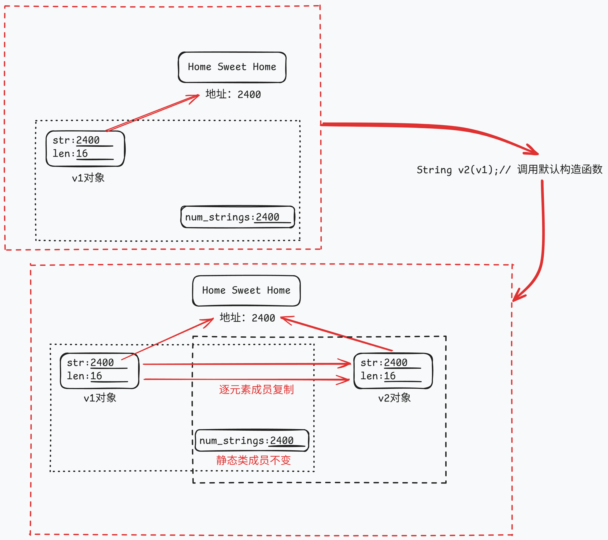
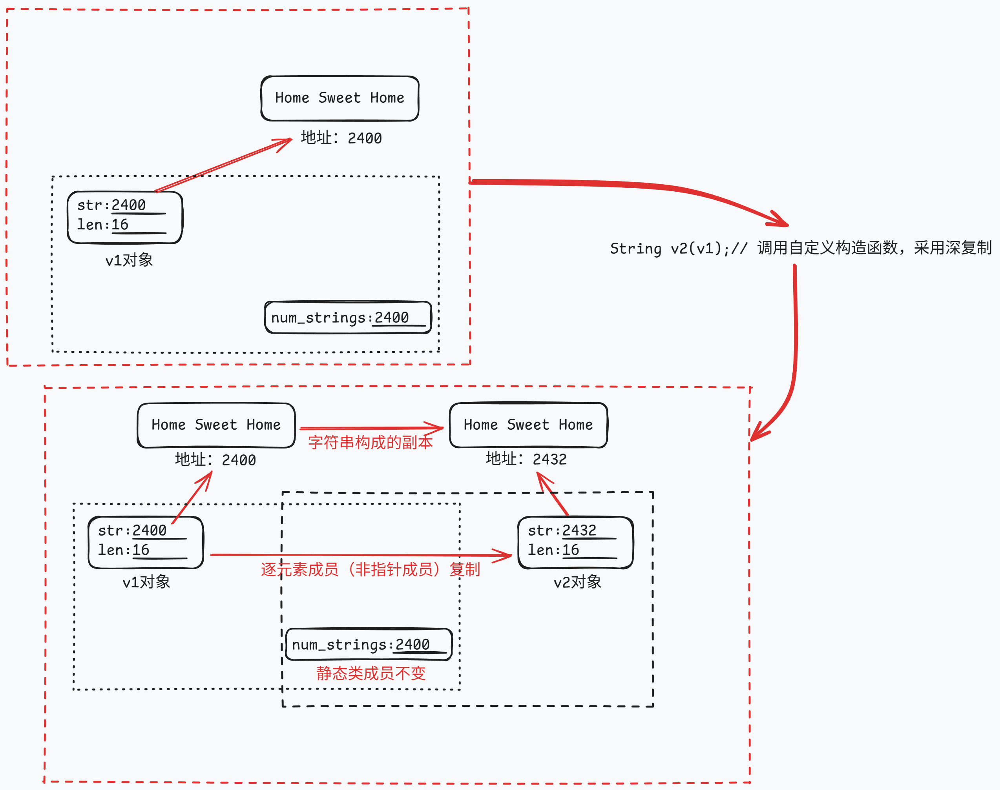

# 类和动态内存分配

## 练习：`StringBad`类的编写

| code-list-12-01                                     | code-list-12-02                                         | code-list-12-03                                       |
| --------------------------------------------------- | ------------------------------------------------------- | ----------------------------------------------------- |
| [strngbad.h](./examples/code-list-12-01-strngbad.h) | [strngbad.cpp](./examples/code-list-12-02-strngbad.cpp) | [vegnews.cpp](./examples/code-list-12-03-vegnews.cpp) |

该案例涉及了类的静态成员和动态内存分配的编写。

## 类的静态成员

### 静态数据成员

### 静态成员函数

### 静态成员在应用中的特点

## 类的动态内存分配

### 指针形式的数据成员

### new初始化问题

### 存储回收问题

### 类对象的基本操作问题

## 类内的特殊成员

C++类中，如果用户没有自定义下面这些成员函数，C++将自动提供。

| 特殊成员函数   | 描述        |
| -------------- | ----------- |
| 默认构造函数   |             |
| 默认析构函数   |             |
| 复制构造函数   |             |
| 赋值运算符     |             |
| 地址运算符     |             |
| 移动构造函数   | C++11中出现 |
| 移动赋值运算符 | C++11中出现 |

### 默认构造函数


### 默认析构函数

在变量离开作用域时被自动调用。

### 复制构造函数

复制构造函数用于将一个对象复制到**新创建**的对象中。类的复制构造函数原型通常如下：

```C++
Class_name(const Class_name&);
```

==那么何时将会调用复制构造函数呢？==

新建一个对象并将其初始化为同类现有对象时，复制构造函数将被调用，下面4中声明都将调用复制构造函数`Class_name(const Class_name&)`：

```C++
Class_name variable1(variable_known);
Class_name variable2 = variable_known;
Class_name variable3 = StringBad(variable_known);
Class_name * p_class = new Class_name(variable_known); 
```

当程序生成了对象副本时，复制构造函数将被调用。具体说，当函数按值传递对象或按值返回对象时，都将使用复制构造函数。

==那么默认复制构造函数将会进行何种程度的复制呢？==

默认的复制构造函数是一种浅复制，逐个复制非静态成员的值，静态成员不受影响。如下图所示。



如上图所示，默认复制构造函数的浅复制方式可能会带来数据受损，重复删除的问题。如下部分代码所示。

```C++
int main()
{
	...
	callme2(v1);
	...
}

void callme2(StringBad v2)
{
	cout << "String passed by value:\n";
	cout << " \"" << v2 << "\"\n";
}
```

 `void callme2(StringBad sb)`此函数为按值传递。若类未定义复制构造函数，那么`v2`将使用类默认的复制构造函数进行浅复制。默认的复制构造函数不会对静态成员变量加1，同时对于其中的指针成员，`v1`和`v2`将指向同一块内存，如上图所示。当函数接近尾声，`v2`的作用域到此为止，将会调用`v2`的析构函数释放`v2`，同时由于`v2`中的指针对象和`v1`中的指针对象指向同一块内存，当`v2`被释放，`v1`中指针成员指向的内存被`v2`的析构函数一并释放了，导致数据丢失，以及当`v1`结束时`v1`的析构函数会对该内存再次释放，导致重复内存空间重复释放。

==如何解决默认复制构造函数浅复制带来的问题呢？==



在自定义的默认复制构造函数中使用深复制（deep copy）。深复制是与浅复制相对的一种复制方法。在复制指针对象时，应当将指针指向的内容复制给另一个对象，并为此创建一个新的地址。这样每个对象自己的成员都是相对独立的，而不是引用另一个对象的成员。那么在调用析构函数时，将依次释放不同的成员，不会错误地释放其他类对象的成员。

```
StringBad::StringBad(const StringBad& st)
{
	num_strings++;
	len = st.len; // 非指针成员正常复制
	str = new char[len + 1]; // 指针成员新建一份地址
	std::strcpy(str, st.str); // 指针成员对字符串进行复制
	cout << nuim_strings << ": \"" << str << "\"object created.\n";
}
```

### 默认赋值运算符

C++允许类对象赋值，这是通过自动为类重载运算符实现的。这种运算符的原型如下：

```
Class_name & Class_name::operator=(const Class_name &);
```

它接受并返回一个指向类对象的引用。

==那么何时以及如何使用赋值运算符呢？==

在将已有对象赋给另一个对象时，将使用重载的赋值运算符。初始化对象不一定会使用赋值运算符。

与构造复制函数类似，赋值元素安抚的隐式实现也对成员进行逐个复制。如果成员本身就是类对象，则程序将使用为这个类定义的赋值运算符来复制该成员，但静态数据成员不受影响。

==以及使用赋值运算符时，会产生哪些问题呢？==

默认的赋值运算符和默认的复制构造函数类似，都是一种浅复制。从而导致类似的数据受损，内存空间重复释放的问题。

==如何解决赋值运算符产生的问题呢？==

同样，默认的赋值赋值运算符都是浅复制，需要定义一种深复制的赋值方式，与定义复制构造函数相似，但也有些不同。

* 由于目标对象可能引用了之前分配的数据，所以函数应当使用delete[]来释放这些数据。
* 函数应当尽量避免将对象赋给自身；否则，给对象重新赋值前，释放内存操作可能删除对象的内容。
* 函数返回一个指向调用对象的引用。

通过返回一个对象，函数可以像常规赋值操作那样，连续进行赋值。

```
StringBad & StringBad::operator = (const StringBad & st)
{
	if (this = &st);
		return *this;
// 首先进行自我复制，查看赋值运算符右边的地址是否与接受对象的地址相同
// 若相同，则直接返回*this，然后结束
	delete [] str;
// 如果地址不同，函数将释放str指向的内存，这是因为稍后将把一个新字符串的地址赋给str。
// 如果不首先使用delete运算符，则上述字符串将保留在内存中。由于程序中不在包含指向这块旧内存的指针，因此导致内存浪费
	len = st.len;
	str = new char [len + 1];
// 与自定义复制构造函数相似，即为新字符串分配足够的内存空间，然后将赋值运算符右边的对象中的字符串赋值到新的内存单元中
	std::strcpy(str, st.str);
	return * this;
// 返回解除引用后的指针
// 赋值操作并不创建新的对象
}
```

## 练习：`StringBad`类改进为`String`类

经过上述补充后，可以对`StringBad`类进行改进，改进后的文件如下：

|                  code-list-12-04                  |                    code-list-12-05                    |                     code-list-12-06                     |
| :-----------------------------------------------: | :---------------------------------------------------: | :-----------------------------------------------------: |
| [string1.h](./examples/code-list-12-04-string1.h) | [string1.cpp](./examples/code-list-12-05-string1.cpp) | [sayings1.cpp](./examples/code-list-12-06-sayings1.cpp) |

在原有的基础上，需要进行**修改**。首先，添加自定义的复制构造函数和赋值运算符，将浅拷贝修正为深拷贝；其次，使类构造函数和析构函数保持沉默；最后，简化默认构造函数，使之创建一个空字符。

接下来，需要再**添加**一些新内容。添加的新方法需要使得String类能够包含标准字符串`cstring`的所有功能。

| 函数声明                                                     | 函数解释                     |
| ------------------------------------------------------------ | ---------------------------- |
| `int length () const {return len;}`                          | 用于对string类对象计数       |
| `friend bool operator<(const String &st, const String &st2);` | 友元函数，重载比较运算符     |
| `friend bool operator>(const String &st, const String &st2);` | 友元函数，重载比较运算符     |
| `friend bool operator==(const String &st, const String &st2);` | 友元函数，重载等价运算符     |
| `friend opereator >>(istream & is, String & st);`            | 友元函数，重载比较输出运算符 |
| `char & operator[](int i);`                                  | 提供了使用数组访问的方式     |
| `const char & operator[](int i) const`                       | 提供了使用数组访问的方式     |
| `static int HowMany();`                                      | 补充静态类数据成员           |

> [!NOTE]
>
> * 如果在构造函数中使用`new`来初始化成员，那么在析构函数中应当使用`delete`
> * `new`和`delete`必须相互兼容。`new`对应于`delete`，而`new []`对应于`delete[]`
> * 如果有多个构造函数，则必须以相同的方式使用，要么都带中括号要么都不带中括号，因为析构函数只有一个
> * 应当定义一个复制构造函数，通过深度复制将一个对象初始化为另一个新对象
> * 应当定义一个赋值运算符，通过深度赋值将一个对象的值提供给另一个对象
> * 对于包含类成员的类，其进行逐成员复制时，将使用对应类成员的复制构造函数，不需要对该类重新编写一个复制构造函数。然而若类中部分类成员没有自己的深复制构造函数，则需要手动规定。

## 函数的返回对象

### 返回指向const对象的引用

使用const对象的引用常常为了提高效率，一般仅在一些只起到只读作用的函数中使用。返回引用不会调用复制构造函数，而返回常量会调用复制构造函数。

### 返回指向非const对象的引用

两种常见的返回非const对象的引用是重载赋值运算符以及重载与`cout`一起使用的`<<`运算符。前者这样做的原因是为了提高运算效率，因为不这样做也可以调用复制构造函数完成；后者这样做的原因是必须如此。

### 返回对象

如果被返回的对象是被调用函数中的局部变量，则不应按引用的方式返回它。因为在被调用函数执行完毕后，局部对象将调用其析构函数。因此，当控制权回到调用函数时，引用指向的对象将不复存在。在这种情况下应当返回对象而不是引用。

通常，重载的运算符常常采用这种返回类型，如下。

```C++
int main()
{
    Vector force1(50,60);
	Vector force2(10,70);
	Vector net;
	net = force1 + force2;
}
...
Vector Vector::operator+(const Vector & b)
{
	return Vector(x+b.x, y+b.y);
}
```

上述代码在函数输出时将调用复制构造函数，将一个临时变量复制给`net`变量。

### 返回const对象

一般由于程序员的粗心或者创意性的设计可能会出现如下语句：

```C++
force1 + force2 = new;
// force1和force2的定义以及+重载运算符的定义如上。
```

这种语句是可以执行的。`force1+force2`将使用重载后的`+`运算符，通过复制构造函数创建一个临时变量，然后变量`net`将通过赋值运算符，覆盖这个临时变量，当临时变量使用完毕后，将被抛弃。

为了避免上述流程带来的不可预估的错误，可以将返回类型声明为`const Vector`，这样对于正常使用没有任何影响，但是上述语句将被定义为非法。


> [!NOTE]
>
> * 总之，如果函数或方法要返回临时变量，则应当返回对象而非对象的引用，在这种情况下将使用复制构造函数来生成返回对象。
>
> * 如果方法或函数要返回一个没有公有复制构造函数的对象，它必须返回一个指向这种对象的引用。
>
> * 最后，对于返回对象和返回引用均可的方法或函数，应当优先返回引用，提高效率。

## 练习：使用指向对象的指针

该程序使用指针来跟踪而非索引值来跟踪最先的`String`对象和最长的`String`对象。

|                  code-list-12-04                  | code-list-12-05                                       |                     code-list-12-07                     |
| :-----------------------------------------------: | ----------------------------------------------------- | :-----------------------------------------------------: |
| [string1.h](./examples/code-list-12-04-string1.h) | [string1.cpp](./examples/code-list-12-05-string1.cpp) | [sayings2.cpp](./examples/code-list-12-07-sayings2.cpp) |

> [!NOTE]
>
> 在下述情况下析构函数将被调用
>
> * 如果对象是自动变量，则当执行完定义该对象的程序块时，将调用析构函数。
> * 如果对象是静态变量，则在程序结束时将调用析构函数。
> * 如果对象是用new创建的动态变量，则在显式使用delete删除对象时，析构函数才会被调用。

该程序使用`new`运算符创建了一个512字节的内存缓冲区，然后使用`new`运算符在堆中创建两个`JustTesting`对象，比试图使用定位`new`运算符在内存缓冲区中创建两个`JustTesting`对象。最后使用`delete`来释放使用`new`分配的内存。

|                      code-list-12-08                      |
| :-------------------------------------------------------: |
| [placenew1.cpp](./examples/code-list-12-08-placenew1.cpp) |

> [!NOTE]
>
> * 使用new定位运算符拉取的内存不能用delete运算符释放，因为其不在new/delete系统之中。

该程序对`placenew1.cpp`进行修改，加入合适的delete和显示的析构函数调用，修复程序原有的问题。

|                      code-list-12-09                      |
| :-------------------------------------------------------: |
| [placenew2.cpp](./examples/code-list-12-09-placenew2.cpp) |

## 练习：队列模拟

背景：Heather银行打算在Food Heap超市开设一个自动柜员机（ATM）。Food Heap超市的管理员担心排队等待使用ATM的人流会干扰超市的交通，希望限制排队等待的人数。Heather银行希望对顾客排队等待的时间进行估测。要编写一个程序来模拟这个情况，让超市管理员可以了解ATM可能造成的影响。

对于这种问题最自然的方法是使用顾客队列。队列是一种抽象的数据类型（Abstract Data Type， ADT），可以存储有序的项目序列。新项目被添加在队尾，并可以删除队首的项目。队列有点像栈，但栈在同一端可以进行添加和删除。这使得栈是一种后进先出的结构，而队列是先进先出的。从概念上说，队列就好比收款台或ATM机前面排的队，所以对于上述问题，队列非常合适。因此工程任务之一就是定义一个Queue类。

队列中的项目是顾客。Heather银行的代表介绍：通常1/3顾客只需要1分钟便可获得服务，1/3的顾客需要2分钟，另外1/3的顾客需要3分钟。另外，顾客到达的时间是随机的，但每个小时使用自动柜员机的顾客数量相当稳定。工程另外两项任务是：设计一个表示顾客的类；编写一个程序来模拟顾客和队列之间的交互。

### 队列类的设计与实现

### 客户类的设计与实现

### ATM机模拟


