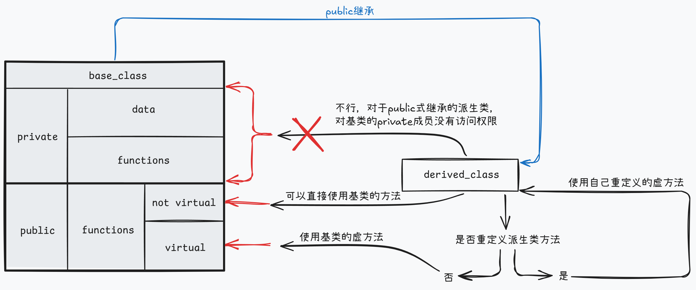

# 类继承

## 练习：一个简单的基类

从一个类派生出另一个类时，原始类被称为基类，继承类称为派生类。演示如下代码。

Webtown俱乐部决定跟踪乒乓球会会员，作为俱乐部的首席程序员，需要设计一个简单的TableTennisPlayer类，如code-list-13-01和code-list-13-02。

| code-list-13-01                                     | code-list-13-02                                         | code-list-13-03                                     |
| --------------------------------------------------- | ------------------------------------------------------- | --------------------------------------------------- |
| [tabtenn0.h](./examples/code-list-13-01-tabtenn0.h) | [tabtenn0.cpp](./examples/code-list-13-02-tabtenn0.cpp) | [usett0.cpp](./examples/code-list-13-03-usett0.cpp) |

### 派生一个类

Webtown俱乐部的一些成员曾经参加过当地的乒乓球竞标赛，需要这样一个类，它能包括成员在比赛中的得分。与其从零开始，不如从TableTennisClass类中派生出一个类，首先将RatedPlayer类声明从TableTennisClass类中派生出来，语法如下：

```C++
Class RatedPlayer : public TableTennisClass
{
    ...
};
```

冒号指出RatedPlayer类的基类是TableTennisClass类。上述特殊的声明头表明TableTennisClass是一个公有的基类，这杯称为公有派生。派生类对象包含积累对象。使用公有派生，基类的公有成员将称为派生类的公有成员；基类的私有部分也将成为派生类的一部分，但只能通过基类的公有和保护方法访问。

>[!NOTE]
>
>* 派生类对象存储了基类的数据成员——派生类继承了基类的实现
>* 派生类对象可以使用基类的方法——派生类继承了基类的接口
>* 派生类需要自己的构造函数
>* 派生类可以根据需要添加额外的数据成员和成员函数

### 派生类的构造函数

派生类的构造函数必须同时为派生类对象的成员和基类对象的成员提供数据。基类对象应当在程序进入派生类构造函数之前被创建，可以使用成员初始化列表来完成。注意，基类的私有成员是无法被派生类直接访问的，只能调用基类的方法进行访问。

```C++
RatedPlayer::RatedPlayer(unsigned int r, const string& fn,
	const string& ln, bool ht) : TableTennisPlayer(fn, ln, ht) {...}
```

如果省略列表初始化，也就是自定义的基类的构造函数不会被调用，因此程序会调用基类的默认构造函数。

```C++
RatedPlayer::RatedPlayer(unsigned int r, const string& fn,
	const string& ln, bool ht) : TableTennisPlayer() {...}
```

当使用同类型的基类对该派生类对象的基类进行初始化时，会调用派生类对象的复制构造函数。对于没有使用动态内存分配的基类，使用默认的复制构造函数是可行的，但是对于使用动态内存分配的基类，应当自定义合适的复制构造函数。

```C++
RatedPlayer::RatedPlayer(unsigned int r,
	const TableTennisPlayer& tp) : TableTennisPlayer(tp), rating(r){...}
```

也可以对派生类对象使用成员初始化列表的方式。

>[!NOTE]
>
>有关派生类对象构造函数的要点如下：
>
>* 首先创建基类对象；
>* 派生类构造函数应通过成员初始化列表将基类信息传递给基类构造函数
>* 派生类构造函数应初始化派生类新增的数据成员

创建派生对象时，先调用基类构造函数，后调用派生类后遭函数。基类构造函数负责初始化继承的数据成员，派生类构造函数主要用于初始化新增的数据成员。释放对象的顺序和创建对象的顺序相反，是先调用派生类对象的析构函数，后调用基类对象的析构函数。 

### 使用派生类

要使用派生类，程序必须能够访问基类声明，以下为一个使用派生类的案例。

| code-list-13-04                                     | code-list-13-05                                         | code-list-13-06                                     |
| --------------------------------------------------- | ------------------------------------------------------- | --------------------------------------------------- |
| [tabtenn1.h](./examples/code-list-13-04-tabtenn1.h) | [tabtenn1.cpp](./examples/code-list-13-05-tabtenn1.cpp) | [usett1.cpp](./examples/code-list-13-06-usett1.cpp) |

> [!NOTE]
> 派生类和基类之间有一些特殊关系：
>
> * 派生类可以使用基类中非私有的方法
> * 基类指针可以在不进行显示类型转换的情况下指向派生类对象
> * 基类引用可以在不进行显示类型转换的情况下引用派生类对象

```C++
derived_class r1{...};
based_class & rt = r1;
based_class * pt = &r1;
rt.Name();
pt->Name();
```

然而，基类指针或引用只能用于调用基类方法，因此不能使用基类指针或引用来调用派生类的方法。

通常，C++要求引用和指针类型与赋给的类型匹配，但是这一规则对继承来说是一个例外。然而这种例外是单向的，不能将基类对象和地址赋给派生类引用和指针，也就是派生类对象的引用和指针不能指向基类。

```C++
based_class b1{...};
derived_class & rt = b1;// DO NOT DO IT
derived_class * pt = &b1;// DO NOT DO IT
```

由于这种特殊的继承关系，因此基类引用定义的函数或指针参数可以用于基类对象或派生类对象，也就是说为基类对象设计的函数也可以用于派生类对象。

同时这种引用兼容性允许程序将基类对象初始化为派生类对象。

```C++
derived_class r1 {...};
base_class b1(r1);
// 这个函数的原函数为base_class(const derived_class &)
// 但是基类的方法中并没有这个函数，因此存在隐式复制构造函数
// base_class(const base_class &)
```

`base_class(const base_class &)`在隐式调用这个函数的时候，将可以引用派生类，这样将派生类用于基类初始化时，将调用基类的复制构造函数。换句话说，该函数将基类对象初始化为嵌套在派生类对象的基类对象。

对于赋值运算符，同样的：

```C++
derived_class r1 {...};
base_class b1 = r1;
// 这个函数的原函数为base_class & operator=(const derived_class &)const
// 但是基类的方法中并没有这个函数，因此使用隐式复制构造函数
// base_class & operator=(const base_class &)const
// 派生类对象的值将被暂时赋给一个基类对象
```

## 继承：is-a关系

C++有三种继承方式：公有继承、保护继承和私有继承。

公有继承是最常用的方式，它建立一种is-a关系，即派生对象也是一个基类对象，可以对基类对象执行的任何操作，也可以对派生类对象执行。


##  多态公有继承

前文中，派生类对象使用基类的方法，而未作任何修改。然而，可能会遇到这样的情况，即希望同一个方法在派生类和基类中的行为是不同的。换句话说，方法的行为应取决于调用该方法的对象。这种较复杂的行为称为**多态**——具有多种形态，即同一个方法的行为随上下文而异。

* 在派生类中重新定义基类方法
* 使用虚方法

**虚函数使得基类的引用或指针也可以使用派生类的方法。**

虚方法，即使用virtual关键字修饰类方法。**注意，关键字virtual值用于类声明的方法原型中，而没有用于方法定义中**。如下案例。

```C++
//ViewAcct()不是一个虚方法
Brass dom("Dominic Banker", 12118, 2592.00);
BrassPlus dot("Dorothy Banker", 12118, 2592.00);
Brass & b1_raf = dom;
Brass & b2_raf = dot;
b1_ref.ViewAcct();// 使用Brass::ViewAcct()
b2_ref.ViewAcct();// 使用Brass::ViewAcct()
```

```C++
//ViewAcct()是一个虚方法
Brass dom("Dominic Banker", 12118, 2592.00);
BrassPlus dot("Dorothy Banker", 12118, 2592.00);
Brass & b1_raf = dom;
Brass & b2_raf = dot;
b1_ref.ViewAcct();// 使用Brass::ViewAcct()
b2_ref.ViewAcct();// 使用BrassPlus::ViewAcct()
```



这种使用虚函数的方法非常方便，因此经常在基类中将派生类会重新定义的方法声明为虚方法。方法在基类中被声明为虚的后，它在派生类中将自动生成虚方法。然而，在派生类中声明使用关键字virtual 直接声明虚函数，也是一个好方法。

### 虚函数的使用要点

> [!NOTE]
>
> * 在基类方法的声明中使用关键字virtual可使该方法在基类以及所有的派生类中式虚的。
> * 如果使用指向对象的引用或指针来调用虚方法，程序将使用为对象类型定义的方法，而不使用为引用或指针类型定义的方法。这称为动态联编或晚期联编，这样使得基类指针或引用可以指向派生类对象。
> * 如果定义类将被用作基类，则应当将哪些要在派生类中重新定义的类方法声明为虚的。

**构造函数与虚函数**

构造函数不能是虚函数。创建派生对象时，将使用派生类的构造函数，而不是基类的构造函数。然后派生类的构造函数将使用基类的一个构造函数，这种顺序不同于继承机制。因此，派生类不继承基类的构造函数，所及将类构造函数声明为虚的没有什么意义。

**析构函数与虚函数**

析构函数应当是虚函数，除非类不用做基类。如果不使用虚函数，类对象在析构删除时，会仅仅删除基类的成员数据；而使用虚函数，类对象会先删除派生类指向的内存，再删除基类指向的内存。

**友元与虚函数**

友元不能是虚函数，因为友元函数就不是成员函数。

**虚函数重定义与函数重载**

```C++
class Dwelling
{
public:
    virtual void showperks(int a) const;
    ...
}
class Hovel : public Dwelling
{
public:
    virtual void showperks() const;
    ...
}
```

注意，此时Hovel：：showperks()的函数定义将覆盖Dwelling::showperks()中的函数定义，而不是重载它。

```C++
Hovel trump;
trump.showperks();//正确
trump.showperks(1);//错误，虚函数定义覆盖
```

故，重新定义继承的方法，应确保与原来的原型完全相同，避免不必要的歧义。其次，如果返回类型是基类引用或指针，则可以修改为指向派生类的引用或指针，这种特性被称为返回类型协变（covariance of return type），因为允许返回类型随类类型的变化而变化，注意这种例外只适用于返回值，不适用于参数。  

```C++
class Dwelling
{
public:
    virtual Dwelling &  showperks(int a) const;
    ...
}
class Hovel : public Dwelling
{
public:
    virtual Hovel &  showperks() const;
    ...
}
// 合理
```

```C++
class Dwelling
{
public:
    virtual void showperks(Dwelling & a) const;
    ...
}
class Hovel : public Dwelling
{
public:
    virtual void showperks(Hovel & a) const;
    ...
}
// 不合理
```

## 练习：多态继承类的开发

当前，银行要求完成一个类开发用于表示基本支票账户——Brass Account，另一个类用于表示代表Brass Plus支票账户，它添加了透支保护特性。也就是说，如果用户签出一张超出其存款余额的支票——但是超出的数额不是很大，银行将支付这张支票，对超出的部分收取额外的费用，并追加罚款。可以根据要保存的数据以及允许执行的操作来确定这种账户的特征。

### 要求

| 类名     | Brass类                                     | BrassPlus类                                                  |
| -------- | ------------------------------------------- | ------------------------------------------------------------ |
| 成员数据 | 1. 客户姓名 2. 账号 3. 当前结余             | 1. 客户姓名 2. 账号 3. 当前结余 <br />4. 透支上限 5. 透支贷款利率 6. 当前的透支总额 |
| 成员方法 | 1. 创建账户 2. 存款 3. 取款 4. 显示账户信息 | **1. 创建账户** 2. 存款 **3. 取款** **4. 显示账户信息**      |

不需要要新增操作，但`BrassPlus`类的实现形式与`Brass`类不同：

* 对于取款操作，必须透支保护
* 显示操作必须显示Brass Plus账户其他信息

开发Brass类和BrassPlus类相关代码和测试如下：

| code-list-13-07                               | code-list-13-08                                   | code-list-13-09                                           | code-list-13-10                                           |
| --------------------------------------------- | ------------------------------------------------- | --------------------------------------------------------- | --------------------------------------------------------- |
| [brass.h](./examples/code-list-13-07-brass.h) | [brass.cpp](./examples/code-list-13-08-brass.cpp) | [usebrass1.cpp](./examples/code-list-13-09-usebrass1.cpp) | [usebrass2.cpp](./examples/code-list-13-10-usebrass2.cpp) |

### 难点解析

**构造函数在成员初始化列表中**

```C++
BrassPlus::BrassPlus(const std::string& s, long a, double bal, double ml, double r) : Brass(s, a, bal)
{
	maxLoan = ml;
	rate = r;
	owesBank = 0.0;
}

BrassPlus::BrassPlus(const Brass& ba, double ml, double r) : Brass(ba)
{
	maxLoan = ml;
	rate = r;
	owesBank = 0.0;
}
```

派生类构造函数在初始化基类私有数据时，采用的是成员初始化列表语法，如上。这几个构造函数都是用成员初始化列表语法，将基类信息传递给基类构造函数，然后使用构造函数体初始化派生类新增的数据项。注意，非构造函数不能使用成员初始化列表语法，但派生类可以是直接调用公有的基类方法。

```C++
void BrassPlus::ViewAcct() const
{
	format initialState = setFormat();
	precis prec = cout.precision(2);

	Brass::ViewAcct();
	cout << "Maximum loan: $" << maxLoan << endl;
	cout << "Owed to bank: $" << owesBank << endl;
	cout.precision(3);
	cout << "Load Rate: " << 100 * rate << "%\n";

	restore(initialState, prec);
}
```

`Brass::Plus::ViewAcct()`显示新增的`BrassPlus`数据成员，并调用基类方法`Brass::ViewAcct()`来显示基类数据成员。在派生类方法中，标准计数是使用作用域解析运算符来调用基类方法。

注意，如果代码没有使用作用域解析运算符，编译器将认为`ViewAcct()`是`BrassPlus::ViewAcct()`，这将创建一个不会终止的递归函数。

**格式化输出**

方法`ViewAcct()`和`WithDraw()`将使用格式化方法setf()和precision()将浮点值的输出设置为定点，即包含两位小数。设置模式后，输出的模式将保持不变，因此该方法将格式模式重置为调用前的状态。

```C++
typedef std::ios_base::fmtflags format;
typedef std::streamsize precis;
format setFormat();
void restore(format f, precis p);

......

format setFormat()
{
	return cout.setf(std::ios_base::fixed, std::ios::floatfield);
}

void restore(format f, precis p)
{
	cout.setf(f, std::ios_base::floatfield);
	cout.precision(p);
}
```

```C++
void classname::function()
{
	format initialState = setFormat();
	precis prec = cout.precision(2);

    ......

	restore(initialState, prec);
}
```

更详细的可以看第17章，这里略述。

**虚方法的调用**

code-list-13-09使用对象调用类对象虚方法，code-list-13-10则使用引用或指针调用类对象虚方法。 

**虚析构函数**

如果虚构函数不是虚函数，那么将只调用对应于指针类型的析构函数。对于本案例而言，将调用基类Brass的析构函数，即使指针指向的是一个派生类对象。而如果析构函数是虚的，则将调用相应对象类型的析构函数，因此如果指针指向一个派生类对象，则在析构时将会分别使用派生类对象的析构函数和基类对象的析构函数。因此，使用析构虚函数可以确保正确的析构函数序列被调用。

## 静态联编和动态联编

程序调用函数时将使用哪个可执行代码呢？编译器负责回答这个问题。将源代码中的函数调用解释为执行特定的函数代码块被称为函数名联编。对于C++，由于函数重载的关系，这项任务相当复杂。编译器去必须查看函数仓库以及函数名才能确定使用哪个函数。一般，编译器在编译过程中完成这种联编。在编译过程中进行联编被称为静态联编（static binding），又称为早期联编（early binding）。然而，虚函数的出现使得编译器不能再编译阶段确定函数。所以，编译器必须生成能够再程序运行时选择正确的虚函数方法的代码，这被称为动态联编（dynamic binding），又称晚期联编（late binding）。

### 向上强制转换和向下强制转换

将派生类引用或指针转换为基类引用或指针称为向上强制转换，这使公有继承不需要进行显示类型转换。同时，向上强制转换是可传递的，也就是基类指针或引用可以接受其派生类的派生类对象。

相反的过程——将基类指针或引用转换为派生类指针或引用——称为向下强制转换，如果不适用显示类型转换，则向下强制转换是不允许的。

隐式向上强制转换使基类指针或引用可以指向基类对象或派生类对象，因此只有程序在动态运行时，才能确定指针或引用实际指向对象的类型，故需要动态联编。

```C++
BrassPlus ophelia;
Brass * bp;
bp = &ophelia;
bp->ViewAcct();
```

如果在基类中将`ViewAcct()`声明为虚方法，则`bp->ViewAcct()`根据对象类型调用`BrassPlus::ViewAcct()`，在这个例子中，对象类型为`BrassPlus`，但只有在运行时才能确定对象的类型。所以编译器生成的代码将在程序执行时，根据对象类型将`ViewAcct()`关联到`Brass::ViewAcct()`或`BrassPlus::ViewAcct()`中。总之，编译器对虚方法使用动态编联。

### 虚函数的工作原理

编译器处理虚函数的方法是：给每一个对象添加一个隐藏成员。隐藏成员中保存了一个指向函数地址数组的指针。这种数组称为虚函数表（virtual function table，vtbl）。虚函数表中存储了为类对象进行声明的虚函数地址。如果派生类对象提供了虚函数的新定义，该虚函数表将保存新函数的地址；如果派生类没有重新定义虚函数，该虚函数表将保存函数原始版本的地址。如果派生类定义了新的虚函数，则该函数的地址也将被添加到vtbl中。

调用虚函数时，程序将查看存储在对象中的vtbl地址，然后转向相应的函数地址表。如果类声明中定义的第一个虚函数，则程序将使用数组中的第一个函数地址，并执行具有该地址的函数。如果使用类声明中的第三个虚函数，程序将使用地址为数组中第三个元素的函数。

总之，使用虚函数时，在内存和执行速度方面有一定的成本，包括：

* 每个对象将增大，增大量为存储地址的空间；
* 对于每个类，编译器都创建一个虚函数地址表；
* 对于每个函数调用，都需要执行一项额外的操作，即到表中查找地址。

## 访问控制protected

protected与private之间的区别只有再基类派生的类中才会表现出来。派生类的成员可以直接访问基类protected中的成员。

protected控制访问权限，让派生类能够访问公众不能访问的内部函数。

## 抽象基类

### 抽象基类概述

抽象基类（abstract base class, ABC）描述的是至少使用一个纯虚函数的接口，从ABC派生出的类将根据派生类具体特征，使用常规虚函数来实现这种接口。

抽象基类从一系列is-a关系的基类和派生类中抽象出公共部分，重新定义一个更加抽象的基类。

对于需要具体化的方法，使用纯虚函数占位。纯虚函数需要在函数头末尾加上一个`=0`表示，如下：

```C++
virtual function(paraslist) = 0
{...}
```

## 练习：抽象基类的开发


## 继承和动态内存分配