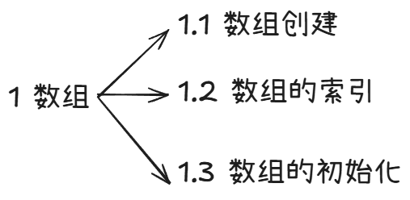
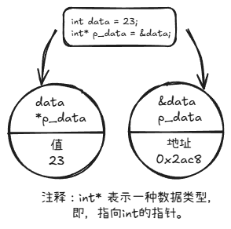
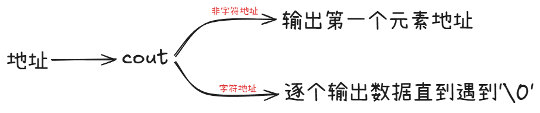
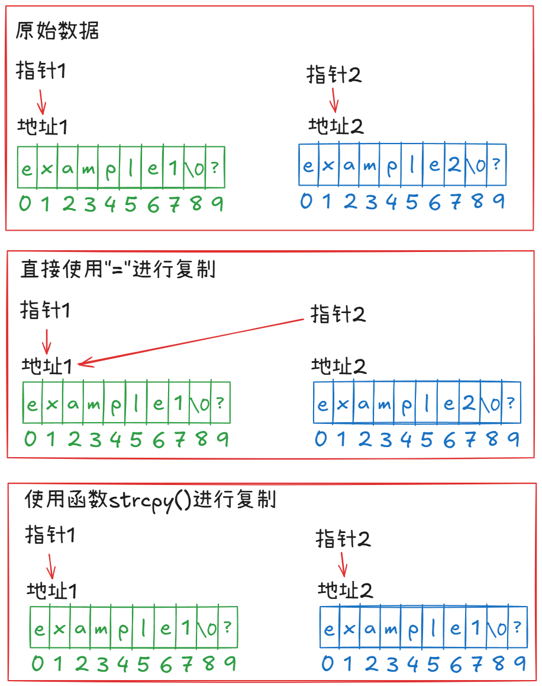

# 复合类型

```markmap
---
markmap:
  zoom: false
  pan: false
  height: 300px
  backgroundColor: "#f8f8f8"
---

# 复合类型
## 数组
### 数组的创建
### 数组的索引
### 数组的初始化
## 字符串
### C-style string 类
#### 字符串的初始化
#### 字符串常量和字符常量
#### 拼接字符串常量
#### 字符串的输入
### string 类
#### string 类的初始化
#### 赋值、拼接和附加
#### string 类的其他操作
## 结构体
### 结构体的定义
## 共用体
## 枚举
## 指针和自由存储空间
### 指针的初始化和声明
### 指针的危险
### 指针和数字
### 使用`new`来分配地址
### 使用delete释放内存
### 使用new来创建动态数组
## 指针、数组和指针算术
### 指针小结
### 指针和字符串
```

## 数组

数组是一种数据格式，能够存储多个同类型的值。每个值都存储在一个独立的数组元素中，计算机在内存中依次存储数组的各个元素。



### 数组的创建

数组的创建需要先声明，声明要求如下：

* 存储元素的类型；
* 数组名；
* 数组中的元素数。

声明数组的通用格式如下：

`typeName arrayName[arraySize];`

表达式 `arraySize` 表示指定元素的数目，必须为整型常数或者 const 值，也可以是常量表达式，即其的值在编译时是已知的，不能是变量，变量的值是在程序运行时产生的。

### 数组的索引

数组中的元素可以通过下标或者索引单独访问，且索引是从 0 开始的。

编译器不会检查使用的下标是否有效，例如如果将一个下标赋给不存在的元素 month [101]，编译器并不会指出错误。但是程序运行后这种赋值可能会引发问题。

```c++
// arrayone.cpp -- small arrays of integers
#include <iostream>
int main()
{
	using namespace std;
    int yams[3];
    yams[0] = 7;
    yams[1] = 8;
    yams[2] = 6;
    
    int yamcosts[3] = {20, 30 ,5};
    return 0;
}
```

### 数组的初始化

C++程序允许在声明语句中初始化数组元素，如下：

`int yamcosts[3] = {20, 30, 5};`

数组初始化规则：

* 只有在定义数组时才能进行初始化，其余时刻就不能了
* 初始化数组时，提供的值可以少于数组的元素数目，其余元素将被编译器设置为 0；
* 如果初始化时，没有规定数组的数目，即方括号内为空，则 C++编译器将根据初始化的元素的个数作为数组的数目；

## 字符串

字符串时存储在内存的连续字节中的一系列字符，C++处理字符串的方式有两种，一种是来自 C 语言的 C 风格字符串，而另一种则是基于 string 类库的方法。对于来自 C 语言风格的字符串每个字符都被存储在 char 数组之中，而 string 类库则单独定义了一个类对象 string 来存储数。


### C-style string 类

#### 字符串的初始化

字符串的存储在连续字节中的一系列字符可以将字符串存储在 char 数组中，其中每一个数组都位于自己的数组元素中，对于 C 风格的字符串其以空字符（null character）结尾，空字符被写作 `\0`，其 ASCII 码为 0，用来标记字符串的结尾。

```c++
char dog[8] = {'b', 'e', 'a', ' ', 's', 'g', 'g', 'o'}; // not a string
char cat[8] = {'a', 'b', 'b', 'v', 'd', 'f', 'g', '\0'}: // is a string
```

对于上面数组 `cat`，对于例如 `cout` 等函数，其将逐元素的处理字符串中的各个元素，直到检测到空字符 `\0`；而对于下方的数组 `cat`，其也将被逐元素处理，但是由于其不是字符串，`cout` 等函数将打印出数组中的所有 8 个字母，并且其还会将该数组内存后的各个字节解释为要打印的字符，直到遇到空字符为止。由于空字符在内存中很常见，因此该过程也很快将会结束。

字符串常量(string constant)或字符串字面值(string literal)是一种更好的字符数组初始化的方式。

```c++
char bird{11} = "Mr. Cheeps";
char fish[] = "Bubbles";
```

用双引号括起来的字符串隐式地包括结尾的空字符，因此不用显式地包括他它

#### 字符串常量和字符常量

注意，字符串常量和字符常量有本质区别，例如字符常量 `'S'` 是字符串编码的简写表示。ASCII 系统上，`'S'` 只是 83 的另一种写法，因此下面语句将 83 赋给变量。

```c++
char shirt_sizes = 'S'; // this is fine
```

但是，字符串常量 `"S"` 则不是如此，其表示的是两个字符 `'S'` 和 `'\0'` 组成的字符串。更糟糕的是 `“S”` 实际上表示的是字符串的所在的内存地址。因此下面的语句实际上将一个地址赋予给变量。

```c++
char shirt_sizes = "S"; // illegal type mismatch
```

地址在 C++中是一种独立的类型。

#### 拼接字符串常量

有时候字符串很长无法被放到一行中。C++允许拼接字符串字面值，即将两个用引号括起来的字符串合并为一个。任何两个由空白（空格、制表符和换行符）分隔的字符串常量都将自动拼接为一个。以下表达都是等效的。注意，拼接时不会在被连接的字符串之间添加空格，第二个字符串的第一个字符将紧跟在第一个字符串最后一个字符后面，不考虑 `\0`，第一个字符串的 `\0` 字符将被第二个字符串的第一个字符取代。

```c++
cout << "I'd give my right arm to be" "a great violinist. \n";
cout << "I'd give my right arm to ba a great violinist.\n";
cout << "I'd give my right arm to be"
    "a great violinist. \n";
```

```c++
// string.cpp -- storing strings in an array
#include <iostream>
#include <cstring>
int main():
{
    using namespace std;
    const int Size = 15;
    char name1[Size];
    char name2[Size] = "C++owboy";
    return 0;
}
```

#### 字符串的输入

本部分介绍如何将键盘的输入读取到字符串数组中去。


1. 直接使用 `cin` 函数

   使用方法

   ```c++
   // instr1.cpp -- reading more than one string
   #include <iostream>
   int main()
   {
       using namespace std;
       const int ArSize = 20;
       char name[ArSize];
       char dessert[ArSize];
       
       cout << "Enter your name:\n";
       cin >> name;
       cout << "Enter your favorite desert:\n";
       cin >> dessert;
       cout << "I have some delicious "<< dessert; 
       cout << " for you, "<< name << ".\n";
       return 0;
   }
   ```

   

   输出结果

   ```cmd
   Enter your name:
   Le Jiang
   Enter your favorite desert:
   I have some delicious Jiang for you, Le.
   ```

   原因分析：

   `cin` 通过命令台中输入行中的空格来确定字符串 `\0` 的位置，也就是 `cin` 函数一次仅仅能读取一个单词。上述代码中，第一个 `cin` 获取得到 Le 后结束运行，第二个 `cin` 读取到的是 Jiang 就直接进入下一步了。

   不足之处：

   一次仅仅能读取一个单词，且当输入的字符串长度比定义的长度长时没有做出处理。

2. 使用 `getline()` 函数

   使用方法：`getline(the name of variable, the amount of str to input)`

   ```c++
   // instr2.cpp -- reading more than one string
   #include <iostream>
   int main()
   {
       using namespace std;
       const int ArSize = 20;
       char name[ArSize];
       char dessert[ArSize];
       
       cout << "Enter your name:\n";
       cin.getline(name, ArSize);
       cout << "Enter your favorite desert:\n";
       cin.getline(dessert, ArSize);
       cout << "I have some delicious "<< dessert; 
       cout << " for you, "<< name << ".\n";
       return 0;
   }
   ```

   运行结果：

   ```cmd
   Enter your name:
   Le Jiang
   Enter your favorite desert:
   Cake
   I have some delicious Cake for you, Le Jiang.
   ```

   

   运行解析：

   `cin.getline()` 通过换行符来确定输入的结尾。该函数包含两个参数，第一个参数为要输入的变量的名字，第二个参数为需要读取的字符数。如果这个这个数字为 20 则函数最多读取 19 个，因为要包含最后一个空字符。当读取达到规定数目，或者遇到换行符时停止读取，并用空字符代替换行符。

3. 使用 `cin.get()` 函数

   与 `cin.getline()` 不同的是，该函数并不读取换行符，而是保留换行符在输入端，这就导致下一次使用该函数进行读取时，首先会读取到一个换行符。为了解决该问题，使用 `cin.get()` 来解决如下：

   ```C++
   cin.get(name, ArSize);
   cin.get();
   cin.get(dessert.ArSize);
   ```

   

   也可以通过函数重载的方式，写为如下形式：

   ```C++
   cin.get(name, ArSize).get();
   cin.get(dessert.ArSize);
   ```

   

   为什么要使用 `cin.get()` 而非 `cin.getline()`，书中如是说：老式的表达中没有实现 `cin.getline()`；其次，`get()` 使得输入更加仔细。

4. 混合输入字符串和数字

   ```C++
   //numstr.cpp -- following number input with line input
   #include <iostream>
   {
       using namespace std;
       cout << "What year was your house built?\n";
       int year;
       cin >> year;
       cout << "What is its street address?\n";
       char address[80];
       cin.get();// or make '(cin >> year).get()' instead
       cin.getline(address, 80);
       cout << "Year built:" << year << endl;
       cout << "Address: " << address << endl;
       return 0;
   }
   ```

   输出结果如下：

   ```cmd
   What year was your house built?
   2015
   What is its street address?
   QueenPark
   Year built:2015
   Address: QueenPark
   ```

   

   

### string 类

#### string 类的初始化

string 类允许将列表初始化用作 C 风格字符串和 string 对象：

```c++
char first_date[] = {"Le Chapon Dodu"};
char second_data[] = {"The Elegant Plate"};
string third_data = {"The Bread Bowl"};
string fourth_data = {"Hank's Fine Eats"};
```


#### 赋值、拼接和附加

string 类可以直接将一个 string 对象赋给另一个 string 对象。

```c++
string str1;
string str2 = "Panther";
str1 = str2;
```

string 类简化了字符串的合并操作。可以使用+将两个 string 对象合并起来，还可以使用+= 符号将字符串附加到 string 对象的末尾。

```c++
string str3;
str3 = str1 + str2;
str1 += str2;
```

也可以将 C 风格字符串或 string 对象与 string 对象相加，或将它们附加到 string 对象的末尾。

```c++
//strtype2.cpp -- assigning, adding, and appending
#include<iostream>
#include<string>
int main()
{
    using namespace std;
    string s1 = "penguin";
    string s2, s3;
 	s2 = s1;
    cout << "s1: "<< s1 << "; s2: " << s2 << "; s3: " << s3<<endl;
    s2 = "buzzard";
    cout << "s1: "<< s1 << "; s2: " << s2 << "; s3: " << s3<<endl;
    s3 = s1 + s2;
    cout << "s1: "<< s1 << "; s2: " << s2 << "; s3: " << s3<<endl;
    s1 += s2;
    cout << "s1: "<< s1 << "; s2: " << s2 << "; s3: " << s3<<endl;
    s2 += "for a day";
    cout << "s1: "<< s1 << "; s2: " << s2 << "; s3: " << s3<<endl;
}
```

输出如下：

```cmd
终端连接成功
s1: penguin; s2: penguin; s3: 
s1: penguin; s2: buzzard; s3: 
s1: penguin; s2: buzzard; s3: penguinbuzzard
s1: penguinbuzzard; s2: buzzard; s3: penguinbuzzard
s1: penguinbuzzard; s2: buzzardfor a day; s3: penguinbuzzard
```

#### string 类的其他操作

```c++
//strtype2.cpp -- assigning, adding, and appending
#include<iostream>
#include<string>
#include<cstring>
int main()
{
    using namespace std;
    char charr1[20];
    char charr2[20] = "jaguar";
    string str1;
    string str2 = "panther";

    str1 = str2;
    strcpy(charr1 ,charr2);

    str1 += " paste";
    strcat(charr1, " juice");

    int len1 = str1.size();
    int len2 = strlen(charr1);

    cout << "The string " << str1 << " contains "
         << len1 << " characters.\n";
    cout << "The C style string " << charr1 << " contains "
         << len2 << " characters\n";
    return 0;
}
```

输出如下：

```cmd
终端连接成功
The string panther paste contains 13 characters.
The C style string jaguar juice contains 12 characters
```

由上，处理 string 对象的语法通常比 C 字符串函数简单，尤其对于一些复杂的操作时。函数 `strlen()`，函数 `strcpy()`，函数 `strcat()` 等函数均为使用 C 怨言风格的字符串。

同样，和 C 语言字符串相似，也可以使用 `cin` 和 `cout` 来对 string 类的对象进行输入和输出，但其在读取一行时而不是一个单词时，使用的句法不同。


```c++
// strtype4.cpp -- line input
#include <iostream>
#include <string>
#include <cstring>
int main()
{
    using namespace std;
    char charr[20];
    string str;

    cout << "Length of string in charr before input: "
    << strlen(charr) << endl;
    cout << "Length of string in str before input: "
    << str.size() << endl;
    cout << "Enter a line of text:\n";
    cin.getline(charr, 20);
    cout << "You entered: "<< charr << endl;
    cout << "Enter another line of text:\n";
    getline(cin, str);
    cout << "You entered: " << str << endl;
    cout << "Length of string in charr after input: "
    << strlen(charr) << endl;
    cout << "Length of string in str after input: "
    << str.size() << endl;
}
```

运行结果如下：

```cmd
终端连接成功
Length of string in charr before input: 6
Length of string in str before input: 0
Enter a line of text:
banaba
You entered: banaba
Enter another line of text:
apple
You entered: apple
Length of string in charr after input: 6
Length of string in str after input: 5
```

注意，对于 `charr` 在未输入变量时，其将随机从内存中读取一个位置，直到遇到空字符为止，因此其长度是随机的。


## 结构体

> [!NOTE]
> 为了解决数组不能将不同类型的数据存储在一个结构中的问题，C++提出结构体这种复合数据类型。结构体是一种比数组更加灵活的数据格式，同一个结构体中可以存储多种类型的数据，将有关的数据全部存储在同一个单元内，实现数据的合并。

### 结构体的定义

结构体定义形式如下：


关键字 `struct` 表示这些代码定义的是一个结构的布局；

标识符 `inflatable` 表示该结构体的名称；

大括号中包含的是结构体存储的数据类型的列表，其中每一个列表项都是一条声明语句，列表中的每一项都被称为结构成员，因此该结构体共有三个成员；

这个例子使用了一个适合用于存储字符串的 char 数组、一个 float 和一个 double。


## 共用体

## 枚举

## 指针和自由存储空间


指针是一个变量其存储的是值的地址而不是值本身。对于常规变量的地址，通过对变量使用地址运算符(&)，就可以获得其位置。

```c++
//address.cpp -- using the & operator to find addresses
#include <iostream>
int main()
{
    using namespace std;
    int donuts = 6;
    double cups = 4.5;

    cout << " donuts value = " << donuts;
    cout << " and donuts address = " << &donuts << endl;
    cout << " cups value = " << cups;
    cout << " and cups address = " << &cups << endl;
    return 0;
}
```

终端输出如下：

```cmd
终端连接成功
 donuts value = 6 and donuts address = 0x7ffeb254de5c
 cups value = 4.5 and cups address = 0x7ffeb254de50
```

### 指针的初始化和声明

显示地址时，该实现的`cout`常常使用十六进制表示法。`cups` 的地址比 `donuts` 的地址低8个字节（`0x7ffeb254de5c - 0x7ffeb254de50 = 0xC`，即12字节，因为 `double` 类型通常占用8字节，而 `int` 类型占用4字节）。

使用常规变量时，值是指定的量，而地址为派生的量。而处理存储数据的新策略则恰恰相反，地址被视为指定的量，而将值视为派生量。一种特殊类型的变量，指针用于存储值的地址

```C++
// pointer.cpp -- our first pointer variable
#include <iostream>
int main()
{
    using namespace std;
    int updates = 6;
    int* p_updates;
    p_updates = &updates;

    // express value two ways
    cout << "Value: updates: " << updates;
    cout << " *p_updates: " << *p_updates << endl;

    // express address two ways
    cout << "Address: &updates: " << &updates;
    cout << " p_updates: " << p_updates << endl;
    
    // use pointer to change value
    *p_updates = *p_updates + 1;
    cout << "Now updates = " << updates << endl;
    return 0;
}
```

终端输出如下：

```cmd
终端连接成功
Value: updates: 6 *p_updates: 6
Address: &updates: 0x7ffd1c0fd374 p_updates: 0x7ffd1c0fd374
Now updates = 7
```



如图所示，`int*`表示一种类型-指向int的指针，在哪里添加空格对于编译器来说没有任何区别，但是为了强调其作为是作为一种数据类型，可以将`*`和`int`紧贴着，与变量名保持距离。

### 指针的危险

```C++
int *ptr;  // 未初始化的指针，可能指向任意位置
*ptr = 10; // 危险操作，可能导致程序崩溃
```

### 指针和数字

```C++
int* pt;
pt = (int*) 0xB8000000;
```

### 使用`new`来分配地址

`new int`告诉程序，需要适合存储int的内存。`new`运算符根据类型来确定需要多少字节的内存。随后，其找到这样的内存，并返回地址。接下来，将地址赋给`pn`，`pn`是被声明为指向`int`的指针。现在`pn`是地址，`*pn`为存储在那里的值

```C++
// use_new.cpp -- use the new operator
#include <iostream>
int main()
{
    using namespace std;

    int data_1 = 65;
    int* p_data_1 = &data_1;
    int* p_data_2 = new int;
    *p_data_2 = data_1;
    cout << "data_1 value: " << data_1;
    cout << " data_1 address: " << p_data_1 << endl;
    cout << "data_2 value: " << *p_data_2;
    cout << " data_2 address: " << p_data_2 << endl;

    double* p_data_3 = new double;
    *p_data_3 = 32.0;
    cout << "data_3 value: " << *p_data_3;
    cout << " data_3 address: " << p_data_3 << endl;
}
```

输出如下：

```cmd
终端连接成功
data_1 value: 65 data_1 address: 0x7ffe23323d34
data_2 value: 65 data_2 address: 0x1864270
data_3 value: 32 data_3 address: 0x18646a0
```

`0x7ffe23323d34`，这是一个栈地址，通常以 `0x7ff` 开头，表示变量在栈（stack）上分配。

`0x1864270`，这是一个堆地址，表示变量在堆（heap）上分配。

### 使用delete释放内存

当需要内存时，可以使用new来请求内存；反之，delete运算符，可以使得内存在被使用完后，能够将其归还内存池，归还或释放的内存可以供程序的其他部分使用。delete使用方式如下：

```C++
int* ps = new int;
delete ps;
```

不要尝试释放已经释放的内存块，不能使用delete释放申明变量名所获得的内存。delete只能用来释放使用new分配的内存。

### 使用new来创建动态数组

如果程序仅仅使用一个值，则可能会声明一个简单变量，因为对于管理小型项目来说这样做更加简答方便。而对于大型数据，应当使用new。例如，假设要编写一个程序，其是否需要数组取决于运行时用户提供的信息。如果通过声明来创建数组，则在程序被编译时将为它分配内存空间，不管程序最后是否使用数组，数组都在那里，占用了内存空间。在编译时给数组分配内存被称为静态联编，意味着数组是在编译时加入到程序当中的。但使用new时，如果运行阶段需要数组，则创建它；如果不需要，则不创建。还可以在程序运行时选择数组的长度，这被称为动态联编，意味着数组是在程序运行时创建的。

使用静态联编（static binding）时，必须在编写程序时指定数组的长度；使用动态联编（dynamic binding）时，程序将在运行时确定数组的长度。

```C++
int* psome = new int [10];
delete [] psome; 
```

new运算符返回第一个元素的地址。在释放内存的时，使用`[]`告诉程序释放整个数组的，而不仅仅是指针所指向的元素。

如果使用new时，不带方括号，则使用delete时，也不应当带方括号；如果使用new时，带方括号，则使用delete时也要带方括号。

* 不要使用delete来释放不是new分配的内存。
* 不要使用delete释放同一个内存块两次。
* 如果使用new[ ]为数组分配内存，则应使用delete[ ]来释放。
* 如果使用new为一个实体分配内存，则应使用delete（没有方括号）来释放。
* 对空指针应用delete是安全的。

`type_name* pointer_name = new type_name [num_elements]`

使用new运算符可以确保内存块足以存储num_elements个类型为type_name的元素，而pointer_name将指向第一个元素，程序追踪的是第一个元素的位置和数组元素的个数。

使用动态数组：

```c++
// arraynew.cpp -- using the new operator for arrays
#include <iostream>
int main()
{
	using namespace std;
    double* p3 = new double [3];
    p3[0] = 0.2;
    p3[1] = 0.3;
    p3[2] = 0.4;
    cout << "p3[0] is "<< p3[0];
    cout << "p3[1] is "<< p3[1];
    cout << "p3[2] is "<< p3[2] << endl;
    p3 = p3 + 1;
    cout << "p3[0] is "<< p3[0];
    cout << "p3[1] is "<< p3[1];
    cout << "p3[2] is "<< p3[2] << endl;
}
```

输出如下：

```c++
p3[0] is 0.2 p3[1] is 0.3 p3[2] is 0.4
p3[0] is 0.3 p3[1] is 0.4 p3[2] is 2.10535e-314
```

## 指针、数组和指针算术

### 指针和数组

指针和数组等价的原因在于指针算数

```C++
// addpntrs.cpp -- pointer addition
#include <iostream>
int main()
{
	using namespace std;
    double wages[3] = {10000.0, 20000.0, 30000.0};
    short stacks[3] = {3, 2, 1};
    double* pw = wages;
    short * ps = stacks;
    
    cout << "pw = " << pw << ", *pw" << *pw << endl;
    pw = pw + 1;
    cout << "add 1 to the ps pointer:\n";
    cout << "pw = " << pw << ", *pw" << *pw << endl;
}
```


 ```c++
 // arraynew.cpp -- using the new operator for arrays
 #include <iostream>
 int main()
 {
     using namespace std;
     short tell[3];
     cout << tell << endl;
     cout << tell + 1 << endl;
     cout << &tell << endl;
     cout << &tell + 1 << endl;
     return 0;
 }
 ```

输出如下：

```c++
000000D71670FBB4
000000D71670FBB6
000000D71670FBB4
000000D71670FBBA
```


### 指针小结

1. 声明指针

   `typename* pointerName;`

   实例用法

   ```c++
   double* pn;//指向double的指针
   char* pc;//指向char的指针
   ```

   

2. 给指针赋值

   应当将内存地址赋给指针，使用运算符&，`pc = &bubble`；

   或者使用new，`pc = new char`；

   或者使用，`pc = (char*) 0xB8000000`；

   

3. 对指针解除引用

   对指针解除引用意味着获取指针指向的值。对指针应用解除引用或间接值运算符（*）来解除引用。

   另一种对指针解除引用的方法是通过数组表达法，例如Fence 36。

   

4. 区分指针和指针所指向的值

   如果pt是指向int的指针，那么*pt不是指向int的指针，而是完全是一个int类型的变量。

   

5. 数组名

   在大多数情况下，C++将数组名视为数组的第一个元素的地址。

   

6. 指针算术

   C++允许将指针和整数相加。加1的结果等于原来的地址加上指向的对象占用的总字节数。还可以将一个指针减去另一个指针，获得两个指针的插值。

   ```C++
   int tacos[10] = {5,2,8,4,1,2,2,4,6,8};
   int* pt = tacos;
   pt = pt + 1;
   int* pe = &tacos[9];
   pe = pe - 1;
   int diff = pe - pt
   ```

   

7. 数组的动态联编和静态联编

   使用数组的声明来创建数组时，将采用静态联编，即数组的长度在编译时设置；

   使用new[]运算符创建数组时，将采用动态联编，即将在运行时为数组分配空间，其长度也在运行时设置。使用完这种数组后，应使用delete[]释放其占用内存。

   ```C++
   int size;
   cin >> size;
   int* pi = new int [size];
   ...;
   delete [] pi;
   ```

   

   

8. 数组表示法和指针表示法

   使用方括号数组表示法等同于对指针解除引用

   ```C++
   int* pt = new int [10];
   *pt = 5;
   pt[3] = 7;
   pt[8] = 11;
   int coats[10];
   *(coats + 4) = 12;
   ```

   


### 指针和字符串

数组和指针的特殊关系可以拓展到C-style字符串，但是其又有些许差别，如下：

```C++
char flower[10] = "rose";
cout << flower << "s are red\n";
```

**对于C语言风格的字符串来说，`cout`接受一个指向字符数据的地址，并打印此处的字符，以及之后的字符，直到遇到空字符`\0`为止。**

由之前，数组名是数组第一元素的地址，因此`cout`语句中的`flower`是包含字符r元素的地址；且对于双引号中的字符串常量，其也应当是地址。实际上在C++中，用双引号括起来的字符串像数组名一样也是第一个元素的地址，将该字符串第一个字符的地址发送给`cout`。

```C++
// ptrstr.cpp -- using pointer to strings
#include <iostream>
#include <cstring>

int main()
{
	using namespace std;
	char animal[20] = "bear";
	const char* bird = "wren";
	char* ps;

	cout << animal << " and";
	cout << bird << endl;

	cout << "Enter a kind of animal:\n";
	cin >> animal;

	ps = animal;
	cout << ps << "!\n";
	cout << "Before using stycpy(): \n";
	cout << animal << " at " << (int*) animal << endl;
	cout << ps << " at " << (int*) ps << endl;

	ps = new char[strlen(animal) + 1];
	strcpy(ps, animal);
	cout << "After using stycpy(): \n";
	cout << animal << " at " << (int*) animal << endl;
	cout << ps << " at " << (int*) ps << endl;

	delete[] ps;

	return 0;
}
```


**对于指向char的指针，可以通过强制转换指针类型后，通过`cout`输出其地址。**



一般来说，如果给`cout`一个指针，它将打印地址。但如果指针是指向char的，那么`cout`将显示指向的字符串。如果要将字符串的地址显示出来则必须将这种指针强制转换为另一种指针类型。如`int*`。因此，`ps`显示为字符串“fox”，而`(int*)ps`显示为该字符串的地址。注意将`"animal"`赋给`ps`并不会复制字符串，而只是复制地址。这样，这两个指针将指向相同的内存单元和字符串。

**为了将复制某一个字符串需要提前为其分配内存空间。**



通过声明数组操作可以分配静态内存，而使用`new`函数操作可以分配动态内存。后一种方法使得内存空间可以根据实际需要复制的字符串动态调整。

字符串`"fox"`不能填满整个`animal`数组，因此这样做浪费了空间。上述代码使用`strlen()`来确定字符串的长度，并将其加1来包含空字符时该字符串的长度。随后，程序通过`new`来分配刚好足够存储字符串的空间。

接下来需要将`animal`数组中的字符串赋值到新分配的空间中去。将`animal`直接赋给`ps`是不可行的，因为这样只能修改存储在`ps`中的地址，从而失去程序访问新分配内存的唯一途径。

`cstring`中的`srtcpy()`函数可以接受两个参数，第一个是目标地址，第二个是要复制的字符串的地址。

应当使用`strcpy()`或者`strnspy()`将字符串赋给数组，而不是等号。因为使用等号时，相当于传递的是地址，即将一个指针指向的地址赋予给另一个指针，对其进行进一步操作时，改变的是原始地址处的值，造成原始值的丢失；而使用`strcpy()`传递的是值，相当于两个指针分别对应两个地址，存储同一个值，修改时针对复制的那份地址处的值，而不会改变原始值。

### 使用new来创建动态结构体

在运行时创建数组优于在编译时创建数组，对于结构体也是如此。需要在程序运行时为结构分配空间，也可以使用new运算符来完成。

将new用于结构分为两步完成：创建结构和访问其成员。要创建结构，需要同时使用结构类型和new。例如要创建一个未命名的inflatable类型，并将其地址赋给一个指针可以这样做：

`inflatable* ps = new inflatable`

这就把足以存储inflatable结构的一块可用的内存赋给ps。

如何通过地址访问该结构的成员函数呢？C++有两种方法

### 自动存储、静态存储和动态存储

根据用于分配内存的方法，C++有3种管理数据内存的方式：自动存储、静态存储和动态存储。

自动存储：

静态存储：

动态存储


