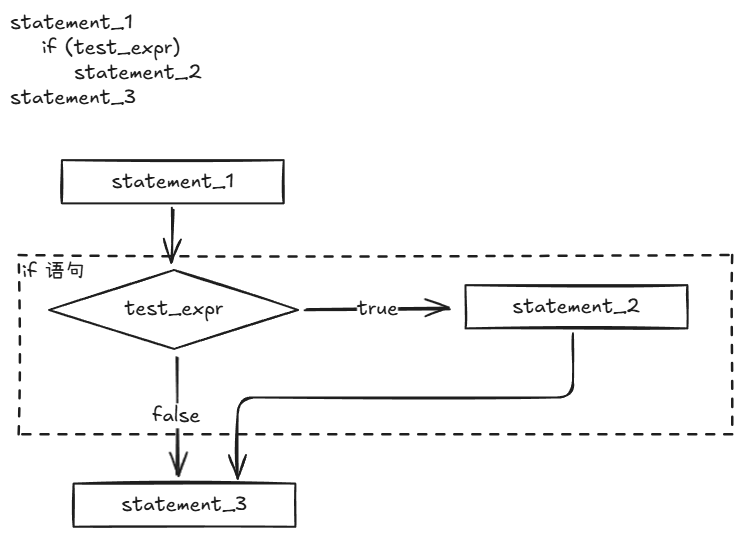
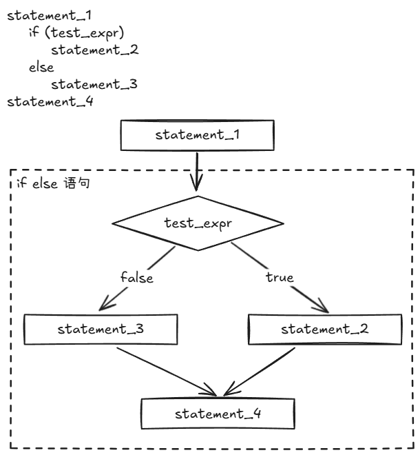
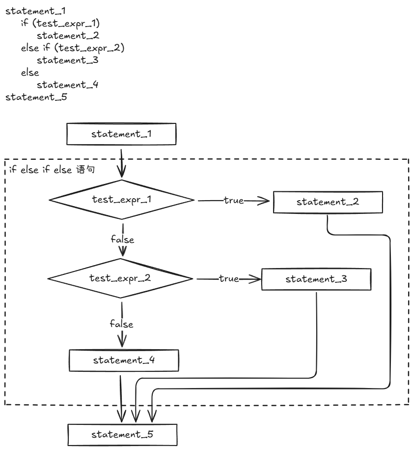

# 分支语句和逻辑运算符

## if语句

### if 结构



通常情况下，测试条件都是关系表达式，测试结果将被强制转换为bool值。判断是否执行的语句，既可以是单一语句也可以是符合语句。

下面程序，将计算输入中的空格数和字符总数，并使用if语句识别空格字符并计算其总数，通过句点（.）来确定句子结尾。

```C++
// if.cpp -- using the if statement
#include <iostream>
int main()
{
	using namespace std;
	char ch;
	int count = 0;
	int space = 0;
	ch = cin.get();

	while (ch != '.')
	{
		count++;
		ch = cin.get();
		if (ch == ' ')
			space++;
	};

	cout << count << " characters, "<<space<<" spaces total in sentence.";
	return 0;
}
```

输出如下：

```cmd
The balloonist was an airhead
with lofty goals.
46 characters, 6 spaces total in sentence.
```

注意，统计的时候换行符也会被统计进来。

### if else 结构

if语句让程序决定是否执行特定的语句或者语句块，而if else语句则让程序决定执行两条语句或语句块中的哪一条。



### if else if else 结构



## 逻辑表达式

为满足测试多种条件的需要，C++提供了三种逻辑运算符，分别为逻辑OR（||），逻辑AND（&&），逻辑NOT（！）。

### 逻辑OR运算符

C++可以采用逻辑OR运算符（`||`），将两个表达式组合在一起。如果原来表达式中的任何一个或全部都为true，则得到的表达式值为true；否则表达式的值为false。

逻辑运算符`||`的优先级比关系运算符低。

C++规定`||`运算符是一个顺序点（Sequence Point），也就是说在此时刻表达式的求值和副作用全部完成，再继续推进。也就是说，先修改左侧的值，再对右侧的值进行判定。

```C++
i++ < 6 || i == j;
```

假设`i`原来的值是10，则在`||`之前，`i`的值变为11，之后再去判断`i`和`j`的值是否相等。但是对于`||`运算符，其左式为true后，并不会再去判断右侧表达式，因为只要一个表达式为true则整个逻辑表达式为true

下面程序，在一条if语句中使用||运算符来检查某个字符的大写或小写。

```C++
// or.cpp -- using the logical OR operator 
#include <iostream>
int main()
{
	using namespace std;
	cout << "This program may reformat your hard disk\n";
	cout << "and destory all your data.\n";
	cout << "Do you wish to continure? (y/n)";
	char ch;
	cin >> ch;
	if (ch == 'y' || ch == 'Y')
		cout << "You were warned!\a\a\n";
	else if (ch == 'n' || ch == 'N')
		cout << "A wise choice .. bye\n";
	else
		cout << "Wrong input! Must be Y/y/N/n";
}
```

### 逻辑AND运算符

逻辑AND运算符（`&&`），也是将两个表达式组合成一个表达式，仅当原来的两个表达式都为true时，得到的表达式的值才为true。

逻辑运算符`&&`的优先级比关系运算符低。

C++规定`&&`运算符是一个顺序点（Sequence Point），也就是说在此时刻表达式的求值和副作用全部完成，再继续推进。也就是说，先修改左侧的值，再对右侧的值进行判定。若左侧的值为false，则C++不会再对右侧进行判断。

下面程序使用&&来处理一种常见的情况

```C++
// and.cpp -- using the logical AND operator
#include <iostream>
const int Arsize = 6;
int main()
{
	using namespace std;
	cout << "Enter the NAQQs (New Age Awareness Quotients) of \n";
	cout << "your neighbors. Program terminates when you make\n";
	cout << Arsize << " entries or enter a negative value.\n";

	int i = 0;
	float temp;
	float naqqs[Arsize];

	cout << "First value:";
	cin >> temp;
	while (i < Arsize && temp >= 0)
	{
		naqqs[i] = temp;
	
		i++;
		if (i < Arsize)
		{
			cout << "Next value:";
			cin >> temp;
		};
	};

	if (i == 0)
		cout << "No data--bye\n";
	else
	{
		cout << "Enter your NAQQ:";
		float my_naqq;
		int count = 0;
		cin >> my_naqq;
		for (int j = 0; j < i;j++)
		{
			if (naqqs[j] < my_naqq)
				count++;
		}
		cout << count;
		cout << " of your neighbors have greater awarness of\n";
		cout << "the New Age than you do.\n";
	};

	return 0;
}
```

### 逻辑NOT运算符

!运算符将它后面的表达式的真值取反。也就是说，如果expression为true，则！expression是false；如果expression为false，则！expression为true。

## 字符函数库cctype

C++从C语言继承了一个与字符无关的、非常方便的函数软件包，它可以简化诸如确定字符是否为大写字母、数字、标点符号等工作，这些函数的原型是在头文件cctype中定义的。

正如之前所述，逻辑运算符OR和逻辑运算符AND的优先级都低于关系运算符。然而，另一方面!运算符的优先级高于所有的关系运算符和算数运算符。

并不是所有键盘都保留了作为逻辑运算符的符号，也可以使用另一种表示方法，如下：

| 运算符 | 另一种表示方式 |
| ------ | -------------- |
| &&     | and            |
| \|\|   | or             |
| !      | not            |

## ？：运算符

C++有一个常被用来替代if else语句的运算符，这个运算符被称为条件运算符(?:)，它是C++中唯一一个需要3个操作数的运算符，该运算符的通用格式如下

`expression1 ? expression2 : expression3`

如果expression1表达式的值为true，则整个条件表达式的值为expression2；如果expression1表达式的值为false，则整个条件表达式的值为expression3的值。

下面程序使用条件运算符来比较两个值中较大的一个值。

```C++
//condit.cpp -- using the conditional operator
#include <iostream>
int main()
{
	using namespace std;
	int a, b;
	cout << "Enter two integers: ";
	cin >> a >> b;
	cout << "The larger of " << a << " and " << b << " is: ";
	int c = a > b ? a : b;
	cout << c << endl;
	return 0;
}
```

注意，该程序中

```C++
int c = a > b ? a : b;
```

和下面语句等效：

```C++
int c;
if (a > b)
    c = a;
else
    c = b;
```

与if else相比，条件运算符更加简洁，但是第一次遇到不那么容易理解。这两种方法之间的区别就是，条件运算符生成一个表达式，因此是一个值，可以将其赋给变量或将其放大一个更大的表达式中。其中一个技巧是，将条件表达式嵌套在另一个条件表达式之中。

```C++
const char x[2] [20] = {"Jason", "at your service\n"};
const char * y = "Quillstone";

for (int i = 0; i < 3; i++)
    cout << ((i < 2) ? (i < 1 ? : x[0] : y) : x[1]);
```

## switch语句

当出现多个选项时，虽然可以通过拓展if else来处理多种情况，但是C++的switch语句更能从大型的列表中进行选择。

```C++
switch (integer-expression)
{
    case label1: statement(s);
    case lable2: statement(s);
  	...
   	default : statement(s);
}
```

```C++
// enum.cpp -- using enum
#include <iostream>
enum {red, orange, yellow, green, blue, violet, indigo};
int main()
{
	using namespace std;
	cout << "Enter color code (0-6): ";
	int code;
	cin >> code;
	while (code >= red && code <= indigo)
	{
		switch (code)
		{
			case red: cout << "Her lips were red.\n";break;
			case orange: cout << "Her hair was orange.\n";break;
			case yellow: cout << "Her shoes were yellow.\n";break;
			case blue: cout << "Her sweatsuit was blue.\n";break;
			case violet: cout << "Her eyes wera violet.\n";break;
			case indigo: cout << "Her mood was indigo.\n";break;
		}
		cout << "Enter color code (0-6): ";
		cin >> code;
	}
	cout << "Bye\n";
	return 0;
}
```

## 读取数字的循环

## 简单文件的输入/输出