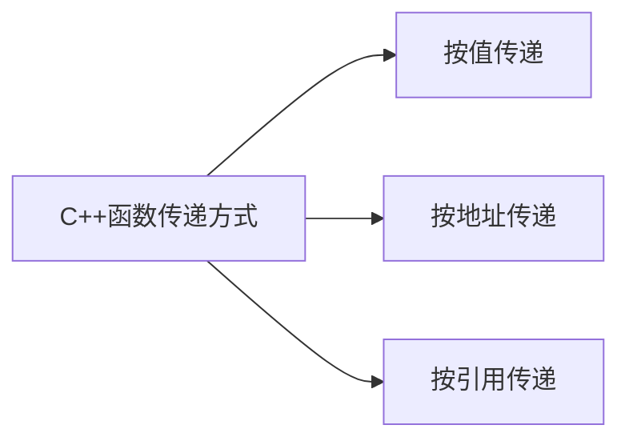

# 函数

## 1 如何使用函数

使用函数三要素：提供函数定义，提供函数原型，调用函数。

### 1.1 函数定义

在定义函数中，根据函数返回值的有无可以将函数分为有返回值的函数和无返回值的函数。

无返回值的函数被称为void函数，可选的返回语句return标记了函数的结尾，该返回语句是可选的，若无该语句，则在右花括号处结束。

```c++
void functionName(parameterList)
{
	statement(s)
	return;
}
```

有返回值的函数将生成一个值，并将它返回给调用函数。

对于有返回值的函数必须使用返回语句。

返回的值可以是常量、变量，也可以是表达式，但是其结果的类型必须与函数头中的声明的数据类型`typeName`一样或者可以被强制转换为该类型（例如，浮点数可以被强制转换为整型）。

注意，返回值不能是数组，但可以是其他任何类型——整型、浮点数、指针，甚至结构体和对象。

虽然，C++函数不可以直接返回数组，但可以将数组作为结构或者对象的组成部分返回。

如果函数包含多条返回语句，则函数将执行遇到的第一条返回语句后结束。

```c++
typeName functionName(parameterList)
{
	statement(s)
	return value;
}
```

### 1.2 函数原型与函数调用

```c++
#include <iostream>
using namespace std;

void cheers(int);
double cube(double x);

int main()
{
    using namespace std;
    cheers(5);
    cout << "Give me a number: ";
    double side;
    cin >> side;
    double volume = cube(side);
    cout << "A " << side << "-foot cube has a volume of ";
    cout << volume << " cubic feet. \n";
    cheers(cube(2));
    return 0;
}

void cheers(int n)
{
    using namespace std;
    for (int i = 0; i < n; i++)
    {
		cout << "Cheers! ";
    }
    cout << endl;
}

double cube(double x)
{
    return x * x * x;
}
```

#### 1.2.1 为什么要使用原型

原型描述了函数到编译器的接口。即，可以将函数的返回值和参数的类型和数量告诉编译器。

C++允许将一个程序放在多个文件中，单独编译这些文件然后将它们组合起来，在这种情况下，编译器在编译main()时，可能无权访问函数代码。

避免使用函数原型的唯一方法是，在使用函数前定义这个函数，但是C++的编写习惯是将main()放在最前面。

#### 1.2.2 如何使用函数原型

函数原型是一条语句，必须使用分号结尾。

可以通过复制函数定义中的函数头，并添加分号实现函数原型声明。

```c++
double cube(double x);
```

函数原型的参数列表中的变量名相当于占位符，因此不必与函数定义中的变量名相同，并且可以省略。

```c++
void cheers(int);
```

#### 1.2.3 原型的功能

* 原型可以确保编译器正确处理函数返回值。

* 原型可以确保编译器检查使用的参数数目是否正确。

* 原型可以确保编译器检查使用的参数类型是否正确，若不正确，则转换为正确的类型。

```c++
cheers(cube(2));
```

上述语句中，参数和返回值的类型均与函数原型不相符。编译器先检查函数`cube()`，发现要求的参数为double，故先将2转换为2.0，随后输出8.0给函数cheers，但cheers要求int，故进一步将8.0转换为8。

原型的对数据的类型转换可能会与函数重载发生冲突。

仅当有意义时，原型化才会导致类型转换。

自动类型转换并不能避免所有错误。较大的类型被自动转换为较小的类型时可能会导致数据丢失。

在编译阶段进行的原型化被称为静态类型检查，静态类型检查可以捕获许多在运行阶段非常难以捕捉的错误。

## 2 函数参数和按值传递

C++通常按值来传递参数。

对于如下函数原型：

```c++
double cube(double x)
```

被调用时，函数cube将会创建一个新的名为x的double变量，并对其进行初始化

```c++
main()
{
    double side = 5.0;
    cube(side);
}
```

如上，cube()将double变量x初始化为5.0。cube()执行的操作并不会影响main中的数据，因为cube()使用的是side变量的副本。

用于接收传递值的变量被称为形参，传递给函数的值被称为实参。处于简化目的，C++将实参记为argument，将形参记为parameter。

在函数中声明的变量包括参数是该函数私有的，在函数被调用时，计算机为这些变量分配内存，在函数结束时，计算机会自动释放这些变量的内存。

这样的变量也被称为自动变量。

### 2.1 多个参数

函数可以有多个参数，在调用函数时，只需使用逗号将这些参数分开即可。

```c++
n_chars('R', 25);
```

同样在定义函数时，也在函数头中使用由逗号分隔的参数声明列表。

```c++
void n_chars(char c, int n)
{
    ...
}
```

如果函数中的两个参数的类型相同，必须分别指定每一个参数的类型，而不能像声明常规变量那样，合并书写。

对于函数原型声明，可以将函数定义中的函数头取出添加分号实现声明，也可以省略变量名。一般来说，书写变量名有助于直观理解函数参数之间的相互关系。

```c++
void n_chars(char c, int n);
void n_chars(char, int);
```

### 2.2 多参数函数实例

编写一个函数，实现对于单个字母的循环输出。

```c++
#include <iostream>
using namespace std;

void n_chars(char c, int n);

int main()
{
    char c;
    cout << "Enter a character: ";
    cin >> c;

    while (c != 'q')
    {
        int n;
        cout << "Enter a integer: ";
        cin >> n;

        n_chars(c, n);
        cout << "\nEnter another character or press the q-key to quit: ";
        cin >> c;
    };
    cout << "Bye!\n";
    return 0;
}

void n_chars(char c, int n)
{
    while (n > 0)
    {
        cout << c;
        n--;
    };
};
```

目前，美国许多州都采用某种纸牌游戏的形式来发行彩票，让参与者从卡片中选择一定数目的选项。随后彩票管理者将随机抽取6个数，如果参与者选择的数字与这6个数字完全相同，将赢得百万大奖。

```c++
#include <iostream>
using namespace std;

long double probability(unsigned numbers, unsigned picks);

int main()
{
    cout << "Enter the total number of choices on the game card and\n"
        "the number 
        
        
        f picks allowed:";
    unsigned numbers;
    unsigned pciks;
    cin >> numbers;
    cin >> 
}
```

## 3 函数和数组

对于数组，函数需要知道对那个数组进行累计，以及数组的长度。

```c++
int sum_arr(int arr[], int n)
{
    statement(s)
   	return 0;
}
```

其中，方括号址出`arr`是一个数组而非整型，方括号为空则表示可以将任意长度的数组传递给该函数。`arr`实际上是一个指针，正如之前所学，数组名为该数组的指针.

### 3.1 数组作为参数

C++将数组名解释为第一个元素的地址。

```
cookies = &cookies[0]
```

但是，该规则有一些例外。数组声明使用数组名来标记存储位置，其次对数组名使用`sizeof`将得到整个数组的长度，最后将地址运算符作用于数组名时会返回一个指向整个数组的地址。

故函数头有以下两种写法。

```
int sum_arr(int* arr, int n);
int sum_arr(int arr[], int n);
```

当且仅当在函数头或者函数原型中,`int* arr`和`int arr[]`是一样的。

```C++
#include <iostream>
using namespace std;

const int ArSize = 8;

int sum_arr(int arr[], int n);

int main()
{
    int cookie[ArSize] = {1,2,3,4,5,6,7,8};
    
    int sum = sum_arr(cookie, Arsize);
    cout << "Total cookie eaten: " << sum << endl;
    return 0;
}

int sum_arr(int arr[], int n)
{
    int total = 0;
    for (int i = 0; i < n; i++)
		total += arr[i];
    return total;
}
```

上述代码中，函数`sum_arr()`将数组的地址，数组的数量，和数组的类型传递给函数，这使得函数可以使用原来的数组。实际上，这并不违反函数按值传递的方法，只不过传递的值变为了数组的地址。这种将数组地址作为参数的操作，可以节省复制数组整个内容所需的时间和内存，但是也增加了原始数据被破坏的风险。为了解决这个问题之后通过const限定符解决。上述代码的输出结果如下：

```
000000216F4FFB58 = array address, 32 = sizeof cookies
000000216F4FFB58 = array address, 8 = sizeof arr
Total cookies eaten: 255
000000216F4FFB58 = array address, 8 = sizeof arr
First three enters ate cookies: 7
000000216F4FFB68 = array address, 8 = sizeof arr
Last four enter ate cookies: 240
```

在函数内，`sizeof`输入的是一个地址，对其运算输出结果为使用8字节的地址的长度。故对于函数来说，其输入数组只是输入数组第一个元素的地址，而数组长度需要手动指定。该方法也使得某些欺骗的手段得以实现，如上代码。

```C++
#include <iostream>

const int MAX = 5;

int fill_array(double ar[], int limit);
void show_array(const double ar[], int n);
void revalue_array(double r, double ar[], int n);

int main()
{
	double properties[MAX];

	int size = fill_array(properties, MAX);
	show_array(properties, size);
	if (size > 0)
	{
		std::cout << "Enter revaluation factor: ";
		double factor;
		while (!(std::cin >> factor))
		{
			std::cin.clear();
			while (std::cin.get() != '\n')
				continue;
			std::cout << "Bad input; Please enter a number\n";
		}
		revalue_array(factor, properties, size);
		show_array(properties, size);

		std::cout << "Done.\n";
		std::cin.get();
		std::cin.get();
		return 0;
	}
}

int fill_array(double ar[], int limit)
{
	double temp;
	int i;
	for (i = 0; i < limit; i++)
	{
		std::cout << "Enter value #" << i + 1 << ": ";
		std::cin >> temp;
		if (!std::cin)
		{
			std::cin.clear();
			while (std::cin.get() != '\n')
				continue;
			std::cout << "Bad input; input process terminated.\n";
			break;
		}
		else if (temp < 0)
			break;
		ar[i] = temp;
	}
	return i;
}

void show_array(const double ar[], int n)
{
	for (int i = 0; i < n; i++)
	{
		std::cout << "Property #" << i + 1 << ": $";
		std::cout << ar[i] << std::endl;
	}
}

void revalue_array(double r, double ar[], int n)
{
	for (int i = 0; i < n; i++)
		ar[i] *= r;
}
```

输出如下

```
Enter value #1: abc
Bad input; input process terminated.
```

```
Enter value #1: 100000
Enter value #2: 80000
Enter value #3: 222000
Enter value #4: 240000
Enter value #5: 118000
Property #1: $100000
Property #2: $80000
Property #3: $222000
Property #4: $240000
Property #5: $118000
Enter revaluation factor: 0.8
Property #1: $80000
Property #2: $64000
Property #3: $177600
Property #4: $192000
Property #5: $94400
Done.
```

```
Enter value #1: 100000
Enter value #2: 200000
Enter value #3: 300000
Enter value #4: -1
Property #1: $100000
Property #2: $200000
Property #3: $300000
Enter revaluation factor: 0.8
Property #1: $80000
Property #2: $160000
Property #3: $240000
Done.
```

### 3.2 使用数组区间的参数

前面函数对于数组参数的方法是获取数组第一个元素的指针和数组的长度，实际上也可以将数组第一个元素的地址和最后一个元素的地址传入函数中。

即，使用两个指针来指定区间。

```c++
#include <iostream>
using namespace std;

const int ArSize = 8;

int sum_arr(const int* begin, const int* end);
int main()
{
    int cookie[ArSize] = { 1,2,3,4,5,6,7,8 };

    int sum = sum_arr(cookie, cookie + ArSize);
    cout << "Total cookie eaten: " << sum << endl;
    return 0;
}

int sum_arr(const int* begin, const int* end)
{
    const int* pt = 0;
    int total = 0;
    for (pt = begin; pt != end; pt++)
        total += *pt;
    return total;
}
```

### 3.3 指针和const

将const用于指针有一些非常微妙的地方。可以用两种不同的方式将const关键字用于指针。第一种方法是让指针指向一个常量对象，这样就可以防止使用该指针来修改所指向的值；另一种方法是将指针本身声明为常量，这样可以防止改变指针指向的位置。

```
const int** pp2;
int* p1;
const int n = 13;
pp2 = &p1;
*pp2 = &n;
*p1 = 10;
```

**const关键字位置不同代表的含义也不同。**

```
// # 1
int age = 39;
const int* pt = &age;
// 表示将一个指向const int的指针pt指向一个int类型的变量。

// # 2
int sage;
pt = &sage;
// 表示将一个指向const int的指针pt指向一个int类型的变量。

// # 3
int sloth = 3;
const int* ps = &sloth;
// 表示将一个指向const int的指针指向一个int类型的变量。

// # 4
int* const finger = &sloth;
// 表示将一个指向int的const指针指向一个int类型的变量。
```

```
int gorp = 16;
int chips = 12;
const int* p_snack = &gorp;
```

可以通过gorp修改值，但不能通过指针修改gorp的值，可以改变指针的指向。

```
gorp = 20; // VALID
*p_snack = 20; // INVALID
p_snack = &chips; // VALID
```


```
int gorp = 16;
int chips = 12;
int* const p_snack = &gorp;
```

可以通过gorp修改值，可以通过指针修改gorp值，不可以改变指针的指向。

```
gorp = 20; // VALID
*p_snack = 20; // VALID
p_snack = &chips; // INVALID
```


**将地址赋给指针：**

将常规变量的地址赋给常规指针l，合法

```
int v = 10;
int* pt = &v;// VALID
```

将常规变量的地址赋给指向const的指针，合法。

```
int v = 10;
const int* = &v;// VALID
```

将const变量的地址赋给指向const的指针，合法。

```
const int v = 10;
const int* p = &v;// VALID
```

将const变量的地址赋给常规指针，非法。

```
const int v = 10;
int* p = &v;// INVALID
```

**将指针指向指针：**

将变量地址传递给指针为一级间接关系，这边将指针指向指针为二级间接关系。进入二级间接关系后，将const和非const混合的指针赋值方式不再安全，如果允许这样做，则可以编写如下代码：

```
const int* * pp2;
int* p1;
const int n = 13;

pp2 = &p1;
*pp2 = &n;
*p1 = 10;
```

上述代码将非const地址&p1，赋给了const指针pp2，因此可以通过修改p1来修改const数据。故，仅当只有一层间接关系时，才可以将非const地址或指针赋给const指针。

## 4 函数和二维数组

必须牢记，数组名被视为数组的地址，因此相应的形参应当是一个指针。函数参数不能是数组。

```
int data[3][4] = {{1,2,3,4}, {9,8,7,6}, {2,4,6,8}};
int total = sum(data, 3);
```

那么函数sum的原型是什么呢？

data是一个数组名，该数组有三个元素。第一个元素本身是一个数组，由四个int值构成。因此data的类型为一个指向由4个int组成的数组的指针。

```
int sum(int (*ar2)[4], int size);
int sum(int ar2[][4], int size);
```

注意，不能写成如下形式，下面的声明表示4个指向int的指针组成的数组，而非地址。

```
int sum(int *ar2[4], int size);
```

这两个声明涉及指针和数组的复杂组合，区别在于 `()` 和 `[]` 的优先级不同，导致完全不同的含义：

- `int* ar2[4]`：`[]` 优先级高于 `*`，所以先解释为数组
- `int (*ar2)[4]`：`()` 改变了优先级，先解释为指针

在函数定义中，只要将二维数组的地址视作二维数组的名称使用即可。由于在函数中，ar2表示数组的第一个元素（第一个包含四个int值的数组的地址），那么表达式`ar2+r`指向编号为r的元素ar2[r]，由于该元素本身是一个数组，因此ar2[r]是一个由4个int值组成的数组的名称。将下标用于数组名将得到该数组中的元素的值，即ar2[r\][c]表示由四个int组成的数组中的一个元素，是一个int值。上述过程中，对ar2进行两次解除引用才可以得到数据，最简单的方法是使用方括号2次，同时若不考虑美观性的化，也可以使用运算符*两次。

## 5 函数和C风格字符串

假设将字符串作为参数传递给函数，则表示字符串的方法有三种：

* char数组。
* 用引号引起来的字符串常量。
* 被设置为字符串的地址的char指针。

### 5.1 C风格字符串作为参数的函数

C风格字符串与常规char数组之间的一个重要区别是，字符串内有内置的结束字符，这意味着不必将字符串长度作为参数传递给函数，而函数可以使用循环依次检查字符串中的每一个字符，直到遇到结尾的空值字符为止。

下面代码设计一个函数用来统计特定字符在字符串中出现的次数。

```C++
#include <iostream>

unsigned int c_in_str(const char* str, char ch);

int main()
{
    char mmm[15] = "minimum";
    const char* wail = "ululate";

    unsigned int ms = c_in_str(mmm, 'm');
    unsigned int us = c_in_str(wail, 'u');
    std::cout << ms << " m characters in " << mmm << std::endl;
    std::cout << us << " u characters in " << wail << std::endl;
}

unsigned int c_in_str(const char* str, char ch)
{
    int count = 0;
    while (*str)
    {
        if (*str == ch)
            count++;
        str++;
    }
    return count;
}
```

也可以在函数头中使用数组表示法，而不使用指针的形式，如下：

```
unsigned int c_in_char (const char str[], char ch)
```

然而，使用指针表示法可以进一步强调参数不一定是数组名，也可以是其他形式的指针。

```
while (*str)
{
	statement
	str++;
}
```

上面的代码块为一个标准的字符串处理方式。str为字符串中第一个字符的地址，*str表示第一个字符。只要\*str指向**非**空值字符('\0')，\*str就表示为非零值，循环继续，直到指针指向字符串末尾的空值字符，循环停止。

### 5.2返回C风格字符串的函数

函数无法返回一个字符串，但是可以通过返回字符串的地址间接实现返回字符串的功能。下面代码设计一个函数，该函数返回一个指针，接受一个字符和一个数字。函数使用new创建一个长度与数字参数相等的字符串，将该字符串中的每一个字符初始化为该字符，然后返回指向新字符串的指针。

``` C++
#include <iostream>

char* builder_str(char c, int n);

int main()
{
    int times;
    char ch;
    std::cout << "Enter a character: ";
    std::cin >> ch;
    std::cout << "Enter a integer: ";
    std::cin >> times;
    char* ps = builder_str(ch, times);
    std::cout << ps << std::endl;
    delete[] ps;

    ps = builder_str('+', 20);
    std::cout << ps << "done" << ps << std::endl;
    delete[] ps;
    return 0;
}

char* builder_str(char c, int n)
{
    char* p_str = new char[n + 1]; // 为'\0'预留一个位置
    p_str[n] = '\0';
    while (*p_str)
    {
        *p_str = c;
        p_str++;
    }
    return p_str - n;
}
```

函数`builder_str()`也可以写为如下形式，结果一样：

```c++
char* builder_str(char c, int n)
{
    char* p_str = new char[n + 1]; // 为'\0'预留一个位置
    p_str[n] = '\0';
    while (n-- > 0)
        *(p_str+n) = c;
    return p_str;
}
```

运行结果如下：

```
Enter a character: h
Enter a integer: 7
hhhhhhh
++++++++++++++++++++done++++++++++++++++++++
```

## 6 函数和结构体

为结构体编写函数要比为数组编写函数简单得多，与数组不同结构将数据合成单个实体或数据对象，该实体被视为一个整体。前文讲过，可以将一个结构体赋给另外一个结构体，同样也可以按值传递结构，但是在这种情况下，函数将使用结构体的副本，导致内存空间的重复占用，降低系统的运行效率，处于这种原因许多函数使用指针来访问结构的内容。同时，C++还可以通过引用的方式来传递参数。




### 6.1 按值传递

无特别要注意的地方，与之前类似，仅仅列举两个例子。

```C++
/*
设计一个travel_time结构，成员函数为hours和mins分别存储小时时间和分钟时间。
设计一个函数，采用值传递的方式传入参数。一个函数命名为sum()，将两个travel_time的结构相加，并返回一个新的tavel_time
设计一个函数，采用值传递的方式传入参数。函数命名为show_travel_time，将tavel_time中的成员函数以合适方式输出到命令行中
*/

#include <iostream>

struct travel_time
{
    int hours;
    int mins;
};

const int Mins_per_hr = 60;

travel_time sum(travel_time t1, travel_time t2);
void show_time(travel_time t);

int main()
{
    travel_time day1 = {5, 45};
    travel_time day2 = {4, 55};

    travel_time trip = sum(day1, day2);
    std::cout << "Two-day total: ";
    show_time(sum(day1, day2));

    travel_time day3 = {4 ,32};
    std::cout << "Three-day total: ";
    show_time(sum(trip, day3));

    system("pause");

    return 0;
}

travel_time sum(travel_time t1, travel_time t2)
{
    int hours;
    int mins;
    mins = (t1.mins + t2.mins) % Mins_per_hr;
    hours = t1.hours + t2.hours + (t1.mins + t2.mins) / Mins_per_hr;
    travel_time sum_time = {hours, mins};
    return sum_time;
};

void show_time(travel_time t)
{
    std::cout << t.hours << " hours " << t.mins << " mins\n";
}
```


```c++
#include <iostream>
#include <cmath>

struct rect
{
    double x;
    double y;
};

struct polar 
{
    double dist;
    double angle;
};

polar rect2polar(rect xy);
void show_polar(polar da);

int main()
{
    rect rplace;
    polar pplace;

    std::cout << "Enter the x and y values: ";
    while (std::cin >> rplace.x >> rplace.y)
    {
        pplace = rect2polar(rplace);
        show_polar(pplace);
        std::cout << "Next two number (q to quit):";
    }
    std::cout << "Done.\n";
    system("pause");
    return 0;
}

polar rect2polar(rect xy)
{
    polar answer;
    answer.dist = sqrt(xy.x * xy.x + xy.y * xy.y);
    answer.angle = atan(xy.y / xy.x);
    return answer;
};

void show_polar(polar da)
{
    const double Rad2degree = 180/M_PI;
    std::cout << "distance = " << da.dist;
    std::cout << ", angle(rad) = " << da.angle;
    std::cout << ", angle(degree) = " << da.angle * Rad2degree << ".\n";
}

```


### 6.2 按地址传递

假设为了节省内存空间，要传递的是地址而非值，则之前的函数需要重新被编写。

* 调用函数时，传入地址，而非结构本身。
* 定义函数时，将形参声明为只想结构的指针，为了保持只读模式，使用const关键字。
* 由于形参是指针而非结构，在调用成员函数或者成员对象时，使用`->`。

```c++
void rect2polar(const rect* pxy, polar* pda)
{
    pda->dist = sqrt(pxy->x * pxy->x + pxy->y * pxy->y);
    pda->angle = atan(pxy->y / pxy->x);
};

void show_polar(const polar* pda)
{
    const double Rad2degree = 180/M_PI;
    std::cout << "distance = " << pda->dist;
    std::cout << ", angle(rad) = " << pda->angle;
    std::cout << ", angle(degree) = " << pda->angle * Rad2degree << ".\n";
};
```

上面代码中的两个函数改写为如上形式。

## 7 函数和string对象

虽然string对象和C风格字符串都是表达字符串的一种手段，但是string对象在函数中的处理方法与结构体更接近。

```c++
#include <iostream>
#include <string>

const int SIZE = 5;

void show_string(std::string*, int);

int main()
{
    std::string array[SIZE];
    std::cout << "Enter your " << SIZE << " favorite astronomical sights:\n";

    for (int i = 0; i < SIZE; i++)
    {
        std::cout << i+1 << ": " ;
        std::getline(std::cin, array[i]);
    };
    std::cout << "Your list: \n";
    show_string(array, SIZE);

    system("pause");
    return 0;
}

void show_string(std::string* ps, int n)
{
    for (int i = 0; i < n; i++)
        std::cout << i+1 << ": " << ps[i] << std::endl;
}
```

该代码声明了一个string对象数组，并将该数组传递给一个函数以显示其内容。除了函数getline()外，该程序向对待内置类型一样对待string对象。

## 8 函数和array对象

在C++中，类对象是基于结构的，因此结构编程方面的有些考虑因素也适用于类。例如可按值将对象传递给函数，在这种情况下，函数处理的是原始对象的副本。另外，也可以传递指向对象的指针，这让函数能够操作原始对象。使用C++11模板类array的雷子。

假设使用一个array对象来存储一年四个季度的开支。

```C++
std::array<double, 4> expenses;
```

如果想用函数来显示expenses的内容，可按值传递expenses。

```C++
show(expenses);
```

如果想要修改对象expenses的值，则需要将该对象的地址传递给函数。

```C++
fill(&expenses);
```

函数的声明，expense的类型为array<double, 4>，因此必须在函数原型中指定这种类型。

```c++
void show(std::array<double, 4) da);
void fill(std::array<double, 4)* pa);
```

具体来说：

```C++
const int Seasons 4;
const std::array<std::string, Seasons> Snames = {"Spring", "Summer", "Fall", "Winter"};
```

模板array并非只能存储基本数据类型，它还可以存储类对象。

```C++
#include <iostream>
#include <string>
#include <array>

using namespace std;

const int Seasons = 4;
const array<string, Seasons> Snames = {"Spring", "Summer", "Fall", "Winter"};

void show(array<double, Seasons>);
void fill(array<double, Seasons>*);

int main()
{
    array<double, Seasons> expenses;
    fill(&expenses);
    show(expenses);
    system("pause");
    return 0;

}

void fill(array<double, Seasons>* pda)
{
    for (int i = 0; i < Seasons; i++)
    {
        cout << "Enter " << Snames[i] << " expenses: $";
        cin >> (*pda)[i]; 
    }
}

void show(array<double, Seasons> da)
{
    double total = 0;
    for (int i = 0; i < Seasons; i++)
    {
        cout << Snames[i] << ": $" << da[i] << endl;
        total += da[i];
    }
    cout << "Total: $" << total << endl; 
}
```

注意，

```C++
cin >> (*pda)[i]; 
```

由于 `pda` 是指向 `array<double, Seasons>` 的指针，`pda[i]` 实际上是指针算术运算。

* `pda[0]` 是第一个 `array<double, Seasons>` 对象（如果 `pda` 指向数组的第一个元素）。

* `pda[1]` 是第二个 `array<double, Seasons>` 对象（但代码里只有一个数组，所以会越界访问）。

正确在方法，

- `*pda`：先解引用指针，得到 `array<double, Seasons>` 对象本身。
- `(*pda)[i]`：然后通过 `operator[]` 访问该数组的第 `i` 个元素。

## 9 函数递归

### 9.1 包含一个递归调用的递归

C++函数允许自己调用自己，但是不允许main()函数调用自己，这种功能称为递归。一般来说，void类型的递归函数代码如下：

```C++
void recurs(argumentlist)
{
    statements1
   	if (test)
    {
        recurs(argumentlist)
    }
    statements2
}
```

如上，只要if语句的条件判断为true，那么函数将会 一直以循环的方式执行`statements1`，而不会执行`statements2`；只有当条件判断为false，递归终止，并且执行语句`statements2`。此时程序将跳回上一级递归调用，执行`statements2`，逐层执行，知道回到最初的函数，递归结束，示意图如下：


```C++
// recur.cpp -- using recursion
#include <iostream>

void countdown (int i);

int main()
{
    countdown(4);
    system("pause");
    return 0;
}

void countdown(int n)
{
    std::cout << "Counting down ..." << n << ", n at " << &n << std::endl;
    if (n > 0)
    {
        countdown(n-1);
    }
    std::cout << n << ": Kaboom!\n";
}
```

结果如下：

```
Counting down ...4, n at 0x5ffe60
Counting down ...3, n at 0x5ffe30
Counting down ...2, n at 0x5ffe00
Counting down ...1, n at 0x5ffdd0
Counting down ...0, n at 0x5ffda0
0: Kaboom!
1: Kaboom!
2: Kaboom!
3: Kaboom!
4: Kaboom!
```

注意，每一个递归都将创建自己的一套变量，因此当程序到达第n次调用时，将会有n个变量。

### 9.2 包含多个递归调用的递归

在需要将一项工作不断分为两项较小的、类似的工作时，可以使用包含多个递归调用的递归函数。下面代码可以绘制一把标尺，标出两端，找到中点并将其标出，然后将同样的操作作用于标尺的左半部分和右半部分。

```c++
// ruler.cpp --using recursion to subdivide a ruler
#include <iostream>

const int Len = 66;
const int Divs = 6;

void subdivide(char ar[], int low, int high, int level);

int main()
{
    char ruler[Len];
    int i = 0;
    for (i = 0; i < Len-1; i++)
        ruler[i] = ' ';
    ruler[Len-1] = '\0';
    ruler[0] = '|';
    ruler[Len-2] = '|';
    int low = 0;
    int high = Len-2;

    for (i = 0; i <= Divs; i++)
    {
        subdivide(ruler, low, high, i);
        std::cout << ruler << std::endl;
        for (int j = 1; j < Len-21; j++)
            ruler[j] = ' ';
    }
    system("pause");
    return 0;
}

void subdivide(char ar[], int low, int high, int level)
{
    if (level == 0)
        return;
    int mid = (low + high) / 2;
    ar[mid] = '|';
    subdivide(ar, low, mid, level-1);
    subdivide(ar, mid, high, level-1);
}

```

输出如下：

```
|                                                               |
|                               |                               |
|               |               |               |               |
|       |       |       |       |       |       |       |       |
|   |   |   |   |   |   |   |   |   |   |   |   |   |   |   |   |
| | | | | | | | | | | | | | | | | | | | | | | | | | | | | | | | |
|||||||||||||||||||||||||||||||||||||||||||||||||||||||||||||||||
```

```c++
int mid = (low + high) / 2;
```

这行代码中强制将mid结果转换为整型，提高了函数的鲁棒性，保证每一次中间查找均能得到结果，该函数对于长度为80，划分11段的输入这样的错误划分也能运行，结果如下。

```
|                                                                             |
|                                      |                                      |
|                  |                   |                  |                   |
|        |         |         |         |        |         |         |         |
|   |    |    |    |    |    |    |    |   |    |    |    |    |    |    |    |
| | | |  | |  | |  | |  | |  | |  | |  | | | |  | |  | |  | |  | |  | |  | |  |
|||||||| |||| |||| |||| |||| |||| |||| |||||||| |||| |||| |||| |||| |||| |||| |
|||||||||||||||||||||||||||||||||||||||||||||||||||||||||||||||||||||||||||||||
|||||||||||||||||||||||||||||||||||||||||||||||||||||||||||||||||||||||||||||||
|||||||||||||||||||||||||||||||||||||||||||||||||||||||||||||||||||||||||||||||
|||||||||||||||||||||||||||||||||||||||||||||||||||||||||||||||||||||||||||||||
|||||||||||||||||||||||||||||||||||||||||||||||||||||||||||||||||||||||||||||||
```


递归调用方式对标尺进行了6次划分，一共需要填充$2^6 = 64$个变量，这种增长速度将不断导致函数调用数翻倍，即需要的内存空间不断翻倍，因此如果要求递归层次很多，这种递归方式是一种很糟糕的选择。

## 10 函数指针

与数据项类似，函数也有地址。函数的地址是存储其机器语言代码的内存的开始地址。通常这些地址对于用于而言，既不重要，也没有什么用处，但对程序而言非常有用。

### 10.1 函数指针基础知识

* 获取函数的指针；
* 声明一个函数指针；
* 使用指针来调用函数。

**获取函数的地址。**

只是用函数名后面不加参数，即可获取函数的地址。要将函数作为参数进行传递，必须传递函数名。

```c++
process(think);// 传递think()的地址
thought(think());// 传递think的返回值
```

process()调用使得process()函数能够在其内部调用think()函数。thought()调用首先调用think()函数，然后将think()的返回值传递给thought()函数。

**声明函数指针。**

声明指向某种数据类型的指针时，必须指定指针指向的类型。同样，声明指向函数的指针时，也必须指定指针指向的函数类型，这意味着声明应指定函数的返回类型以及函数的参数列表，也就是说，声明应当像函数原型那样指出有关函数的信息。

```C++
double pam(int); // 函数原型
double (*pf)(int); // pf指向一个函数，为一个函数指针
```

与函数原型类似，只是将`pam`替换为`(*pf)`。由于`pam`是函数，因此`(*pf)`也是函数；如果`(*pf)`是函数，那么`pf`就是函数指针。`()`的优先级高于`*`。

```C++
double (*pf)(int);// 声明一个返回double的函数的指针
double *pf(int);// 声明一个返回指向double的指针的函数原型
```

正确地声明pf后，便可以将相应函数的地址赋给指针。

```C++
double pam(int);// 声明一个返回double的函数原型
double (*pf)(int);// 声明一个返回double的函数的指针
pf = pam; // 将函数地址pam赋给函数指针pf
```

注意，pam()函数的形参列表和返回值的类型必须和函数指针pf相同。如果不相同，编译器将拒绝这种赋值。

```C++
double ned(double);
int ted(int);
double (*pf)(int);
pf = ned; // 无效
pf = ted; // 无效
```

一个接受函数指针的函数原型。

```C++
void estimate(int lines, double (*pf)(int)); // 第二个参数是一个函数指针
```

**使用指针来调用函数。**

`(*pf)`扮演的角色与函数名想用，因此使用`(*pf)`时，只要将其看作函数名即可。

```C++
double pam(int);
double (*pf)(int);
pf = pam;
double x = pam(4);
double y = (*pf)(5);
```

**C++也允许直接将函数指针pf作为函数名，如下。**

```C++
double y = pf(5);
```

### 10.2 函数指针案例

该案例设计了三个函数。函数`betsy(int lns)`和函数`pam(int lns)`分别为两种不同的计算方式，而函数`estimate()`则分别使用上述两种函数进行具体的计算，该函数仅仅设计了计算思路，而没有进行具体计算方式的计算。

```C++
#include <iostream>
double betsy(int);
double pam(int);

# 使用函数指针作为形参进行函数声明
void  (int lines, double (*pf)(int));

int main()
{
    int code;
    std::cout << "How many lines of code do you need?";
    std::cin >> code;
    std::cout << "Here's Betsy's estimate:\n";
    estimate(code, betsy);
    std::cout << "Here's Pam's estimate:\n";
    estimate(code, pam);
    system("pause");
    return 0;
}

double betsy(int lns)
{
    return 0.5 * lns;
}

double pam(int lns)
{
    return 0.003 * lns + 0.0004 * lns * lns;
}

void estimate(int lines, double (*pf)(int))
{
    std::cout << lines << " lines will take ";
    # 通过函数指针调用函数
    std::cout << (*pf)(lines) << " hour(s)\n";
}
```

### 10.3 深入探讨函数指针

```C++
const double* f1(const double ar[], int n);
const double* f2(const double [], int);
const double* f3(const double*, int);
```

上面三种声明的函数仅仅是函数名不同，形参表达的意思是一样的。接着，声明一个指针，指向其中的一个函数。

```C++
const double* (*p1)(const double*, int);
```

可以在声明的同时，将函数的地址传给执政。

```C++
const double* (*p1)(const double*, int) = f1;
```

鉴于声明了三个函数，如果有一个数组可以存储这三个函数的指针，那么会简化编程流程，可以使用循环语句对函数进行遍历。显然，声明函数指针的数组需要在某个地方加入`[3]`，具体如下：

```C++
const double* (*pa[3])(const double*, int);
```

`[]`的运算顺序先于`*`，数组名是数组第一个元素的地址，因此`pa`是一个指向数组第一个元素的指针，在调用函数时，如下：

```C++
const double* x = pa[0](av, 3);// 直接使用函数指针作为函数操作
const double* y = (*pa)[1](av, 3);// 将函数指针解耦为函数后再进行操作
```

接下来可做的操作是创建指向整个数组（该数组中存储了三个函数指针）的指针。

```C++
const double* (*(*pd)[3])(const double*, int);
```

既然`pd`是指针，那么`*pd`就是数组，`(*pd)[i]`就是数组中的元素，即函数指针。因此较简单的函数调用是`(*pd)[i](av, 3)`，而`*(*pd)[i](av, 3)`就是函数的返回的指针指向的值。较为复杂的函数调用为`*(*pd)[i](av, 3)`，而`*(*(*pd)[i](av, 3))`为函数的返回的指针指向的double值。

注意`pa`和`&pa`的差别，`pa`是第一个数组元素的地址，即`pa == &pa[0]`。但是`&pa`则为整个数组的地址，从数字上说，pa和&pa相等，但它们的类型有本质上的差别。一种差别是`pa+1`为数组下一个元素的地址，`&pa+`为数组后面一块与该数组内存相同的内存块的地址。要获得第一个数组元素的值，使用pa的方法是`*pa`，使用&pa的方法是`**(&pa)`。

```C++
#include <iostream>

const double* f1(const double ar[], int n);
const double* f2(const double[], int);
const double* f3(const double*, int);

int main()
{
    double av[3] = { 1112.3, 1542.6, 2227.9 };

    // 指向函数的指针
    const double* (*p1)(const double*, int) = f1;
    auto p2 = f2;

    // (*p1)(av, 3) 返回函数返回的指针
    // *(*p1)(av, 3) 返回函数返回的指针指向的double值
    // p2(av,3) 返回函数返回的指针
    // (*p2)(av, 3) 返回函数返回的指针
    // *p2(av, 3) 返回函数返回的指针指向的double值
    std::cout << "Using pointers to functions:\n";
    std::cout << " Address Value\n";
    std::cout << (*p1)(av, 3) << ": " << *(*p1)(av, 3) << std::endl;
    std::cout << p2(av, 3) << ": " << *p2(av, 3) << std::endl;

    // pa是一个包含指针的数组,auto关键字不能用于列表初始化
    const double* (*pa[3])(const double*, int) = { f1, f2, f3 };
    // auto对于单值初始化时是可行的，这里pa代表数组第一个元素的地址
    auto pb = pa;
    std::cout << "\nUsing an array of pointers to functions:\n";
    std::cout << " Address Value\n";
    for (int i = 0; i < 3; i++)
        std::cout << pa[i](av, 3) << ": " << *pa[i](av, 3) << std::endl;
    std::cout << "\nUsing an array of pointers to functions:\n";
    std::cout << " Address Value\n";
    for (int i = 0; i < 3; i++)
        std::cout << pb[i](av, 3) << ": " << *pb[i](av, 3) << std::endl;

    // 指向数组的指针，在数字上与该数组第一个元素的地址相同
    std::cout << "\nUsing pointers to an array of pointers:\n";
    std::cout << "Address Value\n";
    auto pc = &pa;
    // 一样const double* (*(*pc))[3])(const double*, int) = &pa;
    std::cout << (*pc)[0](av, 3) << ": " << *(*pc)[0](av, 3) << std::endl;
    const double* (*(*pd)[3])(const double*, int) = &pa;
    const double* pdb = (*pd)[1](av, 3);
    std::cout << pdb << ": " << *pdb << std::endl;
    std::cout << (*(*pd)[2])(av, 3) << ": " << *(*(*pd)[2])(av, 3) << std::endl;
    std::cin.get();
    return 0;
}

const double* f1(const double ar[], int n)
{
    return ar;
}

const double* f2(const double ar[], int n)
{
    return ar + 1;
}

const double* f3(const double* ar, int n)
{
    return ar + 2;
}
```

```
Using pointers to functions:
 Address Value
0000001D7FAFF698: 1112.3
0000001D7FAFF6A0: 1542.6

Using an array of pointers to functions:
 Address Value
0000001D7FAFF698: 1112.3
0000001D7FAFF6A0: 1542.6
0000001D7FAFF6A8: 2227.9

Using an array of pointers to functions:
 Address Value
0000001D7FAFF698: 1112.3
0000001D7FAFF6A0: 1542.6
0000001D7FAFF6A8: 2227.9

Using pointers to an array of pointers:
Address Value
0000001D7FAFF698: 1112.3
0000001D7FAFF6A0: 1542.6
0000001D7FAFF6A8: 2227.9
```

### 10.4 使用`typedef`进行简化代码

关键字`typedef`可以创建类别的别名，之后使用该类别时可以大大简化代码量。

```C++
typedef const double *(*p_fun)(const double*, int);
// p_fun 代表一个类型，该类型通过上面的语句定义，以后创建该类型的变量时，只需要使用这种类似声明的语句
// 就可以为类型取一个别名
p_fun p1 = f1;
p_fun pa[3] = {f1, f2, f3};
p_fun (*pd)[3] = &pa;
```

