# The STL

C++中的每一个容器（containers）都是一个模板（template）。

C++标准模板库（**S**tandard **T**emplate **L**ibrary）由Alexander Stepanov创造，他将模板添加到C++中并且创建了这个广为人知的库，这个标准库最为有名的名字莫过于STL。

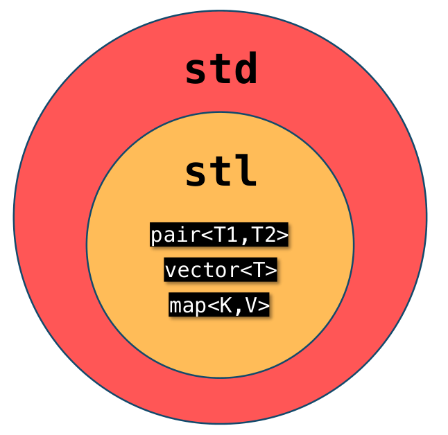

STL提供了一系列表示容器、迭代器、函数对象和算法的模板。STL容器是同质的，即春初的值的类型相同；算法是完成特定任务的处方；迭代器能够用来遍历容器的对象，与能够便利数组的指针类似，是广义指针；函数对象是类似于函数的对象，可以是类对象或函数指针。STL使得能够构造各种容器（包括数组、队列和链表）和执行各种操作（包括搜索、排序和随机排列）。

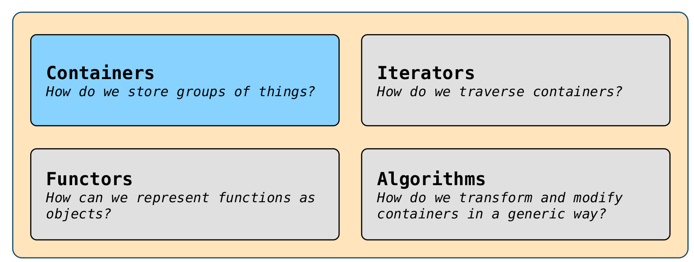

# 序列式容器-`Sequence Container`

## `std::vector`

| Want to                        | `std::vector<int> v`             |
| ------------------------------ | -------------------------------- |
| 创建一个空`vector`             | `std::vector<int> v;`            |
| 创建一个包含n份值为0的`vector` | `std::vector<int> v(n);`         |
| 创建一个包含n份值为k的`vector` | `std::vector<int> v(n, k);`      |
| 将值k添加到`vector`的末尾      | `v.push_back(k);`                |
| 清理`vector`                   | `v.clear();`                     |
| 检查`vector`是否为空           | `if (v.empty())`                 |
| 获得索引为i的元素              | `int k = v[i]; int k = v.at(i);` |
| 替换索引为i处的元素            | `v[i] = k; v.at(i) = k;`         |

**提示**：

在对`std::vector`对象进行迭代时，尽可能使用range-based方法。

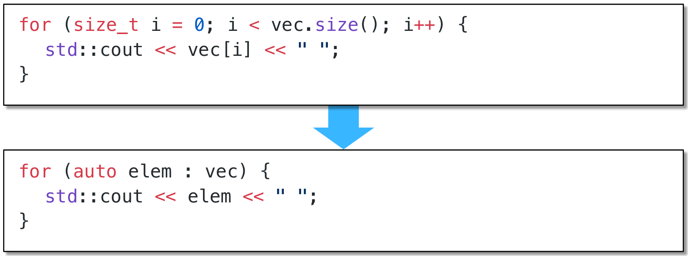

在条件允许时，使用`const auto&`智能类型判断。`const auto&`使得`std::vector`对象的元素无需手动标明，关键字`auto`会根据`std::vector`对象的类型自动判断，同时使用`const`关键字避免了对元素的修改，`&`使得直接从该元素地址处读取，而非在对其进行操作前先拷贝一份副本。

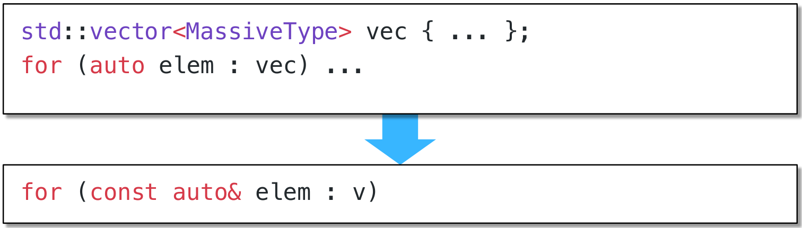

运算符[]在读取索引时，并不会进行边界检测。

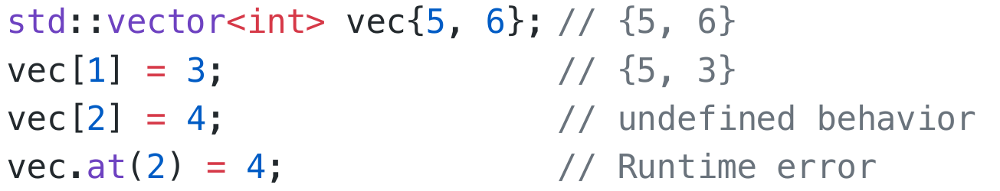

## `std::deque`

`std::vector`容器虽然可以在头尾两端插入元素，但是在其头部操作效率奇差，无法被接受，为STL提供了`std::deque`来解决这个问题。

`std::deque`提供了双端队列（double-end queue）的实现，允许高效地双端插入和删除。同时，`deque`具有`std::vector`的所有功能外。

`deque`提供了两级数组结构， 第一级完全类似于vector，代表实际容器；另一级维护容器的首位地址。

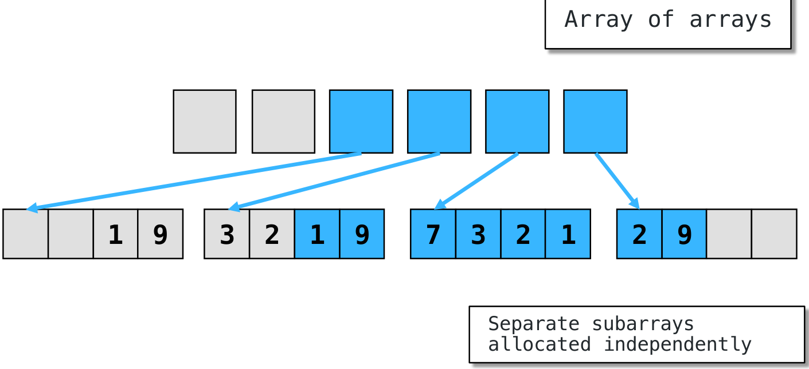

## `std::list`

# 关联式容器-`Associative Container`

关联式容器通过特殊的键（key）来组织元素

## `std::map`

`std::map`容器可以将键映射到值上。即，`std::map`是`std::pair`的组合

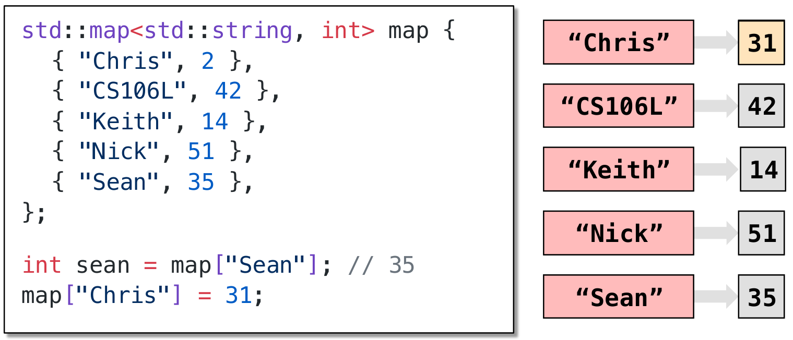

| Want to                                  | `std::map<char, int> m`                |
| ---------------------------------------- | -------------------------------------- |
| 创建一个空`std::map`对象                 | `std::map<char, int> m;`               |
| 将键为k值为v的对添加到``std::map`对象    | `m.insert({k, v}); m[k] = v;`          |
| 将键为k的键从`std::map`对象中移除     | `m.erase(k);`                          |
| 检查键k是否在`std::map`对象中（>c++20) | `if (m.count(k)){*}`,`if (m.contains(k)){*}` |
| 检查`std::map`对象是否为空               | `if (m.empty())`                       |
| 将键为k的值丢弃或覆盖                 |`int i = m[k]`,`m[k] = i;`|

`std::map`容器通过二叉树构建键的搜索方式。

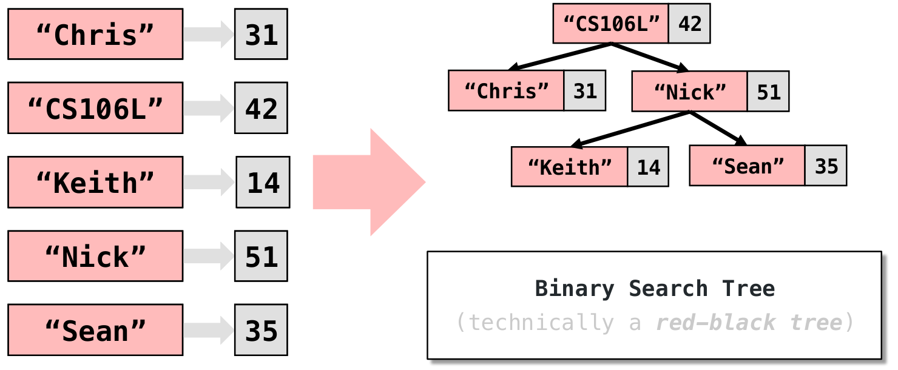

为了构建`std::map`容器的二叉树键搜索方式，需要容器`std::map<k, v>`中的键变量`k`拥有比较运算符`<`的实现。

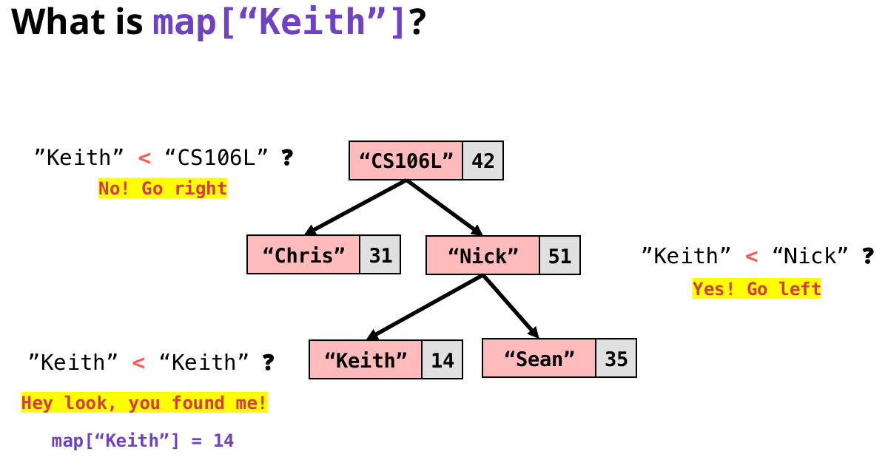

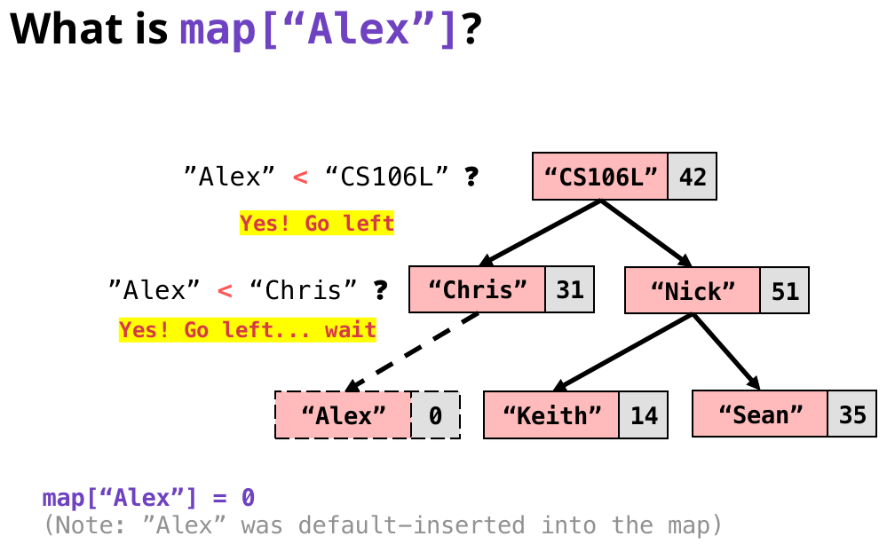

## `std::set`

`std::set`是一个只有键但没有对应值的`std::map`。

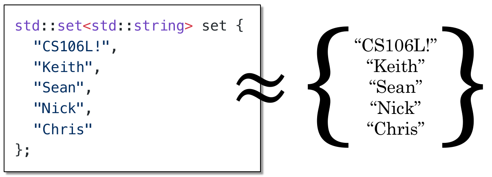

| Want to                                | `std::set<char, int> s`                      |
| -------------------------------------- | -------------------------------------------- |
| 创建一个空`std::set`对象               | `std::set<char> s;`                          |
| 将键为k添加到``std::s`et对象           | `s.insert(k);`                               |
| 将键为k的键从`std::set`对象中移除      | `s.erase(k);`                                |
| 检查键k是否在`std::set`对象中（>c++20) | `if (s.count(k)){*}`,`if (s.contains(k)){*}` |
| 检查`std::set`对象是否为空             | `if (s.empty())`                             |

`std::set`的键同样通过二叉树组织。

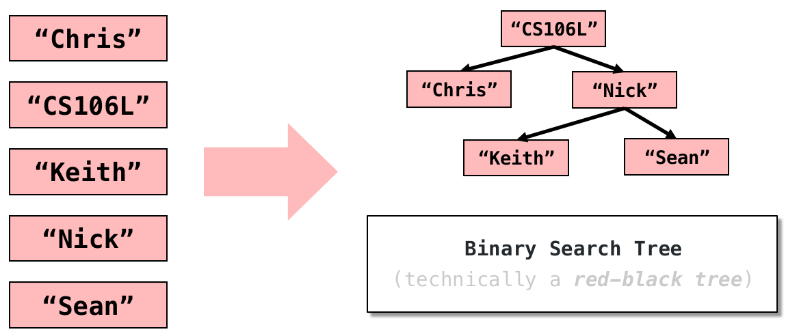

## `std::unordered_map`

可以将`std::unordered_map`视为`std::map`的优化版本，其具有和`std::map`相同的函数接口。

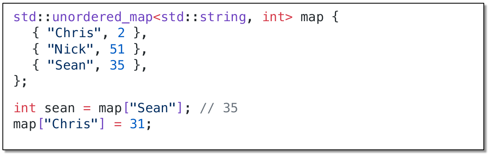

在描述`std::unordered_map`之前，需要了解hash函数。hash函数接受字符串，输出整型数据。在输入端小的变化，在输出端则会产生更大的变化。

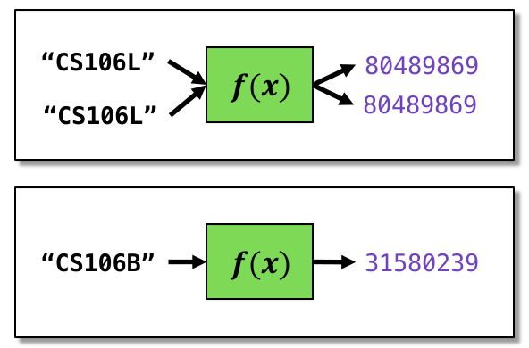

`std::unordered_map`的通过hash函数对键值对进行组织，如下示意：

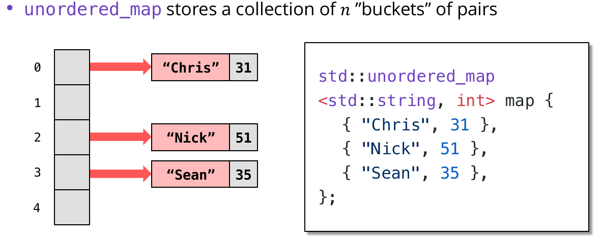

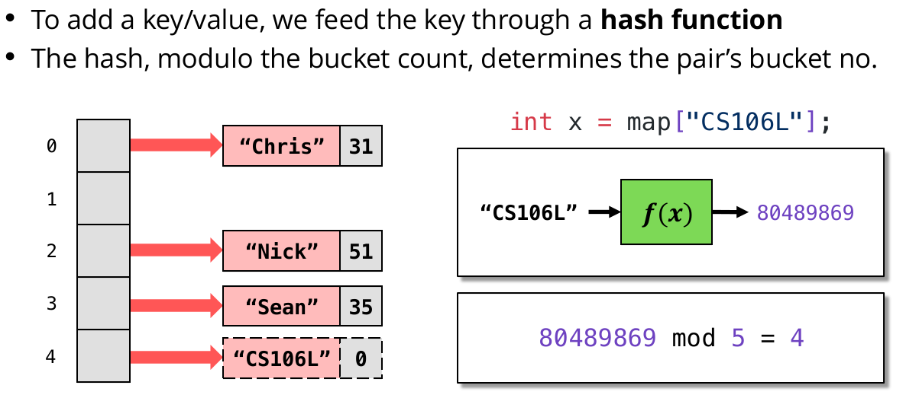

两个不同的键经过hash计算后，得到的hash值相同，就会导致hash碰撞。 主义，两个哈希值相同的键不一定相等！对于hash碰撞通过开放寻址法和拉链法解决。

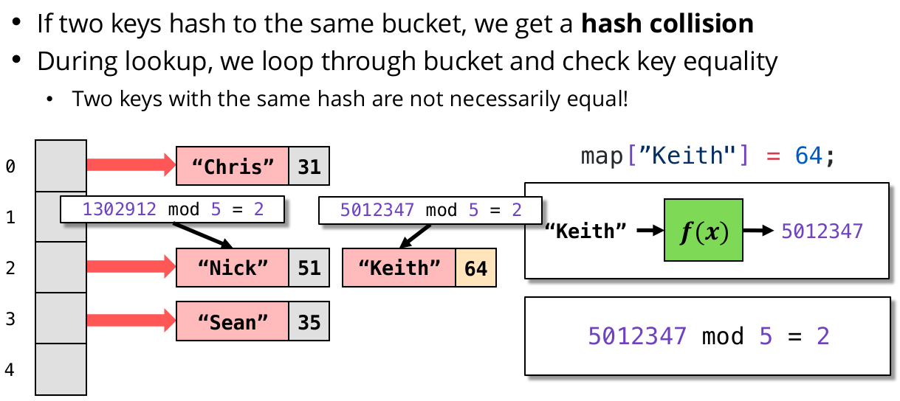

为了构建`std::unordered_map`容器的组织方式，需要容器`std::unordered_map<k, v>`中的键变量`k`**可以被hash化。**

与`std::map`相比`std::unordered_map`有以下特点：

* `std::unordered_map`通常比`std::map`更快
* `std::unordered_map`比`std::map`会占用更多内存（有序与无序）
* 如果键类型没有`operator<`的实现形式，请使用`std::unordered_map`
* 如果必须做出选择，`std::unordered_map`是一个安全的选择

## `std::unordered_set`

`std::unordered_set`是`std::unordered_map`键无值化的实现方式。