# Iterator

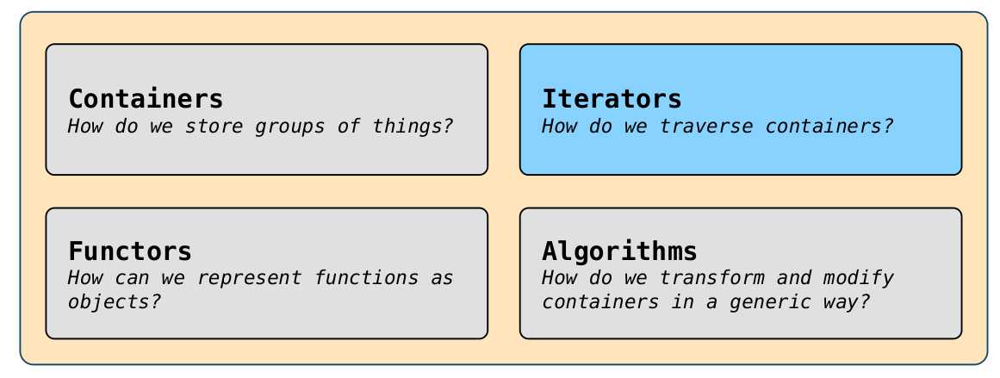

对于之前学习的容器模板`vector`, `deque`, `set`,` map`，为他们分别设计相应的迭代器，以实现`for (const auto& elem: container)`的功能。

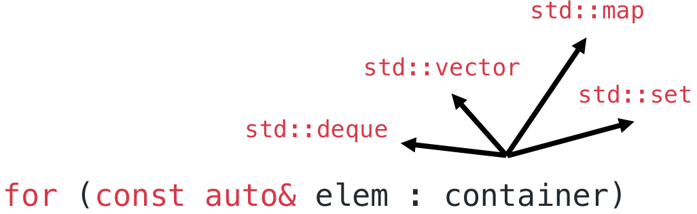

## 迭代器是什么

我们需要某种东西来跟踪我们在容器中的位置……有点像一个索引，这就是迭代器的功能所在。

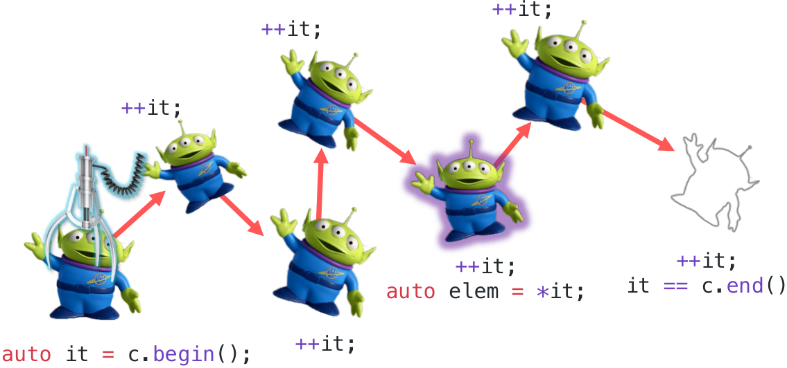

容器和迭代器使得对容器对象的迭代成为可能。

这张图也告诉我们，在设计容器时，需要为其设计两个接口`container.begin()`和`container.end()`，这两个接口分别能够返回一个指向第一个元素的迭代器和容器最后一个元素之后的迭代器。

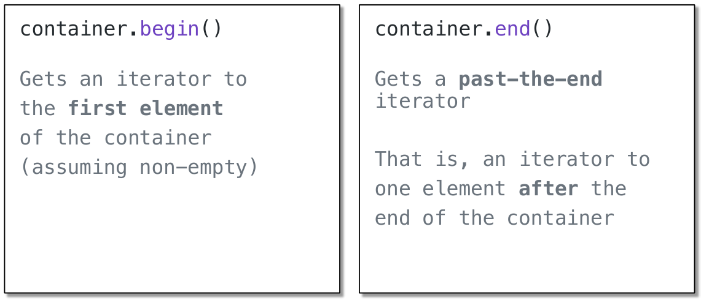

**注意`container.end()`接口返回的迭代器并不是指向最后一个元素的，而是指向最后一个元素之后的那个位置，也就是容器之外的第一个元素。**

如果容器为空，则`c.begin() == c.end()`。最终迭代器的设计如下：

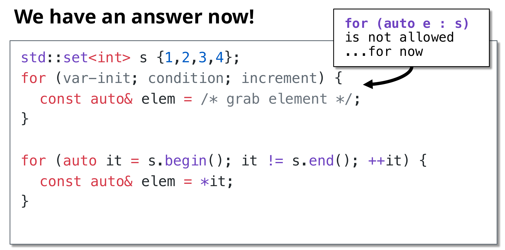

上述代码的示例如下：

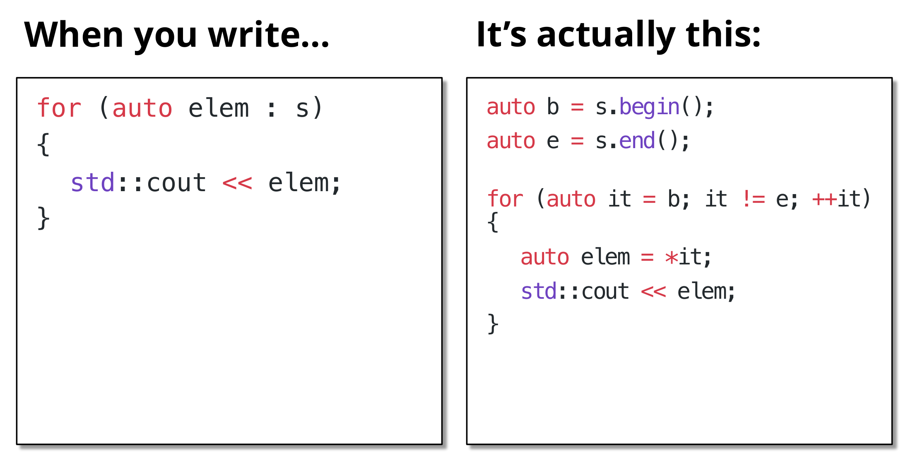

在上述代码中，存在几个问题：**1. auto代替的数据类型是什么？2. 为什么使用`++it`而不是`it++`？**

问题1：实际上，在迭代器中使用`auto`代替的数据类型如下所示：

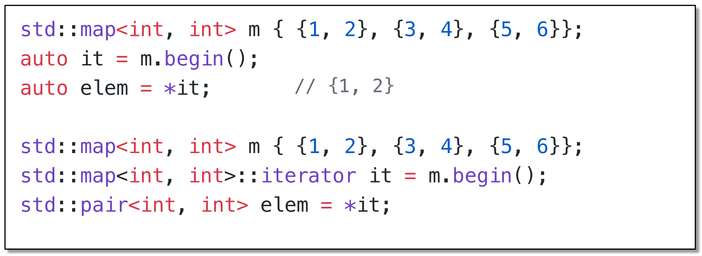

问题2：使用`++it`可以避免不必要的重复复制。

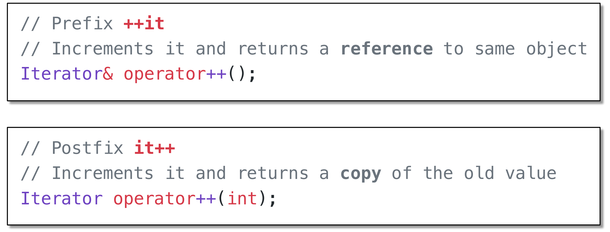

*`++i` is sometimes faster than, and is never slower than, `i++`. ... So if you’re writing `i++` as a statement rather than as part of a larger expression, why not just write `++i` instead? You never lose anything, and you sometimes gain something.*

## 迭代器的种类

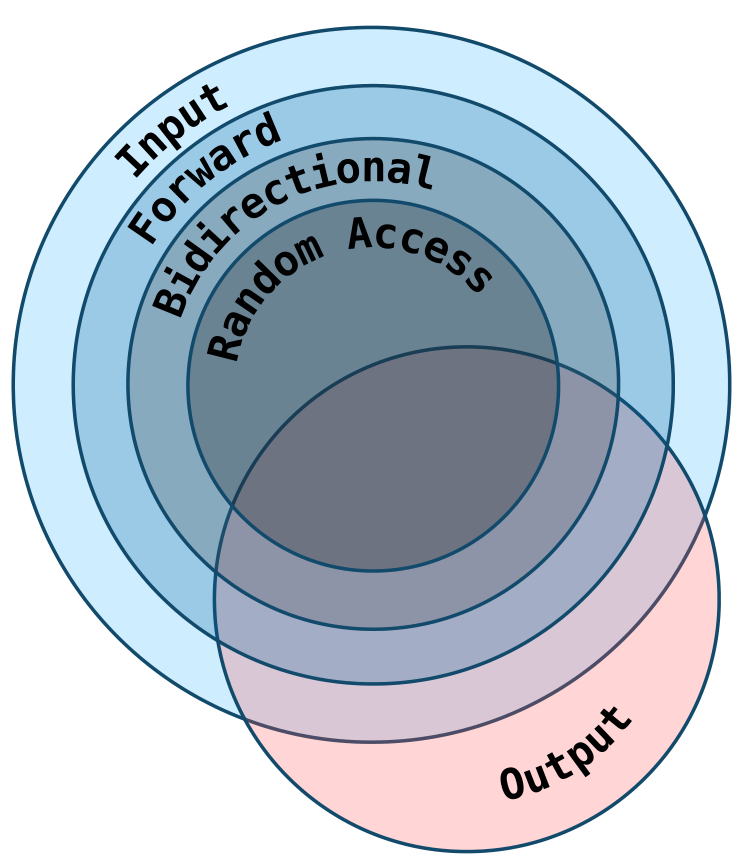

所有的迭代器都提供这四种运算符。

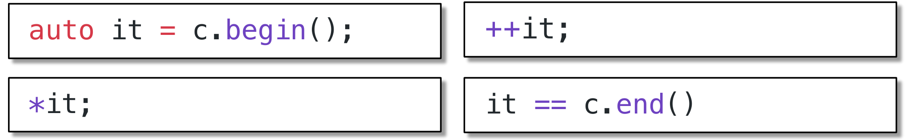
但大多数提供更多的操作。

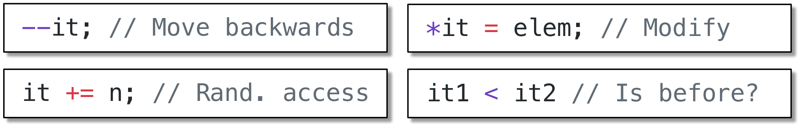

迭代器的种类决定了他们的功能。

### Input Iterators

最基本的迭代器种类，使得可以从迭代器中读取元素。`auto elem = *it;`

### Output Iterator

可以向迭代器中写入元素。`*it = elem;`

### Forward Iterator

允许单步向前移动。

### Bidirectional Iterators

允许我们同时向前和向后移动。

```C++
auto it = m.end();
--it;// get last element
auto& elem = *it;
```

### Random Access Iterators

允许我们快速向前或向后跳过。

```C++
auto it2 = it + 5;// 5 ahead
auto it3 = it2 - 2;// 2 back

// Get 3rd element
auto& second = *(it + 2);
auto& second = it[2];
```

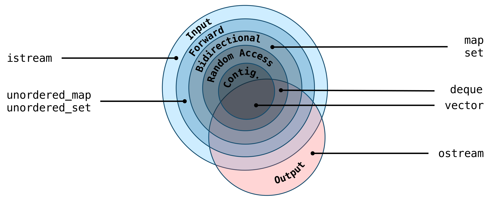

## 指针和内存

一个迭代器指向一个容器元素，一个指针指向任意一个对象。

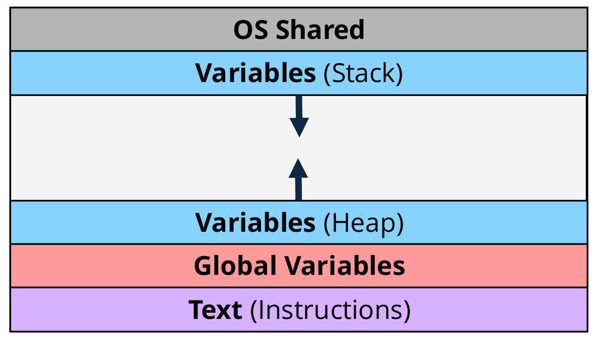

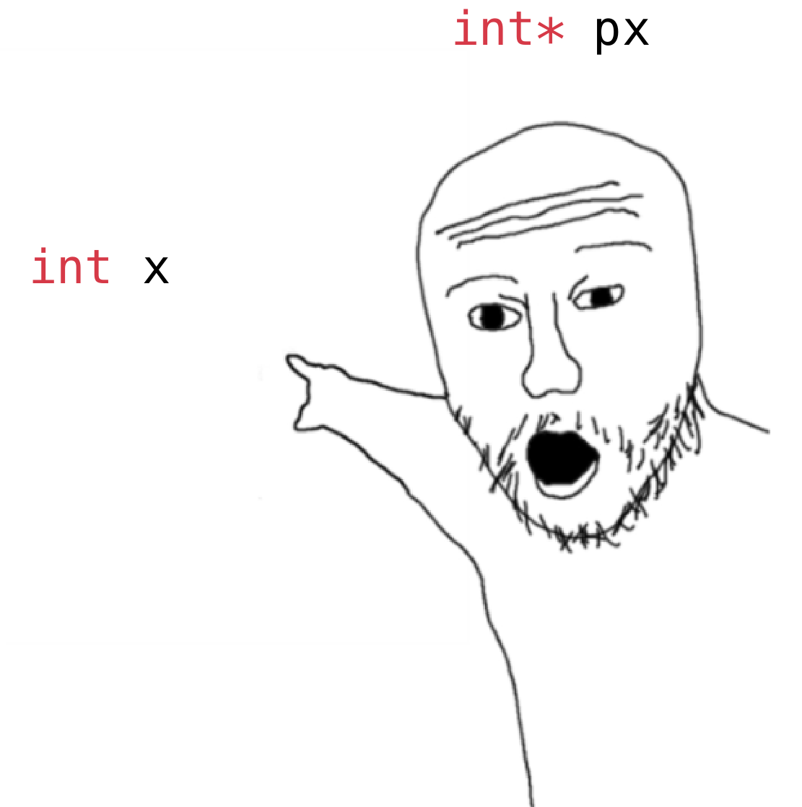

任何对象都可以有一个指向它的指针。