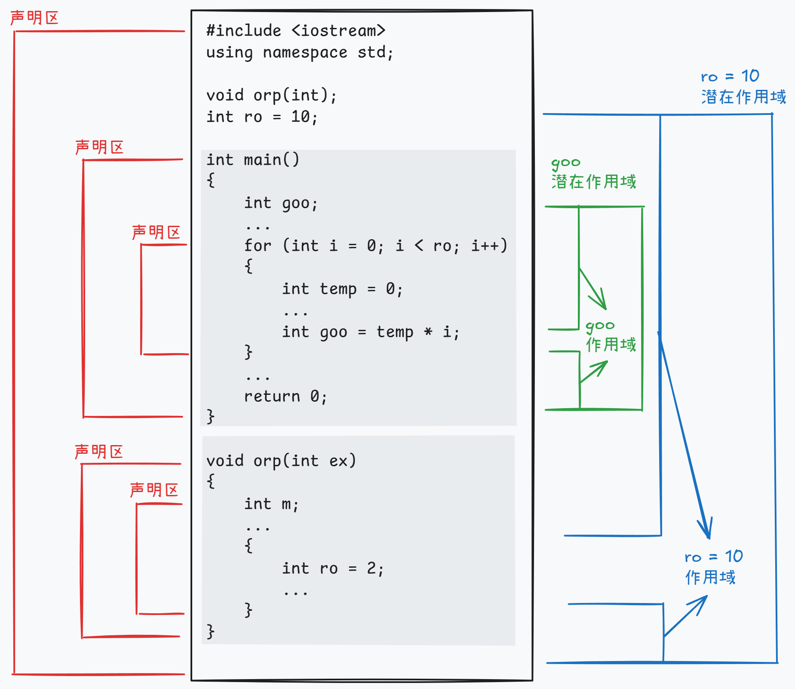
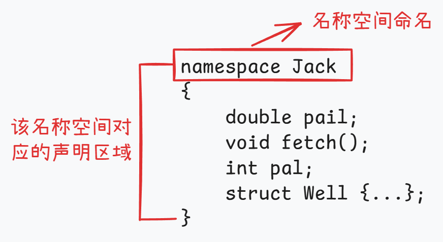
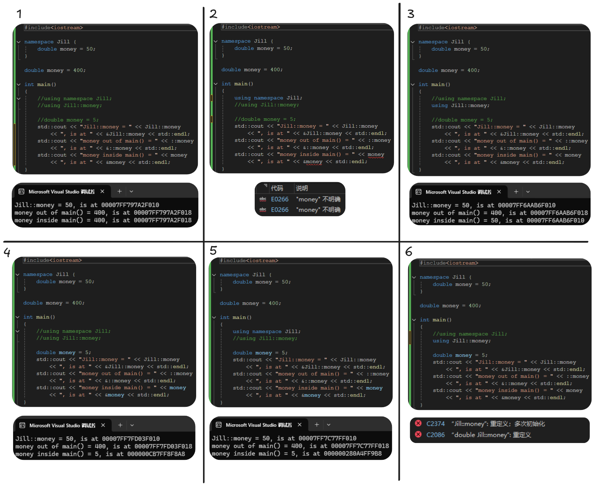

# 9 内存模型和名称变量

## 9.1 多文件编译

在编写程序的过程中，将所有代码都写在一个文件中可能会导致代码冗余，可读性下降。C++允许程序员将组件函数放在独立的文件中，并单独编译这些文件，然后将它们链接成可执行的程序。


如上图所示，程序员常常将原来的程序分为三个部分:**头文件**、**包含定义结构有关函数的源代码文件**、**包含调用结构有关函数的源代码文件**。**头文件**、**包含定义结构有关函数的源代码文件**被称为软件包，可以被用于各种应用之中。不要将**非内联函数**在函数定义或变量声明放到头文件中。因为，如果在头文件中包含一个函数定义，然后在同属于这个工程的另外两个文件中包含该头文件，会导致一个程序包含同一个函数的两个定义。

*小结：头文件中应当说明变量、类或者函数是如何创建的，而并非直接创建这些内容，因为头文件会被多个源代码文件包含，若在头文件中直接创建则会导致重复报错。当然，内联函数除外。*

下面案例中的程序被分解为`coordin.h`，`file1.cpp`和`file2.cpp`三个文件，相关文件链接如下：

|                  code-list-9-01                  | code-list-9-02                                    | code-list-9-03                                   |
| :----------------------------------------------: | ------------------------------------------------- | ------------------------------------------------ |
| [coordin.h](./examples/code-list-9-01-coordin.h) | [file1.cpp ](./examples/code-list-9-02-file1.cpp) | [file2.cpp](./examples/code-list-9-03-file2.cpp) |


## 9.2 内存模型

### 9.2.1 基本概念

C++使用四种不同的方案来存储数据，这些方案的区别就在于数据保留在内存中的时间——**持续性**。

| 存储方案         | 持续时间                                                     |
| ---------------- | ------------------------------------------------------------ |
| 自动存储持续性   | 在函数定义中声明的变量（包括函数参数）的存储持续时间为自动。它们在程序开始执行其所属的函数或代码块时被创建，在执行完函数或代码块时，它们使用的内存被释放。 |
| 静态存储持续性   | 在函数定义外定义的变量和使用关键字static定义的变量的存储持续时间都为静态。它们在程序整个运行过程中都存在。 |
| 线程序存储持续性 | 当前，多核处理器非常常见，这些CPU可以同时处理多个执行任务。这让程序能够将计算放在可并行处理的不同线程中。如果变量是使用关键字thread_local声明的，则其生命周期与所属的线程一样长。 |
| 动态存储持续性   | 用new运算符分配的内存将一直存在，直到使用delete运算符将其释放或程序结束为止。这种内存的存储持续时间为动态，有时被称为自由存储或堆。 |

**作用域（scope）描述了名称在文件的多大范围内可见。**

* 作用域为局部的变量只在定义它的代码块中可用。代码块是由花括号括起的一系列语句。例如函数体就是代码块，但可以在函数体中嵌入其他代码块。
* 作用域为全局的变量在定义变量位置到文件结尾之间都可用。
* 自动变量的作用域为局部，静态变量的作用域是全局还是局部取决于其是如何被定义的。在函数原型作用域中使用的名称只在包含参数列表的括号内可用。在类中声明的成员的作用域为整个类。在名称空间中声明的变量的作用域为整个名称空间。

**链接性（linking）描述了名称如何在不同单元之间共享。**链接性为外部的名称可在文件间共享，链接性为内部的名称只能由一个文件中的函数共享。自动变量的名称没有链接性，因为它们不能共享。

### 9.2.2 自动变量

**在默认情况下，在函数中声明的函数参数和变量的存储持续性为自动，作用域为局部，没有链接性。**

* 如果在代码块中定义了变量，则该变量的存在时间和作用域将被限制在该代码块内。
* 但代码块内的变量和代码块外的变量名相同，内部的变量会自动覆盖外部变量的定义，新定义可见，旧定义暂时不可见。在程序离开该代码块后，新定义失效，旧定义重新可见。

|                     code-list-9-04                     |
| :----------------------------------------------------: |
| [autoscp.cpp](././examples/code-list-9-04-autoscp.cpp) |

**自动变量初始化**

可以使用任何在声明时其值为已知的表达式来初始化自动变量。

**自动变量和栈**

由于自动变量的数目会随着程序的进行而发生改变，因此在程序运行时需要对其进行管理。常用的方法是留出一段内存，并将其视为栈，以管理变量的增减。

在栈中，新数据被象征性的放在原有的数据之上，当程序使用完后，自动将数据删除，此时该内存中的数据恢复到调用之前的值（也就是自动变量中的：新定义覆盖旧定义，新定义结束，旧定义恢复）。

程序使用两个指针来跟踪栈，一个指针指向栈底，另一个指针指向栈顶。

栈空间是先进后出，后进先出的。

**寄存器变量**

关键字register是由C语言引入的，其建议编译器使用CPU寄存器来存储自动变量：

```C++
register int count_fast;
```

旨在提高访问变量的速度。

### 9.2.3 静态变量

静态变量的存储持续性为静态，可以分为如下三类。静态变量的作用域随着变量创建位置的不同而有所不同，链接性也与创建变量时的关键字有关，也如下表。

| 静态变量类型           | 作用域   | 声明位置 | 关键字           |
| ---------------------- | -------- | -------- | ---------------- |
| 静态持续性、外部链接性 | 整个文件 | 代码块外 | 不使用关键字     |
| 静态持续性、内部链接性 | 整个文件 | 代码块外 | 使用关键字static |
| 静态持续性、无链接性   | 代码块内 | 代码块内 | 使用关键字static |

> [!NOTE]
>
> **注意，**如果没有显示的初始化静态变量，编译器将它设置为0。（对于字符变量，则为`\0`）
>
> **注意，**这里变量声明的位置不同，关键字static代表的含义也不同，有人称之为关键字重载，即关键字的含义取决于上下文。
>
> **注意，**静态持续性指变量在整个代码执行间存在。由于静态变量的数目在程序运行期间是不变的，编译器将分配固定的内存块来存储所有的静态变量，因此不需要使用特殊的装置来管理它们。


**静态变量的初始化**

| 初始化方式             | 含义                                                         |
| :--------------------- | ------------------------------------------------------------ |
| 静态初始化             | 静态初始化指局部变量在编译阶段初始化该变量。                 |
| 默认初始化（零初始化） | 首先，静态变量都被零初始化，而不管程序员是否显示地初始化了它。 |
| 常量表达式初始化       | 其次，若编译器仅根据本文件内容（包含被包括的头文件）就可计算表达式，其将进行常量表达式初始化。 |
| 动态初始化             | 最后，动态初始化指程序在编译完成后的运行阶段初始化，如果没有足够的信息进行初始化，变量则将被动态初始化。 |

> [!NOTE]
>
> **注意，**零初始化对于不同类型的对象具有不同含义。例如，对于指针，其被默认初始化为指针意义中的0，并非数字0。


**静态持续性、外部链接性**

链接性为外部的变量通常简称为外部变量，它们的存储持续性为静态，作用域为整个文件。外部变量是在函数外面定义的，因此对所有函数而言都是外部的。在头文件中定义它们，也可以在文件中位于任何函数中使用它。

单定义规则(One Definition)：该规则指出，变量只能有一次定义。

> [!NOTE]
>
> **注意，**单定义规则（One Definition）并非意味多个变量名称不能相同。例如之前提到的新定义覆盖旧定义，新定义结束，旧定义恢复。虽然程序可包含多个同名的变量，但每个变量的定义只能有一个。

为满足这种需要，C++提供了两种变量声明。一种是定义声明（defining declaration）或简称为定义（definition），它给变量分配存储空间；另一种是引用声明（referencing declaration）或简称为声明（declaration），它不给变量分配存储空间，因为其引用已有的变量。

引用声明使用关键字extern，且不进行初始化。若使用关键字extern的同时，还进行了初始化，则该操作自动转为定义声明。

如果要在多个文件中使用外部变量，只需要在一个文件中包含该变量的定义，但在使用该变量的其他文件中，都必须使用关键字extern声明它。

```c++
// file01.cpp
extern int cats = 20;// 虽使用extern关键字，但进行了初始化，仍然为定义
// 对于定义声明，关键字extern并非必不可少，省略它反而更加清晰，且效果相同
int dogs = 22;// 定义可外部链接的静态变量dogs
int fleas;// 定义可外部链接的静态变量fleas

// file02.cpp
extern int cats;//  由于file01.cpp中的cats是可以外部链接的，因此使用extern声明引用该变量。
extern int dogs;// 同上

// files98.cpp
extern int cats;// 同上
extern int dogs;// 同上
extern int fleas;// 同上
```

下面是使用外部链接的静态变量的例子。

|                     code-list-9-05                     | code-list-9-06                                       |
| :----------------------------------------------------: | ---------------------------------------------------- |
| [external.cpp](./examples/code-list-9-05-external.cpp) | [support.cpp](./examples/code-list-9-06-support.cpp) |

**静态持续性、内部链接性**

在多文件程序中，内部链接和外部链接具有的差别是很有意义的。添加static设置变量为内部链接性。链接性为内部的变量只能在其所属的文件内使用；但常规外部变量具有外部链接性，即可以在其他文件中使用。

注意，对于内部链接的静态变量，如果要在其他文件中使用相同名称的变量时，将无法通过关键字使用。

```c++
// file1
int errors = 20;
...
--------------------------------
//file2
int errors = 5
// 这种声明是非法的，因为违反了单定义规则  
--------------------------------
//file3
static int errors = 5;
// 这种声明是合法的，虽然其名字和另一个文件中声明的常规外部变量相同。
// 该文件中，静态变量将隐藏常规的外部变量
// 没有违反单定义规则，这里关键字static指出变量是内部的。
```

可使用链接性为外部的静态变量在多文件程序的不同部分之间共享数据；使用链接性为内部的静态变量在同一个文件中的多个函数之间共享数据。

|                     code-list-9-07                     |                     code-list-9-08                     |
| :----------------------------------------------------: | :----------------------------------------------------: |
| [twofile1.cpp](./examples/code-list-9-07-twofile1.cpp) | [twofile2.cpp](./examples/code-list-9-08-twofile2.cpp) |

**静态持续性、无链接性**

将static限定符用于在代码块中定义的变量。这意味这该变量虽然只在该代码块中可用，但它在该代码块中不处于活动状态时仍然存在。另外如果初始化了静态局部变量，则程序只在启动时进行一次初始化，以后再调用函数时，不会像自动变量那样再次被初始化。

|                   code-list-9-09                   |
| :------------------------------------------------: |
| [static.cpp](./examples/code-list-9-09-static.cpp) |

### 9.2.4 说明符和限定符

存储说明符（storage class specifier）和cv-限定符（cv-qualifier）的C++关键字提供了其他有关存储的信息。

下面是存储说明符：

* auto（在C++11中不是说明符，用于自动类型判断）
* register（寄存器变量）
* static（静态变量）
* thread_local（变量的持续性和线程的持续性相同）
* mutable（即使结构（或类）变量为const，其某个成员变量也可以更改）

```c++
struct data
{
    char name[30];
    mutable int accesses;
    ...
};
const data veep = {"Claybourne Clodde", 0, ...};
strcpy(veep,name, "Joye Joux");// 不允许
veep.accesses++;// 允许
```

下面是cv-限定符：

* const
* volatile（即使程序代码没有对内存单元进行修改，其值也可能发生变化）

在C++中const关键字对变量的存储类型稍有影响。在默认情况下全局变量的链接性为外部的，但const全局变量的链接性为内部的。也就是说，在C++看来，全局const定义就像使用了static说明符一样。

故在头文件中，可以使用const关键字将一组常量包含在其中。那么每个文件引用该头文件时都会拥有自己的一套变量，而不会发生冲突。

如果在某一文件中想使得const变量为外部链接性，则可以使用关键字extern来覆盖默认的内部链接性，操作如下：

```C++
extern const int states = 50;
```

在这种情况下，必须在所有使用该常量的文件中使用extern关键字来说明它。这与常规外部变量不同，定义常规外部变量时，不必使用关键字extern进行初始化，但是在使用该变量的其他文件中，必须使用extern来声明。

在函数或代码块中声明const时，其作用域为代码块，即仅当程序执行该代码块中的代码时，该常量才是可用的。这意味这在函数或代码中中创建常量时，不必担心其名称与其他地方定义的常量发生冲突。

### 9.2.5 函数和链接性

和变量一样，函数也有链接性。C++不允许在一个函数中定义另一个函数。

所有函数的存储持续性都为静态。默认情况下，函数的链接性为外部，即可以在文件间共享。实际上可以在函数原型中使用关键字extern来指出函数是在另一个文件中定义的，不过这是可选的。

使用关键字static将函数的链接性设置为内部的，使之只能在一个文件中使用。必须同时在原型和函数定义中使用该关键字。

```c++
static int private(double x)
...
static int private(double x)
{
	...
}
```

这意味着该函数仅仅在这个文件中可见，和之前静态变量类似，可以在其他文件中命名同名的函数。同时，在定义静态函数的文件中，静态函数将覆盖外部定义，因此即使在外部定义了同名函数，该文件仍将使用静态函数。

单定义规则适用于非内联函数（常规函数）。因此对于链接性为外部的函数来说，只能有一个文件包含该函数的定义，但是用该函数的每个文件都应包含该函数原型。

单定义规则不适用于内联函数（关键字 inline）。这允许程序员能够将内联函数的定义放在头文件中。这样包含了头文件中的每个文件都有内联函数的定义。然而，C++要求同一个函数的所有内联定义都必须相同。

**C++寻找函数**

如果文件中的函数原型指出函数是静态的，则编译器将只在该文件中查找函数定义；否则，编译器将在所有程序文件中查找。如果找到两个定义，编译器将发出错误消息，因为每个外部函数只能有一个定义。如果程序文件中没有找到，编译器将在库中搜索。这意味着如果定义了一个与库函数同名的函数，编译器将使用程序员定义的版本，而不是库函数。

### 9.2.6 语言链接性

链接程序要求每个不同的函数都有不同的符号名。C++中一个函数名可能对应多个函数，必须将这些函数翻译为不同的符号名称。因此C++编译器执行名称矫正或名称修饰，为重载函数生成不同的符号名称。例如可能将`spiff(int)`转换为`_spiff_i()`，而将`spiff(double, double)`转换为`_spiff_d_d()`。这种方法被称为C++语言链接。略略略，看不懂了。

### 9.2.7 动态变量

前面介绍C++用来为变量分配内存的几种方案，它们不适用于使用C++new运算符的分配内存的情况，这种内存称之为动态内存。动态内存通过运算符new和delete控制，而不是由作用域和链接性规则控制。因此可以在一个函数中分匹配动态内存，而在另外一个函数中将其释放。与自动变量不同，动态变量对应的动态内存不是后进先出的LIFO结构，其分配和释放顺序要取决与new和delete在何时以何种方式被使用。通常，编译器使用三块独立的内存：一块用于静态变量，一块用于自动变量，一块用于动态变量。

假设有下面语句：

```c++
float* p_fees = new float [20];
```

由new分配80个字节（假设float为4个字节）的内存将一直保存在内存中，直到使用delete运算符将其释放。但当包含该声明的语句块执行完毕时，p_fees指针将消失。如果希望另一个函数能够使用这个函数中80个字节的内容，则必须将其地址传递给或返回给该函数。另一方面，如果将p_fees的链接性声明为外部的，则文件中位于该声明后面的所有函数都可以使用它。另外，通过在另一个文件中使用下述声明，便可在其中使用该指针。

```C++
extern float * p_fees;
```

**使用new运算符初始化**

```c++
int* pi = new int (6);
double* pd = new double (99.99)
```

如上，在类型名后面加上初始值，并用括号将其括起，可以起到初始化之指针指向值的作用。

要初始化常规结构或数组，需要使用大括号的列表初始化，这要求编译器支持C++11，如下：

```C++
struct where {double; double y; double z;};
where * one = new where {2.5, 5.3, 7.2};
int * arr = new int [4] {2, 3, 4, 5};
```

在C++11中，还可以将列表初始化用于单值变量：

```C++
int * pi = new int {6};
double * pd = new double {99.99};
```

**new失败时**

new可能找不到请求的内存量。以前C++会返回一个空指针，现在将引发异常`std::bad_alloc`。

**new：运算符、函数和替换函数**

运算符new和new[]分别调用下面函数：

```C++
void * operator new (std::size_t);
void * operator new [](std::size_t);
```

这些函数被称为分配函数，它们位于全局名称空间中。同样也有由delete和delelte[]调用的释放函数。

```C++
void operator delete(void *);
void operator delete[](void*);
```

他们使用运算符重载语法。

```c++
int * pi = new int;
// 将被转换为int * pi = new(sizeof(int));
int * pa =  new int[40];
// 将被转换为int * pa = new(40*sizeof(int));
delete pi;
// 将被转换为delete (pi);
```

C++将这些函数称为可替换的。故C++允许程序员对new和delete进行重载。

**定位new运算符**

通常，new负责在堆中找到一个足以能够满足要求的内存块。new运算符还有另外一种变体，被称为定位（placement）new运算符，它让您能够指定要使用的位置。程序员可以通过这种特性来设置其内存管理规程、处理需要通过特定地址进行访问的硬件或在特定位置创建对象。

要使用定位new特性，首先需要包含头文件new，它提供了这种版本的new运算符原型；然后将new运算符用于提供了所需地址的参数。除需要指定参数外，句法与常规的new运算符完全相同。如下。

```c++
#include <new>
struct chaff
{
    char dross[20];
    int slag;
};

char buffer1[50];
char buffer2[500];
int main()
{
    chaff* p1, *p2;
    int *p3, *p4;
    p1 = new chaff;
    p3 = new int[20];
    
    p2 = new (buffer1) chaff;
    p4 = new (buffer2) int [20];
}
...
```

下面程序说明常规new运算符和定位new运算符之间的一些重要差别。

返回值如下，定位new运算符接受一个地址，并将其转化为void*类型，以便传递给任意类型的指针。

## 9.3 **名称空间**

C++中名称可以是变量、函数、结构、枚举、类以及类和结构的成员。当随着项目增大时，名称相互冲突的可能性也将增加。为了解决名称冲突问题，引入名称空间。C++引入名称空间工具，以便更好地控制名称的作用域。

### 9.3.1 声明区域、潜在作用域及作用域

| 概念                           | 描述                                                         |
| ------------------------------ | ------------------------------------------------------------ |
| 声明区域（declaration region） | 指可以在其中进行声明的区域。在函数外面声明全局变量，这种变量的声明区域为其声明所在的文件；在函数内部声明的区域，这种变量的声明区域为其声明所在的代码块。 |
| 潜在作用域（potential scope）  | 指从声明点开始，到其声明区域的结尾在区域。小于声明区域。     |
| 作用域（scope）                | 指变量对程序而言可见的范围。变量并非在潜在作用域之内的任何位置都是可见的。例如，其可能被另一个在嵌套声明中声明的同名变量隐藏，函数中声明的局部变量将隐藏同一个文件中声明的全局变量。 |

下面这张图就很好的展示了上面这三个概念。



上述概念体现了C++中一种名称空间层次。每一个声明区域都可以声明名称，这些名称独立于在其他声明中声明的名称。在一个函数中声明的局部变量不会和在另一个函数中声明的局部变量发生冲突。

### 9.3.2 新的名称空间特性

C++丰富了名称空间的功能，可以创建一种具有名称的声明区域。这使得一个名称空间中的名称不会与另外一个名称空间的相同名称发生冲突，同时允许程序的其他部分使用该名称空间中声明的东西。下面代码分别使用关键字`namespace`创建了一个名称空间：`Jack`。



除了用户定的名称空间外，还存在一个名称空间——全局名称空间（global namespace）。它对应与文件级声明区域，因此前面说的全局变量现在被描述为位于全局名称空间中。

> [!NOTE]
>
> 名称空间可以是全局的，也可以位于另外一个名称空间中，**但不能位于代码块中**。因此在默认情况下，在名称空间中声明的名称的链接性为外部的（除非它引用了变量）。
>
> 任何名称空间中的名称都不会和其他名称空间中的名称冲突。名称空间中的声明和定义规则同全局声明和定义规则相同。
>
> 名称空间是开放的，可以把名称加入到已有的名称空间中。例如，下面这条语句将名称goose添加到Jill已有的名称列表中
>
> ```c++
> namespace Jill {
> 	char * goose(const char *)
> }
> ```
>
> 同样，原来的Jack名称空间为fetch()函数提供了原型。可以在该文件的后面（或另一个文件中）再次使用Jack名称空间来提供该函数的代码。
>
> ```C++
> namespace Jack {
>     void fetch()
>     {
> 		...
>     }
> }
> ```
>
> 通过作用域解析运算符::，可以使用名称空间来限定该名称，以简化书写。
>
> ```C++
> Jack::pail = 12.34;
> Jill::Hill mole;
> Jack::fetch();
> ```
>
> 未被修饰的名称称为未限定的名称，包含名称空间的名称称为限定的名称。
>

### 9.3.3 using声明和using编译指令

在实际使用中，并不希望每次使用名称时都要对其进行限定，因此C++提供了两种机制（using声明和using编译指令）。

using声明使特定的标识符可用，using编译指令使整个名称空间可用。即，using声明使一个名称可用，而using编译指令使得所有的名称空间可用。

```C++
using Jill::fetch;
// 该指令在函数外声明，则该名称在整个文件中都可用
// 该指令在函数内声明，则该名称仅仅在该函数内部可用

using namespace fetch;
// 该指令使得名称空间中的所有名称均可用，而不需要使用作用域解析运算符
// 在全局声明区域中使用using编译指令，将使该名称空间的名称全局可用
// 在函数中使用using编译指令，将使其中的名称在该函数中可用
```

使用using编译命令和使用多个using声明是不一样的，而更像大量使用作用域解析运算符。

* 使用using声明，就好像声明了相应的名称一样。如果某个名称已经在函数中声明了，则不能用using导入 相同的名称。
* 然而，使用using编译指令，将进行名称解析，就像在包含using声明和名称空间本身的最小声明区域中声明了名称一样，局部名称将隐藏名称空间名。

```C++
namespace Jill {
    double bucket(double n) { ... }
    double fetch;
    struct Hill { ... }
}

char fetch;
int main()
{
    using namespace Jill;
    Hill hrill;
    double water = bucket(2);
    double fetch;
    cin >> fetch;// 将值填入局部fetch变量中
    cin >> ::fetch;// 将值填入全局fetch变量中
    cin >> Jill:fetch;// 将值填入Jill名称空间内的fetch变量中
}
 
int foom()
{
    Hill top;// 无效
    Jill::Hill crest;// 有效
}
```

对比下面代码块，对using声明和using编译做进一步说明。



> [!NOTE]
>
> 1、2、3代码中隐去了局部money的声明，对于使用域解析运算符`::`的变量来说，没有任何区别。1中由于未使用任何using指令，因此main()函数中money为全局变量money。2中使用using编译，此时名称空间Jill中的money和全局变量money在此处均可见，因此编译器无法区分代码中的money是哪个money，故报错。3中使用using声明，此时相当于创建了一个money变量，可用。
>
> 4、5、6代码中单独声明了一个局部money变量，对于使用域解析运算符`::`的变量来说，没有任何影响。

### 9.3.4 名称空间嵌套

可以将名称空间进行嵌套

```C++
namespace elements
{
    namespace fire
    {
        int flame;
        ...
    }
    float water;
}
```

### 9.3.5 无命名名称空间

可以通过省略名称空间的名称来创建未命名的名称空间。

```C++
namespace
{
    int ice;
    int bandycoot;
}
```

不能再未命名名称空间所属文件之外的其他文件中，使用该名称空间中的名称。这提供了链接性为内部的静态变量的替代品。

### 9.3.65 名称空间示例

```C++
// namesp.h
#include <string>

namespace pers
{
	struct Person
	{
		std::string fname;
		std::string lname;
	};
	void getPerson(Person&);
	void showPerson(const Person&);
}

namespace debts
{
	using namespace pers;
	struct Debt
	{
		Person name;
		double amount;
	};
	void getDebt(Debt&);
	void showDebt(const Debt&);
	double sumDebts(const Debt ar[], int n);
}
```

```C++
// main.cpp
#include <iostream>
#include "namesp.h"
void other(void);
void another(void);

int main(void)
{
	using debts::Debt;

	using debts::showDebt;

	Debt golf = { {"Benny", "Goatsniff"}, 120.0 };
	showDebt(golf);
	other();
	another();
	return 0;
}

void other(void)
{
	using std::cout;
	using std::endl;
	using namespace debts;
	Person dg = { "Doodles", "Glister" };
	showPerson(dg);
	cout << endl;
	Debt zippy[3];
	int i;
	for (i = 0; i < 3; i++)
		getDebt(zippy[i]);

	for (i = 0; i < 3; i++)
		showDebt(zippy[i]);
	cout << "Total debt: $" << sumDebts(zippy, 3) << endl;
	return;
}

void another(void)
{
	using pers::Person;
	Person collector = { "Milo", "Rightshift" };
	pers::showPerson(collector);
	std::cout << std::endl;
}
```

```C++
// namesp.cpp
#include <iostream>
#include "namesp.h"

namespace pers
{
	using std::cout;
	using std::cin;
	void getPerson(Person & rp)
	{
		cout << "Enter first name: ";
		cin >> rp.fname;
		cout << "Enter last name: ";
		cin >> rp.lname;
	}
	void showPerson(const Person & rp)
	{
		std::cout << rp.lname << ", " << rp.fname;
	}
}

namespace debts
{

	void getDebt(Debt & rd)
	{
		getPerson(rd.name);
		std::cout << "Enter debt: ";
		std::cin >> rd.amount;
	}
	void showDebt(const Debt& rd)
	{
		showPerson(rd.name);
		std::cout << ": $" << rd.amount << std::endl;
	}
	double sumDebts(const Debt ar[], int n)
	{
		double total = 0;
		for (int i = 0; i < n; i++)
			total += ar[i].amount;
		return total;
	}
}
```

输出如下：

```
Goatsniff, Benny: $120
Glister, Doodles
Enter first name: Jack
Enter last name: Brown
Enter debt: 780
Enter first name: Hellen
Enter last name: Dan
Enter debt: 320
Enter first name: Bill
Enter last name: Kuper
Enter debt: 450
Brown, Jack: $780
Dan, Hellen: $320
Kuper, Bill: $450
Total debt: $1550
Rightshift, Milo
```

