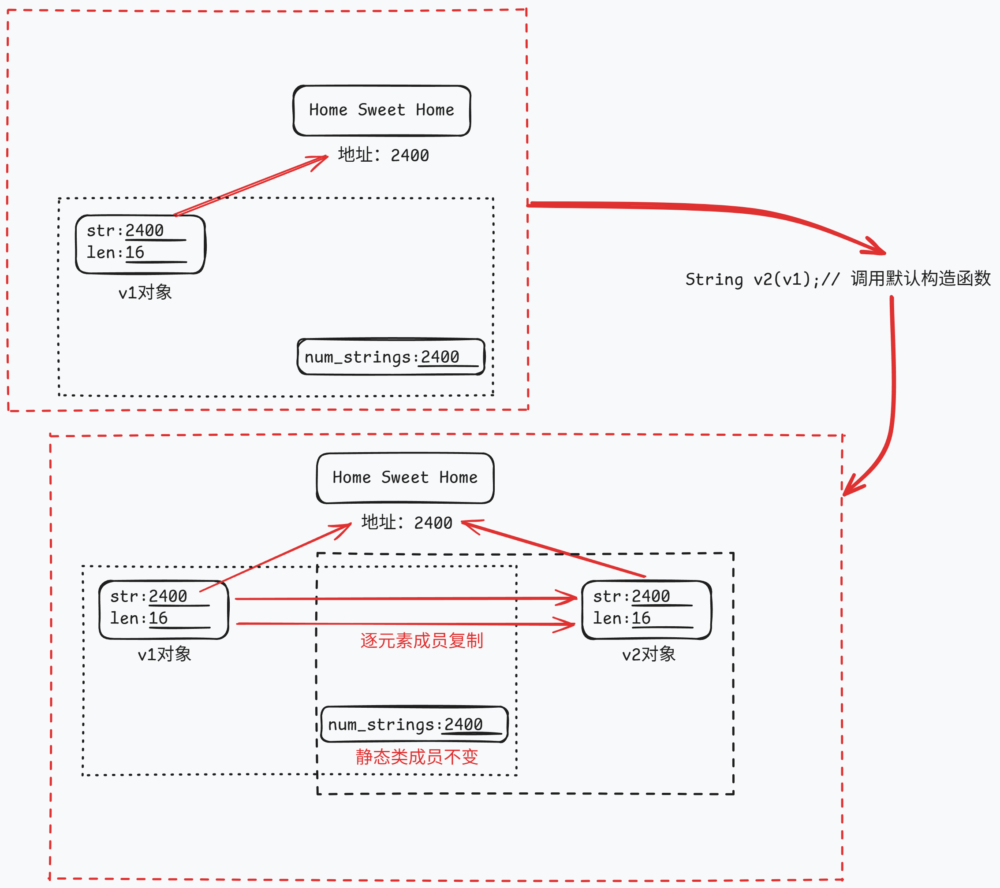
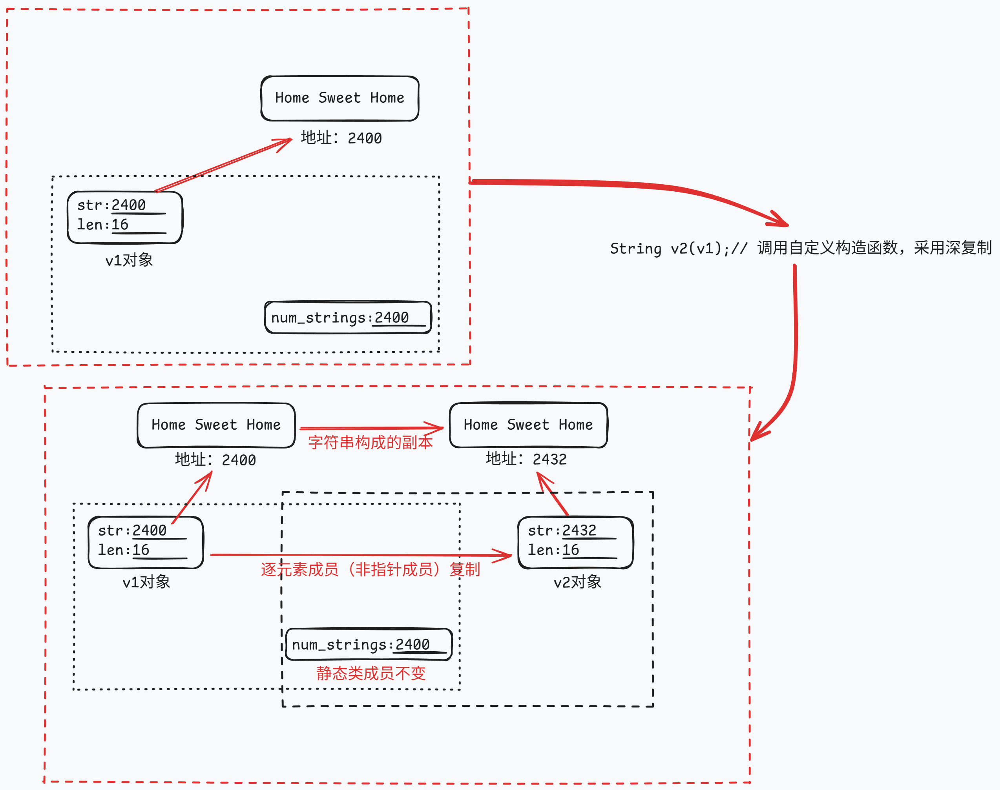
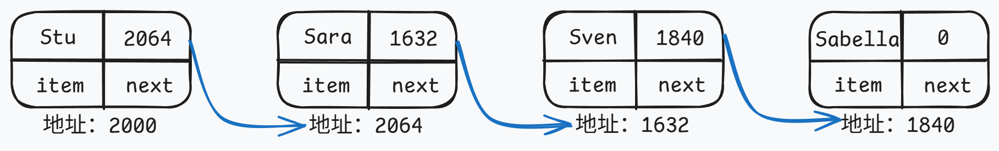
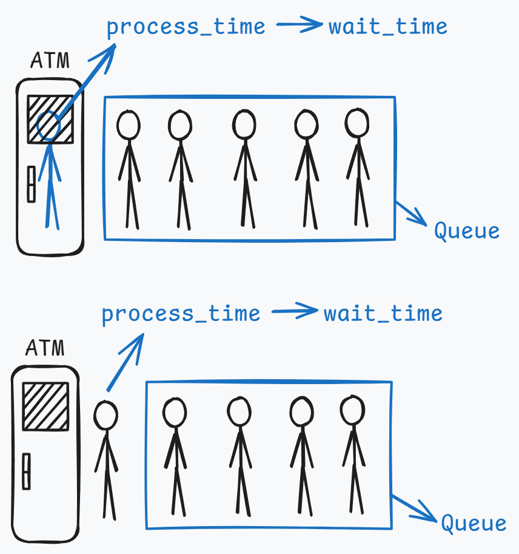

# 类和动态内存分配

## 练习：`StringBad`类的编写

| code-list-12-01                                     | code-list-12-02                                         | code-list-12-03                                       |
| --------------------------------------------------- | ------------------------------------------------------- | ----------------------------------------------------- |
| [strngbad.h](./examples/code-list-12-01-strngbad.h) | [strngbad.cpp](./examples/code-list-12-02-strngbad.cpp) | [vegnews.cpp](./examples/code-list-12-03-vegnews.cpp) |

该案例涉及了类的静态成员和动态内存分配的编写。

## 类的静态成员

### 静态数据成员

### 静态成员函数

### 静态成员在应用中的特点

## 类的动态内存分配

### 指针形式的数据成员

### new初始化问题

### 存储回收问题

### 类对象的基本操作问题

## 类内的特殊成员

C++类中，如果用户没有自定义下面这些成员函数，C++将自动提供。

| 特殊成员函数   | 描述        |
| -------------- | ----------- |
| 默认构造函数   |             |
| 默认析构函数   |             |
| 复制构造函数   |             |
| 赋值运算符     |             |
| 地址运算符     |             |
| 移动构造函数   | C++11中出现 |
| 移动赋值运算符 | C++11中出现 |

### 默认构造函数


### 默认析构函数

在变量离开作用域时被自动调用。

### 复制构造函数

复制构造函数用于将一个对象复制到**新创建**的对象中。类的复制构造函数原型通常如下：

```C++
Class_name(const Class_name&);
```

==那么何时将会调用复制构造函数呢？==

新建一个对象并将其初始化为同类现有对象时，复制构造函数将被调用，下面4中声明都将调用复制构造函数`Class_name(const Class_name&)`：

```C++
Class_name variable1(variable_known);
Class_name variable2 = variable_known;
Class_name variable3 = StringBad(variable_known);
Class_name * p_class = new Class_name(variable_known); 
```

当程序生成了对象副本时，复制构造函数将被调用。具体说，当函数按值传递对象或按值返回对象时，都将使用复制构造函数。

==那么默认复制构造函数将会进行何种程度的复制呢？==

默认的复制构造函数是一种浅复制，逐个复制非静态成员的值，静态成员不受影响。如下图所示。



如上图所示，默认复制构造函数的浅复制方式可能会带来数据受损，重复删除的问题。如下部分代码所示。

```C++
int main()
{
	...
	callme2(v1);
	...
}

void callme2(StringBad v2)
{
	cout << "String passed by value:\n";
	cout << " \"" << v2 << "\"\n";
}
```

 `void callme2(StringBad sb)`此函数为按值传递。若类未定义复制构造函数，那么`v2`将使用类默认的复制构造函数进行浅复制。默认的复制构造函数不会对静态成员变量加1，同时对于其中的指针成员，`v1`和`v2`将指向同一块内存，如上图所示。当函数接近尾声，`v2`的作用域到此为止，将会调用`v2`的析构函数释放`v2`，同时由于`v2`中的指针对象和`v1`中的指针对象指向同一块内存，当`v2`被释放，`v1`中指针成员指向的内存被`v2`的析构函数一并释放了，导致数据丢失，以及当`v1`结束时`v1`的析构函数会对该内存再次释放，导致重复内存空间重复释放。

==如何解决默认复制构造函数浅复制带来的问题呢？==



在自定义的默认复制构造函数中使用深复制（deep copy）。深复制是与浅复制相对的一种复制方法。在复制指针对象时，应当将指针指向的内容复制给另一个对象，并为此创建一个新的地址。这样每个对象自己的成员都是相对独立的，而不是引用另一个对象的成员。那么在调用析构函数时，将依次释放不同的成员，不会错误地释放其他类对象的成员。

```
StringBad::StringBad(const StringBad& st)
{
	num_strings++;
	len = st.len; // 非指针成员正常复制
	str = new char[len + 1]; // 指针成员新建一份地址
	std::strcpy(str, st.str); // 指针成员对字符串进行复制
	cout << nuim_strings << ": \"" << str << "\"object created.\n";
}
```

### 默认赋值运算符

C++允许类对象赋值，这是通过自动为类重载运算符实现的。这种运算符的原型如下：

```
Class_name & Class_name::operator=(const Class_name &);
```

它接受并返回一个指向类对象的引用。

==那么何时以及如何使用赋值运算符呢？==

在将已有对象赋给另一个对象时，将使用重载的赋值运算符。初始化对象不一定会使用赋值运算符。

与构造复制函数类似，赋值元素安抚的隐式实现也对成员进行逐个复制。如果成员本身就是类对象，则程序将使用为这个类定义的赋值运算符来复制该成员，但静态数据成员不受影响。

==以及使用赋值运算符时，会产生哪些问题呢？==

默认的赋值运算符和默认的复制构造函数类似，都是一种浅复制。从而导致类似的数据受损，内存空间重复释放的问题。

==如何解决赋值运算符产生的问题呢？==

同样，默认的赋值赋值运算符都是浅复制，需要定义一种深复制的赋值方式，与定义复制构造函数相似，但也有些不同。

* 由于目标对象可能引用了之前分配的数据，所以函数应当使用delete[]来释放这些数据。
* 函数应当尽量避免将对象赋给自身；否则，给对象重新赋值前，释放内存操作可能删除对象的内容。
* 函数返回一个指向调用对象的引用。

通过返回一个对象，函数可以像常规赋值操作那样，连续进行赋值。

```
StringBad & StringBad::operator = (const StringBad & st)
{
	if (this = &st);
		return *this;
// 首先进行自我复制，查看赋值运算符右边的地址是否与接受对象的地址相同
// 若相同，则直接返回*this，然后结束
	delete [] str;
// 如果地址不同，函数将释放str指向的内存，这是因为稍后将把一个新字符串的地址赋给str。
// 如果不首先使用delete运算符，则上述字符串将保留在内存中。由于程序中不在包含指向这块旧内存的指针，因此导致内存浪费
	len = st.len;
	str = new char [len + 1];
// 与自定义复制构造函数相似，即为新字符串分配足够的内存空间，然后将赋值运算符右边的对象中的字符串赋值到新的内存单元中
	std::strcpy(str, st.str);
	return * this;
// 返回解除引用后的指针
// 赋值操作并不创建新的对象
}
```

## 练习：`StringBad`类改进为`String`类

经过上述补充后，可以对`StringBad`类进行改进，改进后的文件如下：

|                  code-list-12-04                  |                    code-list-12-05                    |                     code-list-12-06                     |
| :-----------------------------------------------: | :---------------------------------------------------: | :-----------------------------------------------------: |
| [string1.h](./examples/code-list-12-04-string1.h) | [string1.cpp](./examples/code-list-12-05-string1.cpp) | [sayings1.cpp](./examples/code-list-12-06-sayings1.cpp) |

在原有的基础上，需要进行**修改**。首先，添加自定义的复制构造函数和赋值运算符，将浅拷贝修正为深拷贝；其次，使类构造函数和析构函数保持沉默；最后，简化默认构造函数，使之创建一个空字符。

接下来，需要再**添加**一些新内容。添加的新方法需要使得String类能够包含标准字符串`cstring`的所有功能。

| 函数声明                                                     | 函数解释                     |
| ------------------------------------------------------------ | ---------------------------- |
| `int length () const {return len;}`                          | 用于对string类对象计数       |
| `friend bool operator<(const String &st, const String &st2);` | 友元函数，重载比较运算符     |
| `friend bool operator>(const String &st, const String &st2);` | 友元函数，重载比较运算符     |
| `friend bool operator==(const String &st, const String &st2);` | 友元函数，重载等价运算符     |
| `friend opereator >>(istream & is, String & st);`            | 友元函数，重载比较输出运算符 |
| `char & operator[](int i);`                                  | 提供了使用数组访问的方式     |
| `const char & operator[](int i) const`                       | 提供了使用数组访问的方式     |
| `static int HowMany();`                                      | 补充静态类数据成员           |

> [!NOTE]
>
> * 如果在构造函数中使用`new`来初始化成员，那么在析构函数中应当使用`delete`
> * `new`和`delete`必须相互兼容。`new`对应于`delete`，而`new []`对应于`delete[]`
> * 如果有多个构造函数，则必须以相同的方式使用，要么都带中括号要么都不带中括号，因为析构函数只有一个
> * 应当定义一个复制构造函数，通过深度复制将一个对象初始化为另一个新对象
> * 应当定义一个赋值运算符，通过深度赋值将一个对象的值提供给另一个对象
> * 对于包含类成员的类，其进行逐成员复制时，将使用对应类成员的复制构造函数，不需要对该类重新编写一个复制构造函数。然而若类中部分类成员没有自己的深复制构造函数，则需要手动规定。

## 函数的返回对象

### 返回指向const对象的引用

使用const对象的引用常常为了提高效率，一般仅在一些只起到只读作用的函数中使用。返回引用不会调用复制构造函数，而返回常量会调用复制构造函数。

### 返回指向非const对象的引用

两种常见的返回非const对象的引用是重载赋值运算符以及重载与`cout`一起使用的`<<`运算符。前者这样做的原因是为了提高运算效率，因为不这样做也可以调用复制构造函数完成；后者这样做的原因是必须如此。

### 返回对象

如果被返回的对象是被调用函数中的局部变量，则不应按引用的方式返回它。因为在被调用函数执行完毕后，局部对象将调用其析构函数。因此，当控制权回到调用函数时，引用指向的对象将不复存在。在这种情况下应当返回对象而不是引用。

通常，重载的运算符常常采用这种返回类型，如下。

```C++
int main()
{
    Vector force1(50,60);
	Vector force2(10,70);
	Vector net;
	net = force1 + force2;
}
...
Vector Vector::operator+(const Vector & b)
{
	return Vector(x+b.x, y+b.y);
}
```

上述代码在函数输出时将调用复制构造函数，将一个临时变量复制给`net`变量。

### 返回const对象

一般由于程序员的粗心或者创意性的设计可能会出现如下语句：

```C++
force1 + force2 = new;
// force1和force2的定义以及+重载运算符的定义如上。
```

这种语句是可以执行的。`force1+force2`将使用重载后的`+`运算符，通过复制构造函数创建一个临时变量，然后变量`net`将通过赋值运算符，覆盖这个临时变量，当临时变量使用完毕后，将被抛弃。

为了避免上述流程带来的不可预估的错误，可以将返回类型声明为`const Vector`，这样对于正常使用没有任何影响，但是上述语句将被定义为非法。


> [!NOTE]
>
> * 总之，如果函数或方法要返回临时变量，则应当返回对象而非对象的引用，在这种情况下将使用复制构造函数来生成返回对象。
>
> * 如果方法或函数要返回一个没有公有复制构造函数的对象，它必须返回一个指向这种对象的引用。
>
> * 最后，对于返回对象和返回引用均可的方法或函数，应当优先返回引用，提高效率。

## 练习：使用指向对象的指针

该程序使用指针来跟踪而非索引值来跟踪最先的`String`对象和最长的`String`对象。

|                  code-list-12-04                  | code-list-12-05                                       |                     code-list-12-07                     |
| :-----------------------------------------------: | ----------------------------------------------------- | :-----------------------------------------------------: |
| [string1.h](./examples/code-list-12-04-string1.h) | [string1.cpp](./examples/code-list-12-05-string1.cpp) | [sayings2.cpp](./examples/code-list-12-07-sayings2.cpp) |

> [!NOTE]
>
> 在下述情况下析构函数将被调用
>
> * 如果对象是自动变量，则当执行完定义该对象的程序块时，将调用析构函数。
> * 如果对象是静态变量，则在程序结束时将调用析构函数。
> * 如果对象是用new创建的动态变量，则在显式使用delete删除对象时，析构函数才会被调用。

该程序使用`new`运算符创建了一个512字节的内存缓冲区，然后使用`new`运算符在堆中创建两个`JustTesting`对象，比试图使用定位`new`运算符在内存缓冲区中创建两个`JustTesting`对象。最后使用`delete`来释放使用`new`分配的内存。

|                      code-list-12-08                      |
| :-------------------------------------------------------: |
| [placenew1.cpp](./examples/code-list-12-08-placenew1.cpp) |

> [!NOTE]
>
> * 使用new定位运算符拉取的内存不能用delete运算符释放，因为其不在new/delete系统之中。

该程序对`placenew1.cpp`进行修改，加入合适的delete和显示的析构函数调用，修复程序原有的问题。

|                      code-list-12-09                      |
| :-------------------------------------------------------: |
| [placenew2.cpp](./examples/code-list-12-09-placenew2.cpp) |

## 练习：队列模拟

背景：Heather银行打算在Food Heap超市开设一个自动柜员机（ATM）。Food Heap超市的管理员担心排队等待使用ATM的人流会干扰超市的交通，希望限制排队等待的人数。Heather银行希望对顾客排队等待的时间进行估测。要编写一个程序来模拟这个情况，让超市管理员可以了解ATM可能造成的影响。

对于这种问题最自然的方法是使用顾客队列。队列是一种抽象的数据类型（Abstract Data Type， ADT），可以存储有序的项目序列。新项目被添加在队尾，并可以删除队首的项目。队列有点像栈，但栈在同一端可以进行添加和删除。这使得栈是一种后进先出的结构，而队列是先进先出的。从概念上说，队列就好比收款台或ATM机前面排的队，所以对于上述问题，队列非常合适。因此工程任务之一就是定义一个Queue类。

队列中的项目是顾客。Heather银行的代表介绍：通常1/3顾客只需要1分钟便可获得服务，1/3的顾客需要2分钟，另外1/3的顾客需要3分钟。另外，顾客到达的时间是随机的，但每个小时使用自动柜员机的顾客数量相当稳定。工程另外两项任务是：设计一个表示顾客的类；编写一个程序来模拟顾客和队列之间的交互。

### 队列类的设计与实现

首先需要设计一个Queue类，这里列出队列的特征：

> [!NOTE]
>
> * 队列存储有限的项目序列
> * 队列所能容纳的项目数有一定限制
> * 应当能够创建空队列
> * 应当能够检查队列是否为空
> * 应当能够检查队列是否为满
> * 应当能够在队尾添加项目
> * 应当能够在队首删除项目
> * 应当能够确定队列中的项目数

==首先，要确定如何表示队列数据。==一种方法是使用new动态分配一个数组，其包含所需的元素数，然而对于队列操作而言，数组并不合适。这里，引入链表结构，以满足队列操作的要求，链表由节点序列构成，每一个节点都包含要保存到链表中的信息以及一个指向下一个节点的指针。

```C++
struct Node
{
    Item item;// 将数据存储在节点中
    struct Node * next;// 指向下一个数据的指针
}
```

通常，链表最后一个节点重点指针被设置为NULL（或0），以指出后面没有节点了。要跟踪链表，必须知道第一个节点的地址。可以让Queue类的一个数据成员指向链表的起始位置，有了这种信息后，就可以沿节点链找到任何节点。然而，由于队列总是将新项目添加到队尾，因此包含一个指向最后一个节点的数据成员将非常方便。此外，还可以使用数据成员来跟踪队列可存储的最大项目数，以及当前项目数。



==其次，可以在类中嵌套结构或类声明。==在类声明中声明的结构、类或枚举被称为是被嵌套在类中，其作用域为整个类。这种类不会创建数据对象，而只是指定了可以在类中使用的类型。如果声明是在类中私有部分进行的，则只能在这个类中使用被声明的类型。如果是在公有部分进行的，则可以从类的外部通过作用域解析运算符使用被声明的类型。

```C++
class Queue
{
	struct Node { Item item; struct Node* next; };
	enum {Q_SIZE = 10};
private:
	Node* front;
	Node* rear;
	int items;
	const int qsize;
	Queue(const Queue & q) : qsize(0) {}
	Queue& operator=(const Queue& q) { return *this; }
public:
	Queue(int qs = Q_SIZE);
	~Queue();
	bool isempty() const;
	bool isfull() const;
	int queuecount() const;
	bool enqueue(const Item& Item);
	bool dequeue(Item& item);
};
```

==类构造函数应当提供类成员的值，对于特殊的数据成员可以使用列表初始化的方式。==构造函数应当对成员函数进行赋值，但是下面的构造函数是无法实现的。

```C++
Queue::Queue(int qs)
{
	front = rear = NULL;
    items = 0;
    qsize = qs;
}
```

这是因为`qsize`是`const`常量，只能对其进行初始化，而不能进行赋值。对于`const`数据成员，必须在执行到构造函数体之前，即创建对象时进行初始化。C++专门为类构造函数提供一种特殊的语法来完成，即成员初始化列表（member initializer list）。

成员初始化列表由逗号分隔的初始化列表组成，位于参数列表的右括号之后，函数体左括号之前。故上述构造函数可以编写为如下所示：

```C++
Queue::Queue(int qs) : qsize(qs)
{
    front = pear = NULL:
    items = 0;
}
// 或写为
// Queue::Queue(int qs) : qsize(qs), front(NULL), rear(NULL), items(0) {...}
```

即，语法为`Class_name::Class_name(int n, int m) :mem1(n), mem2(0), mem3(n*m + 2) {...}`

> [!NOTE]
>
> 注意，通过成员初始化列表进行初始化是在对象创建时完成的，此时还未执行括号中的任何代码。
>
> * 只有构造函数可以使用这种初始化列表语法。
> * const成员**必须**使用这种方法。
> * 被声明为引用的类成员**必须**使用这种语法，因为被声明为引用的数据成员也只能在被创建时被初始化。
> * 常规数据成员**可以**使用这种语法。
>
> 数据成员被初始化的顺序于它们出现在类声明中的顺序相同，与初始化器中的排列顺序无关。
>
> 千万注意，只有类的构造函数中可以使用成员初始化列表！！！

在C++11以及更高版本中，可以在类声明中直接对变量进行初始化。对于在类声明时初始化的变量，若成员初始化列表中也进行了初始化，则成员初始化列表中的值会覆盖类声明中的值；若成员初始列表没有进行初始化，则使用类声明中的值。

```C++
class Classy
{
	int mem1 = 10;
    const int mem2 = 20;
    ...
}

Classy::Classy() : mem1(30){...}
// 当类对象被创建时，`mem1`将被初始化为30，而`mem2`将被初始化为20。
```

==对于查看是否为空，查看队列是否为满，从队尾添加项目，从队首删除项目可以参考源代码中的注释==

相关函数分别为`isempty()`，`isfull()`，`queuecount()`，`enqueue(const Item& Item)`，`dequeue(Item& item)`。

==对于析构函数，需要特别注意。==

```C++
Queue::~Queue()
{
	Node* temp;
	while (front != NULL)
	{
		temp = front;
		front = front->next;
		delete temp;
	}
}
```

由于类对象是一个链表，其中的指针类型仅仅有队列的一头和一尾两个是显示表示的，中间还有许多指针是隐式表示的，因此析构函数可以调用一个循环一次删除这些指针。从链表头开始，依次删除每一个节点。

==最后，需要看一下我们的老朋友复制构造函数和赋值运算符，采用默认的是否合适。==

答案显然是否定的。复制Queue对象的成员将生成一个新对象，该对象指向链表原来的头和尾。因此将项目添加到复制的Queue对象中，将修改共享的链表。这样做的后果非常严重。同时，只有副本的尾指针得到了更新，从原始对象的角度看这将损坏链表。显然，要克隆或复制队列，必须提供复制构造函数和执行深度复制的赋值构造函数。

但是如果暂时不需要使用复制构造函数，可以通过将复制构造函数和赋值运算符放到私有成员中，从而显示的禁止对其的调用，如下代码。

```C++
class Queue
{
private:
    Queue(const Queue & q) : qsize(0) {}
	Queue& operator=(const Queue& q) { return *this; }
}
```

这样做不仅避免了本来将自动生成的默认方法定义，还由于这些是私有方法，无法被广泛使用。下面两行代码将不变编译通过。

```C++
Queue snick(nip);
tuck = nip;
// 将分别调用复制构造函数和赋值运算符，但由于这些方法被定义为私有方法，因此无法被类对象调用
```

即，预期将来面对无法预料的运行故障，不如得到一个易于跟踪的编译错误。

### 客户类的设计与实现

其次，还需要设计一个`customer`类。这里仅仅模拟客户何时进入队列以及客户交易所需的时间。当模拟生成新客户是，程序将创建一个新的客户对象，并在其中存储客户到达时间以及一个随机生成的交易时间。当客户达到队首时，程序将记录此时的时间，并将其与进入队列的时间相减，得到客户的等候时间。

```C++
class Customer
{
private:
	long arrive;
	int processtime;
public:
	Customer() { arrive = processtime = 0; }
	void set(long when);
	long when() const { return arrive; }
	int ptime() const { return processtime; }
};
```

### ATM机模拟

程序允许用户输入3个数：队列的最大长度、程序模拟的持续时间以及平均单位的客户数。程序将使用循环——每次循环代表1分钟。每分钟的循环中程序将完成下面工作。

1. 判断是否来了新的客户。如果来了此时队列未满，则将它添加到队列中，否则拒绝客户入队。
2. 如果没有客户在进行交易，则选取队列的第一个客户。确定该客户的已等候时间，并将wait_time计数器设置为新客户所需的处理时间。
3. 如果棵树正在处理中，则将wait_time计数器减1.
4. 记录各种数据，如获得服务的客户数目、被拒绝的客户数目、排队等候的累计时间以及累计的队列长度等。

注意，当等待时间结束，队列中的第一个人被提取至ATM机前进行服务，新的等待时间为这个被提取的人的处理时间，ATM机处理和队列是分开考虑的。


