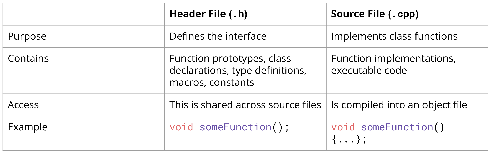
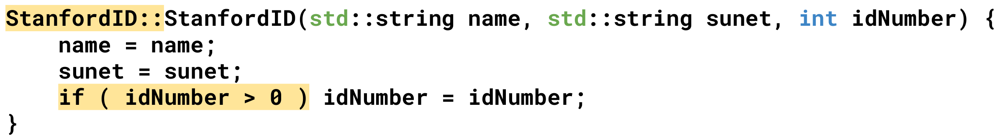
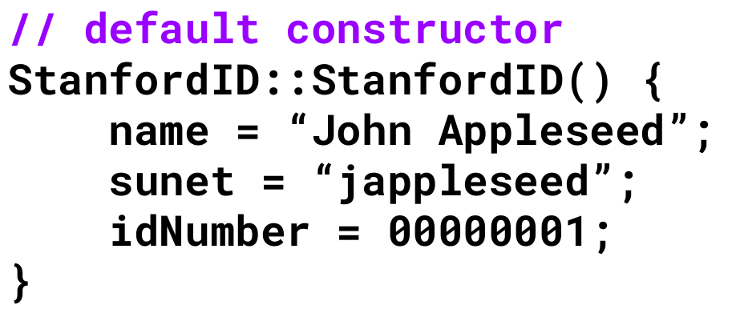
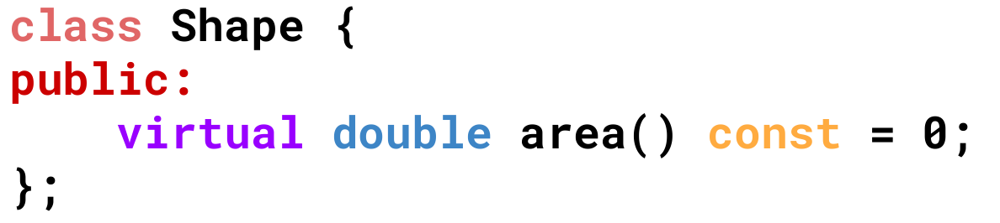
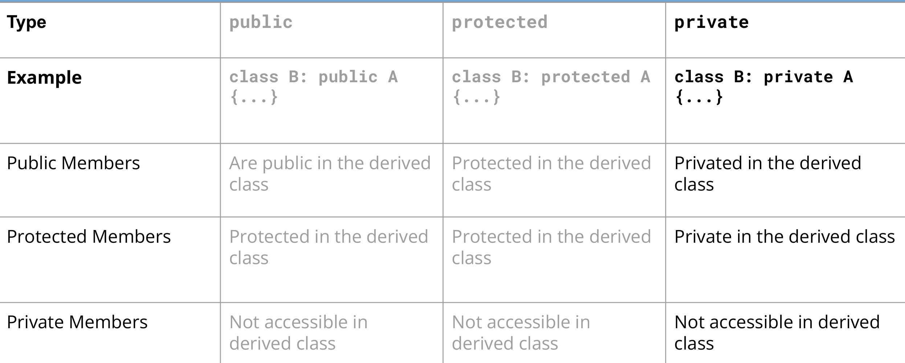
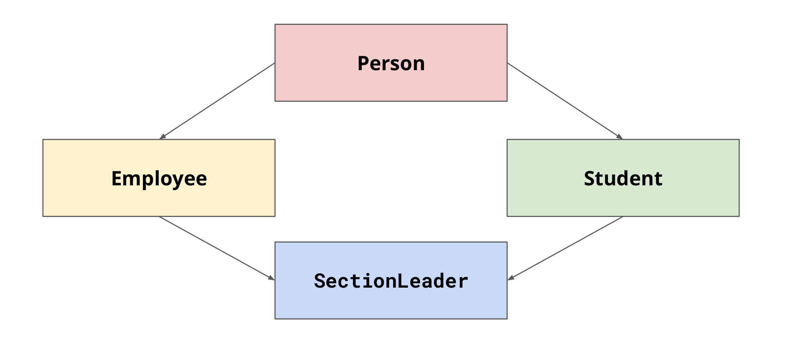
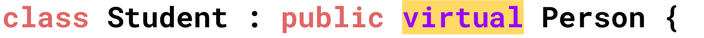
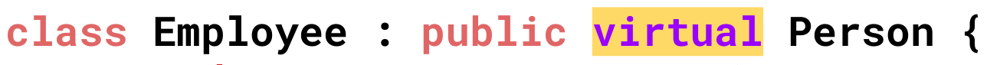

# 类和类继承

**结构体和类有什么区别？**

类包含一序列不同类别的对象，以及一组用于操作这些对象的函数，以及一组用于限制访问这些对象和函数的规则。而结构体没有访问权限的限制。

## 类-Classes

包含private和public权限，用户可以访问public的成员或方法，但是不能使用private的成员或方法



一个类的设计应当包含：

* 构造器
* 私有成员方法和成员对象
* 公共成员函数（为用户设计的接口）
* 析构器

### 构造函数

构造器用于构造新对象、将值赋给它们的数据成员。更准确地说，C++为这些成员函数提供了名称和使用语法，而程序员需要提供方法定义。

* 构造器的函数名和类名保持相同。
* 在`.cpp`文件中，需要使用类作为命名空间来定义成员函数，如下：



* 使用`this`关键字指针来分辨与类成员名字相同的变量。`this`指向的对象为类的成员变量。
* C++中的函数参数初始化通过统一初始化实现，如下：


* 当不给函数提供任何参数时，相当于如下：



* 根据输入的不同，编译器会自动帮我们找到对应的函数，即构造函数的重载。

### 析构函数

用构造函数创建对象后，程序负责跟踪该对象，直到其过期为止。对象过期时，程序将自动调用一个特殊的成员函数——析构函数。

对于没有使用`new`创建动态内存的类，只需要创建一个空的析构函数，这种析构函数若没有设定，一般由程序自动生成。

析构函数的名称十分特殊，为类名前加上`~`。析构函数没有返回值和声明类型，进一步地析构函数没有任何参数。

### 访问权限

### `this`指针

当出现两个类对象时，且类方法可能涉及两个类对象时，需要使用`this`指针表明类方法中的对象分别是谁。

C++使用this指针，指向用来调用成员函数的对象。

每个成员函数（包括析构函数和构造函数）都有一个this指针。this指针指向调用对象。如果方法需要引用整个调用对象，则可以使用表达式`*this`。在函数的括号后面使用`const`限定符将`this`限定为从const，这样将不适用`this`来修改对象的值。

注意，this是指向调用该函数的对象的指针，*this才是调用该函数的对象。

## 类的继承-Inheritance

* 纯虚函数在基类中被实例化，但在子类中被重写。



### 类的派生

从一个类派生出另一个类时，原始类被称为基类，继承类称为派生类。演示如下代码。

```C++
Class RatedPlayer : public TableTennisClass
{
    ...
};
```

冒号指出`RatedPlayer`类的基类是`TableTennisClass`类。上述的声明头表明`TableTennisClass`是一个公有的基类，这被称为公有派生。

| 继承的               | 添加的                       |
| -------------------- | ---------------------------- |
| 继承了基类的成员对象 | 需要自己的构造函数           |
| 继承了基类的成员方法 | 按需添加额外的成员对象和方法 |

### 派生类的构造函数

派生类的构造函数必须同时为派生类对象的成员和基类对象的成员提供数据。注意，**基类的私有成员是无法被派生类直接访问的**，只能调用基类的方法进行访问。

**使用基类的自定义构造函数初始化基类。**基类对象应在程序进入派生类构造函数之前被创建，可以使用成员初始化列表来完成。

```C++
RatedPlayer::RatedPlayer(unsigned int r, const string& fn,
	const string& ln, bool ht) : TableTennisPlayer(fn, ln, ht) {...}
```

**使用基类的默认构造函数初始化基类。**如省略列表初始化，即自定义的基类构造函数不会被调用，因此程序会调用其默认构造函数。

```C++
RatedPlayer::RatedPlayer(unsigned int r, const string& fn,
	const string& ln, bool ht) : TableTennisPlayer() {...}
```

**使用基类的复制构造函数初始化基类。**当使用同类型的基类对该派生类对象的基类进行初始化时，会调用派生类对象的复制构造函数。注意对于使用动态内存分配的基类，应当自定义合适的复制构造函数。

```C++
RatedPlayer::RatedPlayer(unsigned int r,
	const TableTennisPlayer& tp) : TableTennisPlayer(tp){...}
```

### 派生类的使用

> [!NOTE]
>
> **对象切片**
>
> 在 C++ 中将派生类对象分配给基类对象时，派生类对象的额外属性将被切掉以生成基类对象，这个过程称为**对象切片**。
>
> 在 C++ 中，为了解决这个切片问题，我们可以使用指针或引用。
>
> 当指针或对对象的引用作为函数参数传递时，不会发生对象切片，因为任何类型的指针或引用都占用相同的内存量。

然而，**基类指针或引用**只能用于调用基类方法，因此不能使用基类指针或引用来调用派生类的方法。

通常，C++要求引用和指针类型与赋给的类型匹配，但是这一规则对继承来说是一个例外。然而，这种例外是单向的，派生类对象的引用和指针不能指向基类。

```C++
based_class b1{...};
derived_class & rt = b1;// DO NOT DO IT
derived_class * pt = &b1;// DO NOT DO IT
```

由于这种特殊的继承关系，为基类对象设计的函数也可以用于派生类对象。同时这种引用兼容性允许程序将基类对象初始化为派生类对象。

```C++
derived_class r1 {...};
base_class b1(r1);
// 这个函数的原函数为base_class(const derived_class &)
// 但是基类的方法中并没有这个函数，因此存在隐式复制构造函数
// base_class(const base_class &)
// 该函数将基类对象初始化为嵌套于派生类对象的基类对象。
```

对于赋值运算符，同样的：

```C++
derived_class r1 {...};
base_class b1 = r1;
// 这个函数的原函数为base_class & operator=(const derived_class &)const
// 但是基类的方法中并没有这个函数，因此使用隐式复制构造函数
// base_class & operator=(const base_class &)const
// 派生类对象的值将被暂时赋给一个基类对象
```

### 继承的种类





在这种情况下，`Employee`和`Student`都继承于`Person`，他们都会调用`Person`的构造函数。然而对于`SectionLeader`来说，它和调用两次`Person`的构造函数，创造出两份`Person`的副本，一份来自于`Student`，另一份来自于`Employee`

为了解决这个问题，使`Employee`和`Student`以一种虚继承的方式继承`Person`。虚拟继承意味着派生类，在这里是`SectionLeader`，只应该有基类的单一实例，这里指的是`Person`。





### 多态继承和虚函数

前文中，**基类指针或引用**只能用于调用基类方法，因此不能使用基类指针或引用来调用派生类的方法。

然而，我们希望同一个方法在派生类和基类中的行为是不同的。换句话说，方法的行为应取决于调用该方法的对象。这种较复杂的行为称为**多态**——具有多种形态，即同一个方法的行为随上下文而异。为实现这一点，需要在基类中使用虚函数。

虚函数，即使用virtual关键字修饰类方法。**注意，关键字virtual值用于类声明的方法原型中，而没有用于方法定义中**。如下案例。

```C++
//ViewAcct()不是一个虚方法
Brass dom("Dominic Banker", 12118, 2592.00);
BrassPlus dot("Dorothy Banker", 12118, 2592.00);
Brass & b1_raf = dom;
Brass & b2_raf = dot;
b1_ref.ViewAcct();// 使用Brass::ViewAcct()
b2_ref.ViewAcct();// 使用Brass::ViewAcct()
```

```C++
//ViewAcct()是一个虚方法
Brass dom("Dominic Banker", 12118, 2592.00);
BrassPlus dot("Dorothy Banker", 12118, 2592.00);
Brass & b1_raf = dom;
Brass & b2_raf = dot;
b1_ref.ViewAcct();// 使用Brass::ViewAcct()
b2_ref.ViewAcct();// 使用BrassPlus::ViewAcct()
```

* 虚函数可以让子类对象在运行时动态地继承和修改父类的成员函数，使得代码更加灵活、可重用，并且可以实现多态性和抽象类等高级特性。
* 通过虚函数，可以实现多态性（Polymorphism），即同一个函数名可以在不同的子类中表现出不同的行为，这样可以提高代码的可重用性和灵活性。
* 避免静态绑定，在使用父类指针或引用调用子类对象的成员函数时，如果没有使用虚函数，则会进行静态绑定（Static Binding），即只能调用父类的成员函数，无法调用子类特有的成员函数。
* 虚函数的调用是动态绑定（Dynamic Binding）的，即在运行时根据指针或引用所指向的对象类型来选择调用哪个函数，从而实现动态多态性。
* 抽象类是一种不能直接实例化的类，只能被其他类继承并实现其虚函数。通过定义纯虚函数（Pure Virtual Function），可以使得一个类成为抽象类，强制其子类必须实现该函数。

> [!NOTE]
>
> **构造函数与虚函数**
>
> 构造函数不能是虚函数。创建派生对象时，将使用派生类的构造函数，而不是基类的构造函数。然后派生类的构造函数将使用基类的一个构造函数，这种顺序不同于继承机制。因此，派生类不继承基类的构造函数，所及将类构造函数声明为虚的没有什么意义。
>
> **析构函数与虚函数**
>
> 析构函数应当是虚函数，除非类不用做基类。如果不使用虚函数，类对象在析构删除时，会仅仅删除基类的成员数据；而使用虚函数，类对象会先删除派生类指向的内存，再删除基类指向的内存。

