# 类模板

## 背景

模板是一种增加代码复用性的手段。

## 历史

宏定义

## 类模板

模板可以自动化代码生成

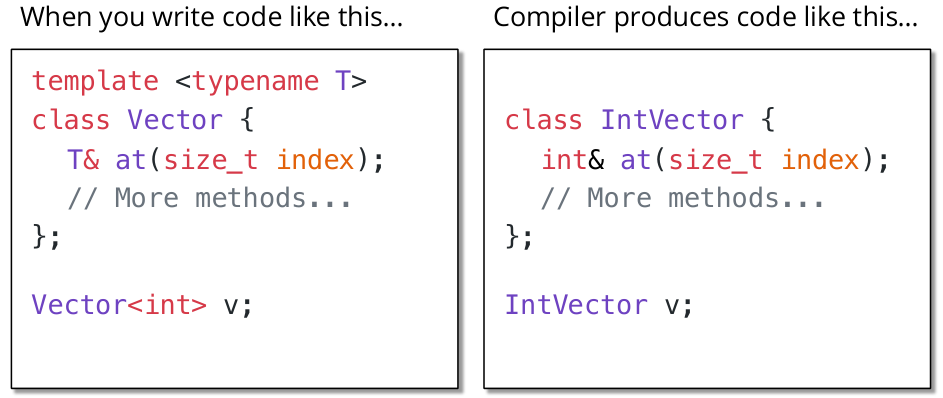

## 案例

已知有类模板如下：

```C++
tempalte<class T>
class Vector {
public:
    size_t size();
    bool empty();
    
    T& operator[] (size_t index);
    T& at(size_t index);
    void push_back(const T& elem);
};
```

对该类模板添加如下函数：

```C++
void printVec(const Vector<int>& v) {
    for (size_t i = 0; i < v.size(); i++) {
        std::cout << v.at(i) << " ";
    }
    std::cout << std::endl;
}
```

由于`printVec()`将`v`视为`const`类型，因此不允许对其进行修改。但是编译器无法确定`v.size()` 和`v.at(i)`是否对`v`进行了修改，因此编译器会报错。可以进行如下修改：

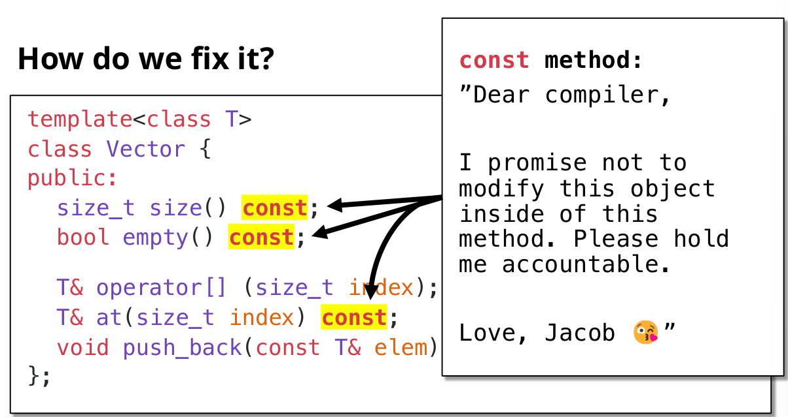

上图中的修改是在头文件中进行的，在对应的`.cpp`文件中，同样需要在函数头后面添加关键字`const`。

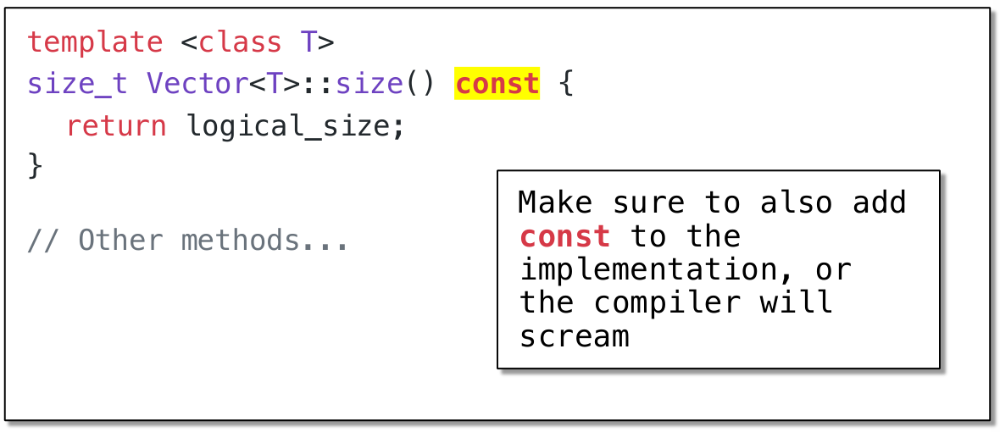

> [!NOTE]
>
> **`const`函数中的`this`指针**
>
> `const`函数中的`this`指针类型是`const class_name*`的，不能对`this`指针的对象进行修改。

若类对象被标记为const类型，那么就只能使用const类型的接口。

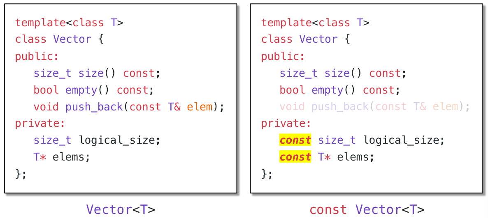

`T& at(size_t index) const`此函数虽然不会对数据成员进行修改，但是其会返回一个引用，用户可以通过该引用对数据成员进行修改。为了修改这个问题，可以将函数头写为`const T& at(size_t index) const`。

但是这随之也带来另一个问题，对于非const的类对象，我们可能需要对数据成员进行修改，将函数头写为`const T& at(size_t index) const`使得我们无法对数据成员进行修改。

故只能通过重载该方法，使得在面对const的类对象和非const的类对象时函数可以做出不同的反应。

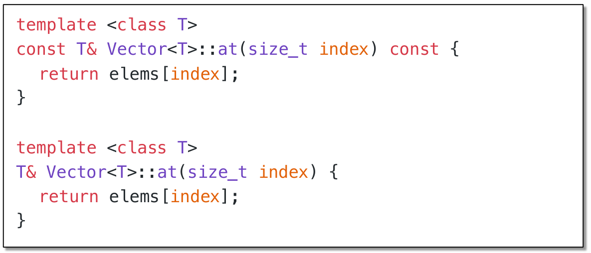

在对应`.cpp`文件中对应做出如下改动。

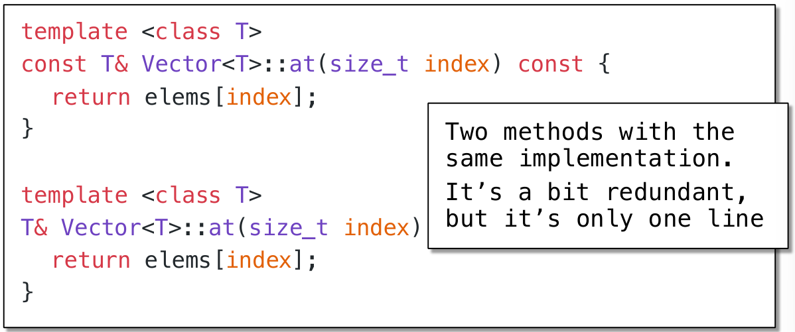

对于另一个函数`findElement()`：

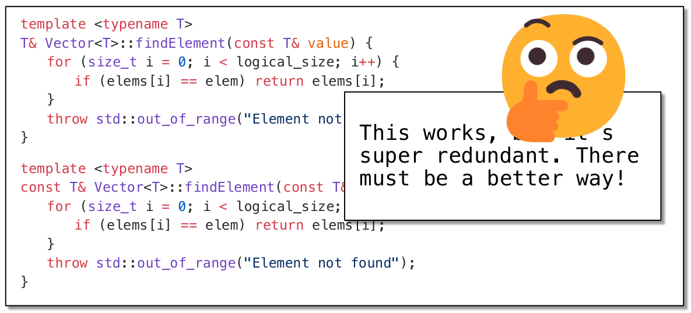

反复对函数进行重载会导致大量重复的代码出现，导致程序非常冗余，那么是否有对应的改进方法呢？

有的，兄弟，有的：`const_cast<Vector<T>&>(*this).findElement(value);`

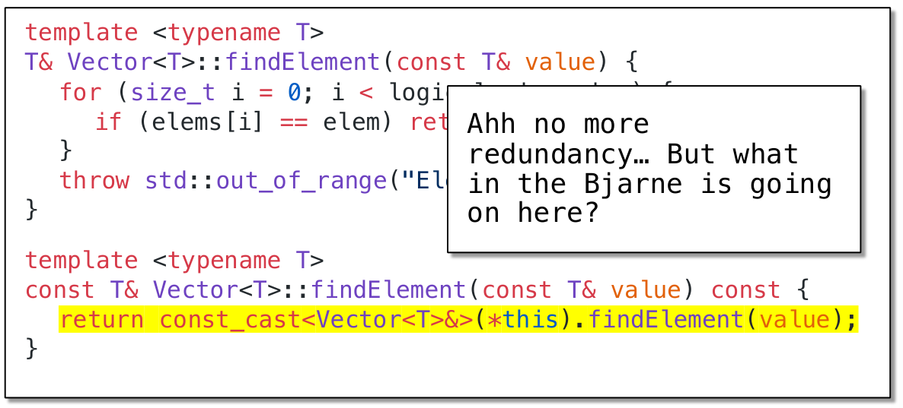

改进后如上形式。

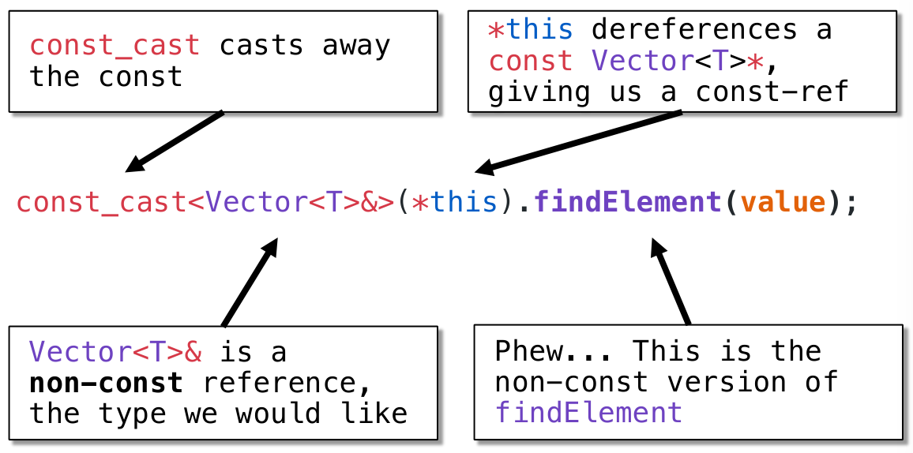

`mutalbe`的中文意思是“可变的，易变的”，跟`constant`（既C++中的`const`）是反义词。

在C++中，`mutable`也是为了突破`const`的限制而设置的。被`mutable`修饰的变量，将永远处于可变的状态，即使在一个`const`函数中。

我们知道，被`const`关键字修饰的函数的一个重要作用就是为了能够保护类中的成员变量。即：该函数可以使用类中的所有成员变量，但是不能修改他们的值。然而，在某些特殊情况下，我们还是需要在`const`函数中修改类的某些成员变量，因为要修改的成员变量与类本身并无多少关系，即使修改了也不会对类造成多少影响。当然，你可以说，你可以去掉该函数的const关键字呀！但问题是，我只想修改某个成员变量，其余成员变量仍然希望被`const`保护。此时就可以使用`mutbale`关键字，如下案例所示：

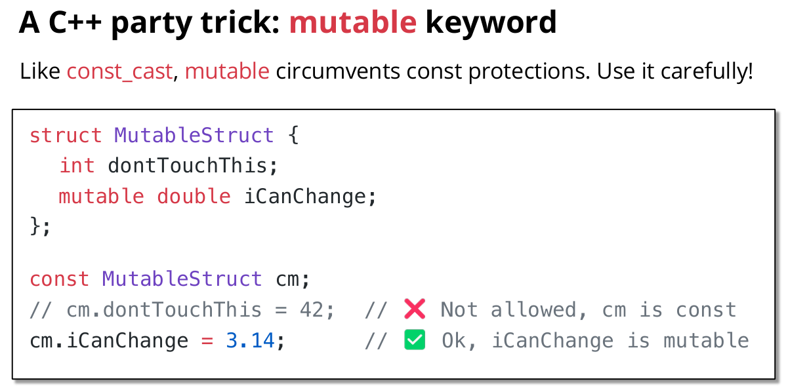

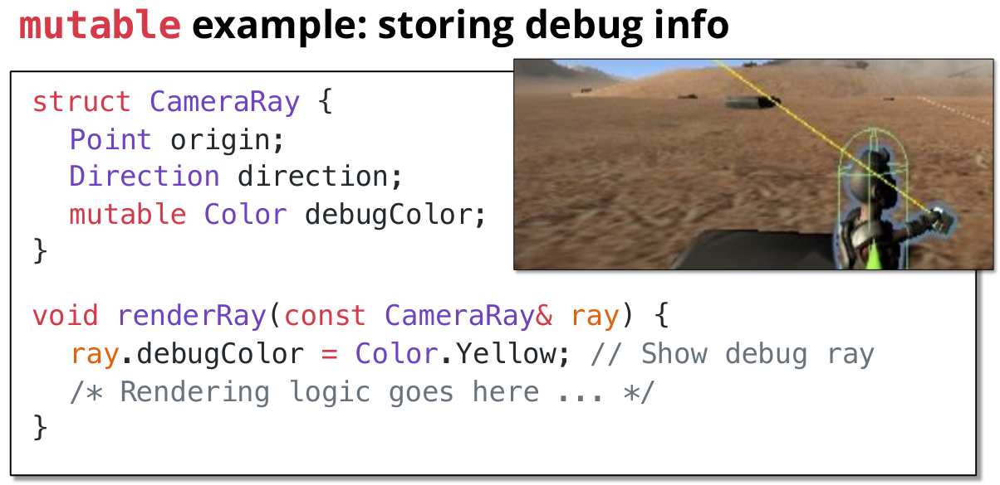

# 函数模板

## 背景

想让

## 函数模板

### 函数模板的使用

模板可以自动化代码生成


`min`函数模板的使用如下：

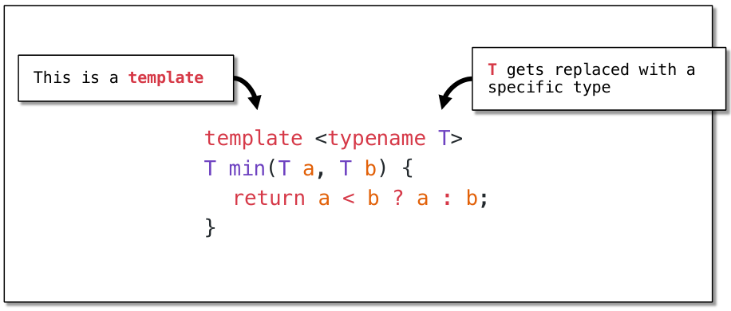

**显示实例化`explicit instantiaion`**

```C++
min<int>(106, 107); // return 106
min<double>(1.2, 3.4); // return 1.2
```

**隐式实例化`implicit instantiation`**

```C++
min(106, 107); // int, returns 106
min(1.2, 3.4); // double, returns 1.2
```

但是使用隐式实例化有时可能会很棘手：

```C++
const char* min(const char* a, const char* b) {
	return a < b ? a : b;
}
...;
min("Jacob", "Fabio");
```

上述使用隐式实例化，此时模板会自动将`T`识别为`const char*`，但是对于这种类型的数据，是没有定义比较运算符的，因此编译器会报错。

解决方法：使用显式实例化。`min<std::string>("Jacob", "Fabio");`将`"Jacob"`强制转换为`string`类型的数据，再进行比较运算。

```C++
min(3.4, 4);
```

对于上式来说，`3.4`是double类型的，而`4`是int类型，上述模板无法使用，解决方法是之一是使用显示实例化，将两个数据类型全部转换为double。`min<double>(3.4, 4)`，而另一个解决方法是

### `Concepts`约束模板

在前文的编写中，对于`min("Jacob", "Fabio")`来说编译器无法通过编译，因为其并没有找到适用于`const char*`类型的比较运算符；且这种错误只有在完成模板的实例化之后才会被编译器发现。那么有没有什么方法可以帮我们对模板进行约束呢？使得错误在完成实例化之前就被发现？

答：`Concepts`是用来约束模板类型的语法糖。附上一条链接：[C++20: Concept详解以及个人理解 - 知乎](https://zhuanlan.zhihu.com/p/266086040)

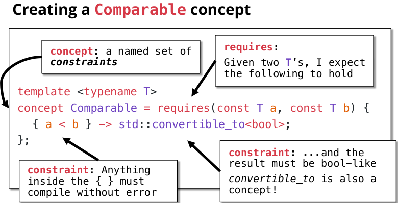

如下使用`concepts`约束，将`typename`关键字换为约束模板的名字。

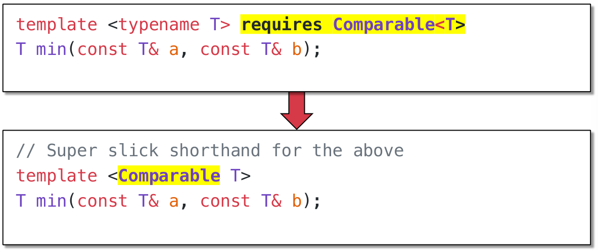

当然对于C++来说有许多内置的`Concepts`。

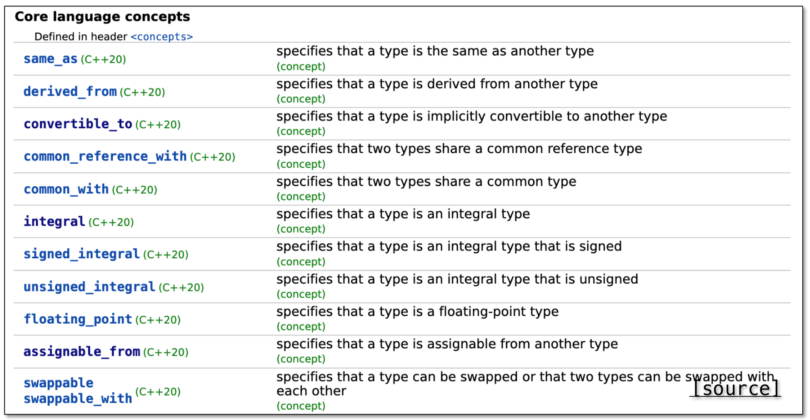

### `Variadic`可变参数模板

前文描述的函数模板的参数数目都是确定的，那么是否有这样一种技术使得函数模板可以根据参数数目的不同自动生成对应参数数目的函数代码呢？

在目前介绍的技术中，函数重载可以帮助我们实现这个功能，但是这种方法会出现大量的重复代码，并且非常不方便。

那么是否可以将函数的参数使用一个`vector`类型的容器呢？`vector`是一种动态数组，可以帮助我们实现这个功能，但是会带来低效的问题。

* 递归地复制向量（可以通过包装函数避免）
* 每次调用都必须分配一个向量（不可避免的开销）

**介绍可变参数模板`Variadic Template`。**

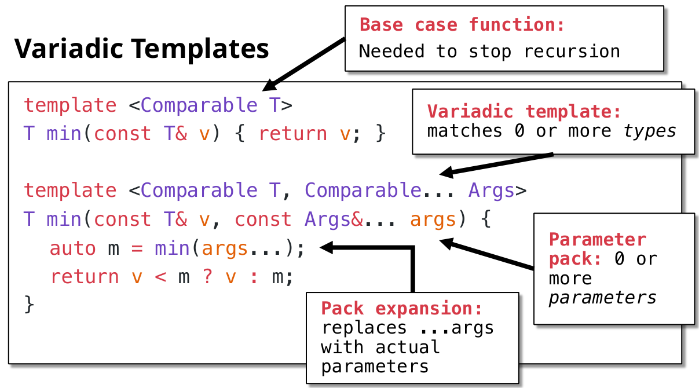

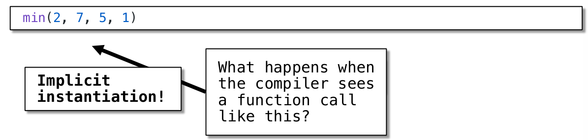

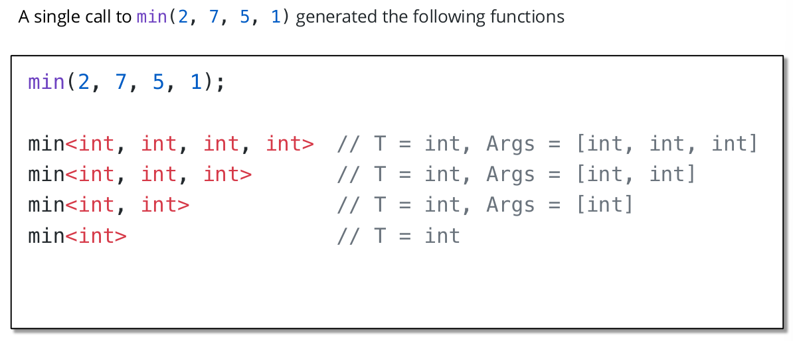

### `Metaprogramming`模板元编程

模板元编程使得程序在编译阶段就能进行工作，提高了程序的运行速度。

[Cpp入门级模板元编程(Template Metaprogramming) - 知乎](https://zhuanlan.zhihu.com/p/354927495)

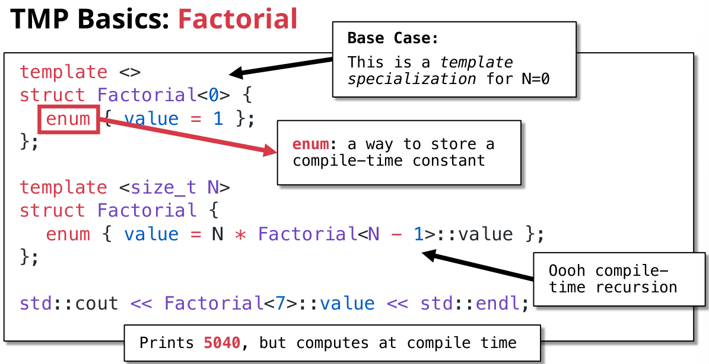

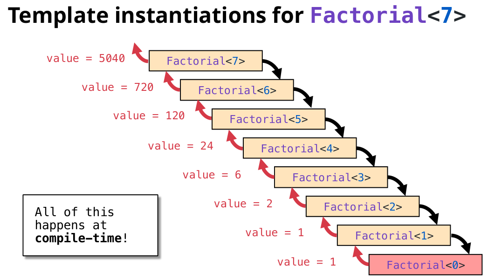

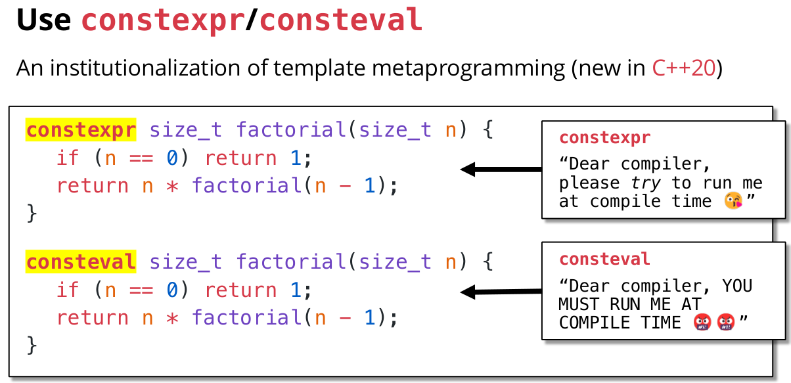

## 案例

### 迭代器iterators

```c++
template <typename Iterator, typename TElem>
TElem find(Iterator begin, Iterator end, TElem value)
{
	for 
}
```

